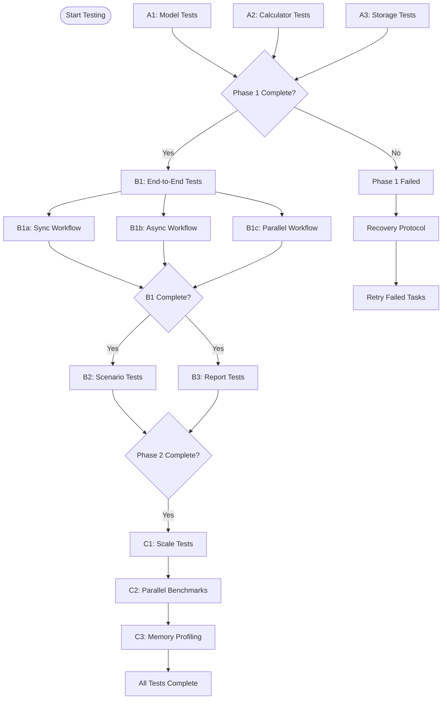

# Task Orchestration System for Agentic AI Testing

## Overview

This document defines the orchestration system for coordinating multiple AI agents executing the CashCow testing suite in parallel. It includes task scheduling, dependency management, resource allocation, and failure recovery protocols.

## Orchestration Architecture

### Master Orchestrator Role
**Responsibilities:**
- Task assignment and scheduling
- Dependency tracking and enforcement  
- Resource allocation and monitoring
- Agent coordination and communication
- Failure detection and recovery
- Progress aggregation and reporting

### Agent Worker Roles
**Responsibilities:**
- Task execution according to assigned role
- Progress reporting to orchestrator
- Resource usage monitoring
- Error detection and initial recovery attempts
- Artifact generation and management

---

## TASK SCHEDULING ALGORITHM

### Phase-Based Execution Strategy

```python
# Orchestrator Logic Pseudocode

class TaskOrchestrator:
    def __init__(self):
        self.phases = {
            'PHASE_1_UNIT': ['A1', 'A2', 'A3'],
            'PHASE_2_INTEGRATION': ['B1', 'B2', 'B3'], 
            'PHASE_3_PERFORMANCE': ['C1', 'C2', 'C3']
        }
        self.task_status = {}
        self.agent_pool = []
        self.resource_limits = self.load_resource_config()
    
    def execute_testing_suite(self):
        for phase_name, tasks in self.phases.items():
            print(f"Starting {phase_name}")
            
            if phase_name == 'PHASE_1_UNIT':
                self.execute_parallel_phase(tasks)
            elif phase_name == 'PHASE_2_INTEGRATION':
                self.execute_sequential_with_parallel_subtasks(tasks)
            elif phase_name == 'PHASE_3_PERFORMANCE':
                self.execute_sequential_phase(tasks)
            
            if not self.validate_phase_completion(phase_name):
                return self.handle_phase_failure(phase_name)
        
        return self.generate_final_report()
    
    def execute_parallel_phase(self, tasks):
        # Launch all tasks simultaneously
        agents = []
        for task_id in tasks:
            agent = self.assign_agent(task_id)
            agent.start_task_async(task_id)
            agents.append(agent)
        
        # Wait for completion with timeout
        self.wait_for_completion(agents, timeout=600)
    
    def execute_sequential_with_parallel_subtasks(self, tasks):
        for task_id in tasks:
            subtasks = self.get_subtasks(task_id)
            if subtasks:
                # Execute subtasks in parallel
                self.execute_parallel_phase(subtasks)
            else:
                # Execute main task
                agent = self.assign_agent(task_id)
                agent.start_task_sync(task_id)
    
    def assign_agent(self, task_id):
        # Find available agent with sufficient resources
        required_resources = self.get_task_requirements(task_id)
        available_agent = self.find_suitable_agent(required_resources)
        
        if not available_agent:
            available_agent = self.provision_new_agent(required_resources)
        
        return available_agent
```

### Resource Allocation Matrix

```yaml
# orchestrator_config.yaml
resource_allocation:
  unit_tests:
    memory_mb: 512
    cpu_cores: 1
    disk_mb: 100
    timeout_seconds: 600
    max_parallel: 3
    
  integration_tests:
    memory_mb: 1024
    cpu_cores: 2
    disk_mb: 500
    timeout_seconds: 1800
    max_parallel: 2
    
  performance_tests:
    memory_mb: 4096
    cpu_cores: 4
    disk_mb: 2048
    timeout_seconds: 3600
    max_parallel: 1

agent_limits:
  max_agents: 6
  total_memory_mb: 8192
  total_cpu_cores: 8
  
failure_handling:
  max_retries: 2
  retry_delay_seconds: 30
  escalation_threshold: 3
  timeout_grace_period: 60
```

---

## DEPENDENCY MANAGEMENT

### Dependency Graph


### Dependency Enforcement Logic
```python
class DependencyManager:
    def __init__(self):
        self.dependencies = {
            'A1': [],
            'A2': [],  
            'A3': [],
            'B1': ['A1', 'A2', 'A3'],
            'B2': ['B1'],
            'B3': ['B1'],
            'C1': ['B1', 'B2', 'B3'],
            'C2': ['C1'],
            'C3': ['C1']
        }
        self.task_status = {}
    
    def can_start_task(self, task_id):
        dependencies = self.dependencies.get(task_id, [])
        for dep_task in dependencies:
            if self.task_status.get(dep_task) != 'completed_success':
                return False, f"Waiting for {dep_task}"
        return True, "Dependencies satisfied"
    
    def update_task_status(self, task_id, status):
        self.task_status[task_id] = status
        
        # Notify waiting tasks
        waiting_tasks = self.get_waiting_tasks()
        for waiting_task in waiting_tasks:
            can_start, reason = self.can_start_task(waiting_task)
            if can_start:
                self.notify_task_ready(waiting_task)
    
    def get_waiting_tasks(self):
        waiting = []
        for task_id, deps in self.dependencies.items():
            if self.task_status.get(task_id) in [None, 'waiting']:
                can_start, _ = self.can_start_task(task_id)
                if not can_start:
                    waiting.append(task_id)
        return waiting
```

---

## AGENT COMMUNICATION PROTOCOL

### Message Types and Schemas

#### Task Assignment Message
```json
{
    "message_type": "task_assignment",
    "message_id": "msg_001",
    "timestamp": "2025-07-10T10:00:00Z",
    "orchestrator_id": "orchestrator_main",
    "target_agent": "agent_001",
    "task_details": {
        "task_id": "A1",
        "task_type": "unit_test",
        "role": "Model Test Specialist",
        "priority": "high",
        "timeout_seconds": 600,
        "resources": {
            "memory_mb": 512,
            "cpu_cores": 1,
            "disk_mb": 100
        },
        "execution_template": "template_a",
        "dependencies": [],
        "success_criteria": {
            "min_pass_rate": 0.95,
            "max_execution_time": 600,
            "required_coverage": 0.95
        }
    }
}
```

#### Progress Update Message  
```json
{
    "message_type": "progress_update",
    "message_id": "msg_002", 
    "timestamp": "2025-07-10T10:02:30Z",
    "agent_id": "agent_001",
    "task_id": "A1",
    "progress": {
        "percentage": 65,
        "current_test": "test_employee_equity_calculation",
        "tests_completed": 29,
        "tests_remaining": 16,
        "estimated_completion": "2025-07-10T10:03:45Z"
    },
    "resources": {
        "memory_usage_mb": 145,
        "cpu_utilization": 85,
        "disk_usage_mb": 23
    },
    "status": "running"
}
```

#### Task Completion Message
```json
{
    "message_type": "task_completion",
    "message_id": "msg_003",
    "timestamp": "2025-07-10T10:05:30Z", 
    "agent_id": "agent_001",
    "task_id": "A1",
    "final_status": "success",
    "execution_summary": {
        "start_time": "2025-07-10T10:00:00Z",
        "end_time": "2025-07-10T10:05:30Z",
        "duration_seconds": 330,
        "exit_code": 0
    },
    "test_results": {
        "total_tests": 45,
        "passed": 43,
        "failed": 2,
        "pass_rate": 0.956,
        "coverage_percentage": 96.2
    },
    "artifacts": [
        "A1_results.json",
        "A1_coverage.json",
        "A1_agent_report.json"
    ],
    "next_actions": [
        "Task B1 can proceed when A2 and A3 complete"
    ]
}
```

#### Failure Notification Message
```json
{
    "message_type": "failure_notification",
    "message_id": "msg_004",
    "timestamp": "2025-07-10T10:05:30Z",
    "agent_id": "agent_002", 
    "task_id": "A2",
    "failure_details": {
        "error_type": "calculation_error",
        "error_message": "AssertionError: Expected 2083.33, got 2083.34",
        "failed_tests": ["test_equity_vesting_precision"],
        "error_context": {
            "test_file": "tests/test_calculators.py",
            "line_number": 152,
            "function": "test_equity_vesting_calculation"
        }
    },
    "recovery_attempts": [
        {
            "attempt": 1,
            "action": "automatic_retry",
            "result": "failed",
            "timestamp": "2025-07-10T10:04:00Z"
        }
    ],
    "escalation_required": true,
    "recommended_actions": [
        "Review floating-point precision in equity calculations",
        "Add tolerance to financial calculations",
        "Manual investigation required"
    ]
}
```

---

## FAILURE RECOVERY PROTOCOLS

### Failure Classification System

#### Level 1: Automatic Recovery (Agent-Level)
```python
class AutoRecoveryHandler:
    def handle_failure(self, task_id, error_type, error_details):
        recovery_strategies = {
            'import_error': self.fix_import_error,
            'permission_error': self.fix_permission_error,
            'memory_error': self.reduce_memory_usage,
            'timeout_error': self.extend_timeout,
            'network_error': self.retry_with_backoff
        }
        
        strategy = recovery_strategies.get(error_type)
        if strategy:
            return strategy(task_id, error_details)
        else:
            return self.escalate_to_orchestrator(task_id, error_type, error_details)
    
    def fix_import_error(self, task_id, error_details):
        # Reinstall dependencies
        subprocess.run(['poetry', 'install'], check=True)
        
        # Verify imports
        test_import = subprocess.run([
            'poetry', 'run', 'python', '-c', 'import src.cashcow'
        ], capture_output=True)
        
        if test_import.returncode == 0:
            return self.retry_task(task_id)
        else:
            return self.escalate_to_orchestrator(task_id, 'import_error', 
                                               'Dependencies installation failed')
```

#### Level 2: Orchestrator Recovery (System-Level)
```python
class OrchestratorRecoveryManager:
    def handle_agent_failure(self, agent_id, task_id, failure_details):
        failure_type = failure_details.get('error_type')
        
        if failure_type in ['resource_exhaustion', 'system_error']:
            return self.reallocate_resources(task_id)
        elif failure_type in ['calculation_error', 'logic_error']:
            return self.escalate_to_human(task_id, failure_details)
        elif failure_type == 'timeout':
            return self.handle_timeout(task_id, failure_details)
        else:
            return self.attempt_task_reassignment(task_id)
    
    def reallocate_resources(self, task_id):
        # Increase resource allocation
        current_resources = self.get_task_resources(task_id)
        enhanced_resources = {
            'memory_mb': current_resources['memory_mb'] * 2,
            'cpu_cores': min(current_resources['cpu_cores'] * 2, 4),
            'timeout_seconds': current_resources['timeout_seconds'] * 1.5
        }
        
        new_agent = self.provision_agent(enhanced_resources)
        return self.reassign_task(task_id, new_agent)
```

#### Level 3: Human Escalation (Critical Issues)
```python
class HumanEscalationProtocol:
    def escalate_issue(self, task_id, issue_type, context):
        escalation_report = {
            'escalation_id': self.generate_escalation_id(),
            'timestamp': datetime.utcnow().isoformat(),
            'task_id': task_id,
            'issue_type': issue_type,
            'severity': self.assess_severity(issue_type),
            'context': context,
            'system_state': self.capture_system_state(),
            'recommended_actions': self.generate_recommendations(issue_type),
            'blocking_tasks': self.get_blocked_tasks(task_id)
        }
        
        self.send_human_notification(escalation_report)
        self.pause_dependent_tasks(task_id)
        return escalation_report
```

### Recovery Decision Matrix

| Error Type | Agent Recovery | Orchestrator Recovery | Human Escalation |
|------------|----------------|----------------------|------------------|
| Import Error | ✓ Reinstall deps | ✓ Environment reset | - |
| Permission Error | ✓ Fix permissions | ✓ Reallocate agent | - |
| Memory Error | ✓ Reduce dataset | ✓ Increase allocation | ✓ If persistent |
| Timeout | ✓ Extend timeout | ✓ Resource reallocation | ✓ If exceeds 2x |
| Calculation Error | - | - | ✓ Always |
| Logic Error | - | - | ✓ Always |
| System Error | - | ✓ Agent reallocation | ✓ If persistent |
| Network Error | ✓ Retry w/ backoff | ✓ Alternative agent | ✓ If widespread |

---

## MONITORING AND OBSERVABILITY

### Real-Time Dashboard Metrics
```yaml
# Metrics collected every 10 seconds
system_metrics:
  - orchestrator_status
  - active_agents_count
  - total_memory_usage
  - total_cpu_utilization
  - task_queue_length
  - completed_tasks_count
  - failed_tasks_count

task_metrics:
  - task_execution_time
  - task_success_rate
  - resource_utilization_per_task
  - test_coverage_percentage
  - performance_benchmarks

agent_metrics:
  - agent_health_status
  - agent_resource_usage
  - agent_task_history
  - agent_error_rate
  - agent_communication_latency
```

### Alert Conditions
```python
class AlertManager:
    def __init__(self):
        self.alert_rules = {
            'high_failure_rate': {
                'condition': lambda metrics: metrics['failure_rate'] > 0.2,
                'severity': 'critical',
                'action': 'pause_new_tasks'
            },
            'memory_exhaustion': {
                'condition': lambda metrics: metrics['memory_usage'] > 0.9,
                'severity': 'warning', 
                'action': 'reduce_parallel_tasks'
            },
            'agent_unresponsive': {
                'condition': lambda agent: agent['last_heartbeat'] > 120,
                'severity': 'critical',
                'action': 'reassign_tasks'
            },
            'performance_degradation': {
                'condition': lambda metrics: metrics['avg_execution_time'] > 
                            metrics['baseline_execution_time'] * 2,
                'severity': 'warning',
                'action': 'investigate_bottlenecks'
            }
        }
```

### Logging Strategy
```python
# Structured logging for orchestration events
import structlog

logger = structlog.get_logger()

def log_task_assignment(task_id, agent_id, resources):
    logger.info("task_assigned",
                task_id=task_id,
                agent_id=agent_id,
                memory_mb=resources['memory_mb'],
                cpu_cores=resources['cpu_cores'],
                timestamp=datetime.utcnow().isoformat())

def log_task_completion(task_id, agent_id, duration, status, metrics):
    logger.info("task_completed",
                task_id=task_id,
                agent_id=agent_id,
                duration_seconds=duration,
                status=status,
                test_pass_rate=metrics.get('pass_rate'),
                coverage=metrics.get('coverage'),
                timestamp=datetime.utcnow().isoformat())
```

---

## ORCHESTRATION EXECUTION SCRIPT

### Master Orchestrator Script
```bash
#!/bin/bash
# orchestrator.sh - Main orchestration script

set -euo pipefail

SCRIPT_DIR="$(cd "$(dirname "${BASH_SOURCE[0]}")" && pwd)"
PROJECT_DIR="/home/alex/cashcow"
LOG_DIR="$PROJECT_DIR/orchestration_logs"
AGENT_COUNT=6

# Initialize orchestration environment
init_orchestration() {
    echo "Initializing orchestration environment..."
    
    # Create log directory
    mkdir -p "$LOG_DIR"
    
    # Verify project setup
    cd "$PROJECT_DIR"
    poetry install
    
    # Start orchestrator daemon
    python3 -m orchestrator.main --config orchestrator_config.yaml &
    ORCHESTRATOR_PID=$!
    echo $ORCHESTRATOR_PID > "$LOG_DIR/orchestrator.pid"
    
    # Wait for orchestrator to be ready
    sleep 5
}

# Launch agent pool
launch_agents() {
    echo "Launching $AGENT_COUNT agents..."
    
    for i in $(seq 1 $AGENT_COUNT); do
        agent_id="agent_$(printf "%03d" $i)"
        
        # Launch agent in background
        python3 -m orchestrator.agent \
            --agent-id "$agent_id" \
            --orchestrator-endpoint "http://localhost:8080" \
            --log-file "$LOG_DIR/$agent_id.log" &
        
        agent_pid=$!
        echo $agent_pid > "$LOG_DIR/$agent_id.pid"
        
        echo "Launched $agent_id (PID: $agent_pid)"
        sleep 1
    done
}

# Execute testing suite
execute_testing_suite() {
    echo "Starting CashCow testing suite execution..."
    
    # Send suite execution command to orchestrator
    curl -X POST http://localhost:8080/api/v1/execute-suite \
         -H "Content-Type: application/json" \
         -d '{
             "suite_name": "cashcow_full_suite",
             "phases": ["PHASE_1_UNIT", "PHASE_2_INTEGRATION", "PHASE_3_PERFORMANCE"],
             "timeout_seconds": 7200,
             "resource_limits": {
                 "max_memory_gb": 8,
                 "max_cpu_cores": 8
             }
         }'
    
    # Monitor execution
    monitor_execution
}

# Monitor execution progress
monitor_execution() {
    echo "Monitoring execution progress..."
    
    while true; do
        # Get orchestrator status
        status=$(curl -s http://localhost:8080/api/v1/status | jq -r '.status')
        
        case $status in
            "completed")
                echo "Testing suite completed successfully!"
                break
                ;;
            "failed")
                echo "Testing suite failed!"
                get_failure_report
                exit 1
                ;;
            "running")
                # Show progress
                progress=$(curl -s http://localhost:8080/api/v1/progress)
                echo "Progress: $(echo $progress | jq -r '.overall_progress')%"
                
                # Show active tasks
                active_tasks=$(echo $progress | jq -r '.active_tasks | join(", ")')
                echo "Active tasks: $active_tasks"
                ;;
        esac
        
        sleep 10
    done
}

# Get final report
get_failure_report() {
    echo "Retrieving failure report..."
    curl -s http://localhost:8080/api/v1/final-report > "$LOG_DIR/failure_report.json"
    echo "Failure report saved to $LOG_DIR/failure_report.json"
}

# Cleanup function
cleanup() {
    echo "Cleaning up orchestration environment..."
    
    # Stop agents
    for pid_file in "$LOG_DIR"/agent_*.pid; do
        if [[ -f "$pid_file" ]]; then
            pid=$(cat "$pid_file")
            kill $pid 2>/dev/null || true
            rm "$pid_file"
        fi
    done
    
    # Stop orchestrator
    if [[ -f "$LOG_DIR/orchestrator.pid" ]]; then
        orchestrator_pid=$(cat "$LOG_DIR/orchestrator.pid")
        kill $orchestrator_pid 2>/dev/null || true
        rm "$LOG_DIR/orchestrator.pid"
    fi
    
    echo "Cleanup completed"
}

# Trap cleanup on exit
trap cleanup EXIT

# Main execution flow
main() {
    echo "CashCow Agentic Testing Orchestrator"
    echo "====================================="
    
    init_orchestration
    launch_agents
    execute_testing_suite
    
    echo "Orchestration completed successfully!"
}

# Execute main function
main "$@"
```

---

## CONFIGURATION MANAGEMENT

### Orchestrator Configuration File
```yaml
# orchestrator_config.yaml
orchestrator:
  name: "cashcow_test_orchestrator"
  version: "1.0.0"
  log_level: "INFO"
  api_port: 8080
  metrics_port: 9090
  
  task_definitions:
    unit_tests:
      - id: "A1"
        name: "Model Validation Tests"
        template: "template_a"
        resources: {memory_mb: 512, cpu_cores: 1, timeout: 600}
        success_criteria: {pass_rate: 0.95, coverage: 0.95}
        
      - id: "A2" 
        name: "Calculator Function Tests"
        template: "template_a"
        resources: {memory_mb: 512, cpu_cores: 1, timeout: 600}
        success_criteria: {pass_rate: 1.0, coverage: 0.90}
        
      - id: "A3"
        name: "Storage Layer Tests"
        template: "template_a" 
        resources: {memory_mb: 512, cpu_cores: 1, timeout: 600}
        success_criteria: {pass_rate: 1.0, coverage: 0.90}
    
    integration_tests:
      - id: "B1"
        name: "End-to-End Workflow Tests"
        template: "template_b"
        dependencies: ["A1", "A2", "A3"]
        resources: {memory_mb: 1024, cpu_cores: 2, timeout: 1800}
        success_criteria: {pass_rate: 1.0}
        subtasks: ["B1a", "B1b", "B1c"]
        
      - id: "B2"
        name: "Scenario Management Tests"
        template: "template_b"
        dependencies: ["B1"]
        resources: {memory_mb: 1024, cpu_cores: 2, timeout: 1800}
        success_criteria: {pass_rate: 0.95}
        
      - id: "B3"
        name: "Report Generation Tests"
        template: "template_b"
        dependencies: ["B1"]
        resources: {memory_mb: 1024, cpu_cores: 2, timeout: 1800}
        success_criteria: {pass_rate: 0.95}
    
    performance_tests:
      - id: "C1"
        name: "Scale Performance Tests"
        template: "template_c"
        dependencies: ["B1", "B2", "B3"]
        resources: {memory_mb: 4096, cpu_cores: 4, timeout: 3600}
        success_criteria: {execution_time_max: 1800, memory_max: 2048}
        
      - id: "C2"
        name: "Parallel Execution Benchmarks"
        template: "template_c"
        dependencies: ["C1"]
        resources: {memory_mb: 4096, cpu_cores: 4, timeout: 3600}
        success_criteria: {speedup_min: 2.0}
        
      - id: "C3"
        name: "Memory Profiling Analysis"
        template: "template_c"
        dependencies: ["C1"]
        resources: {memory_mb: 4096, cpu_cores: 2, timeout: 3600}
        success_criteria: {memory_efficiency: 0.8}

agent_pool:
  min_agents: 3
  max_agents: 6
  scale_up_threshold: 0.8  # Resource utilization
  scale_down_threshold: 0.3
  agent_timeout: 300  # Seconds without heartbeat
  
recovery:
  max_retries: 2
  retry_delay: 30
  escalation_threshold: 3
  human_notification_webhook: "https://alerts.company.com/webhook"
  
monitoring:
  metrics_interval: 10  # Seconds
  health_check_interval: 30
  log_rotation_size: "100MB"
  log_retention_days: 7
```

---

**Orchestration System Version**: 1.0  
**Supported Agent Types**: Python-based AI agents with REST API communication  
**Last Updated**: 2025-07-10  
**Maintainer**: System Architecture Team