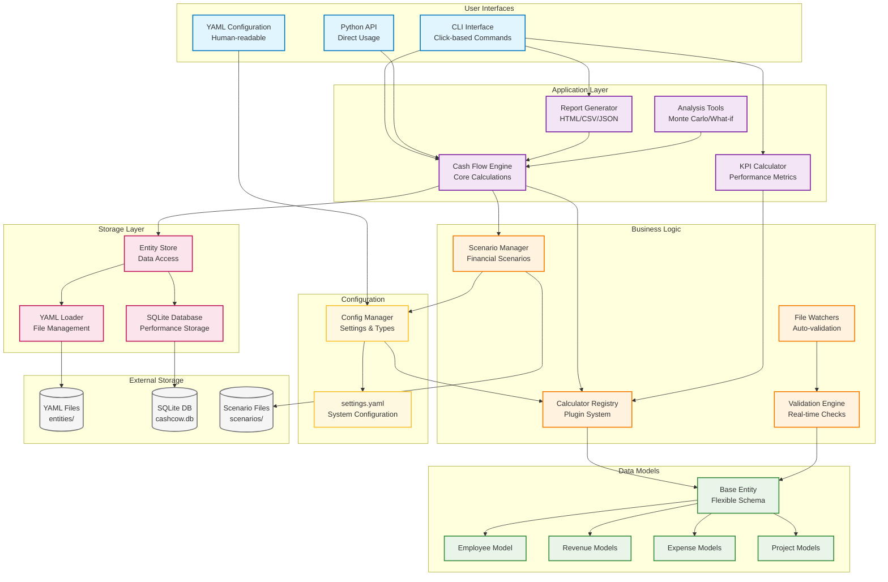
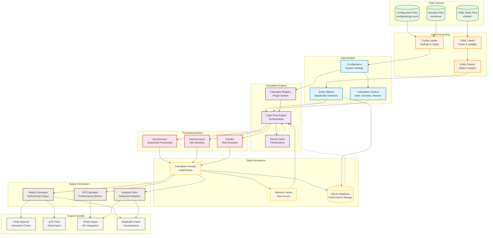
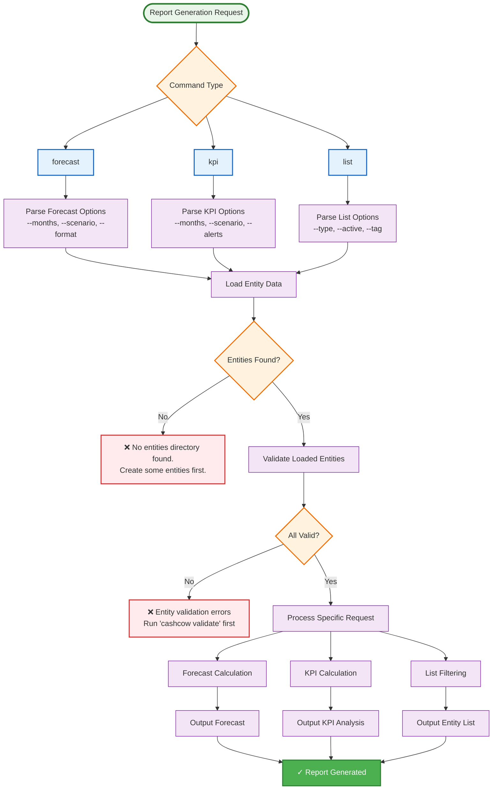

# Integration & Deployment Documentation Summary

This document summarizes the comprehensive documentation created for CashCow integration and deployment.

## System Architecture Overview

The CashCow system follows a modular architecture with clear separation of concerns across user interfaces, business logic, data models, and storage layers:



## Data Processing Pipeline

The system processes data through a comprehensive pipeline from input sources to final output formats:



## Documentation Created

### 1. GETTING_STARTED.md (` ~/cashcow/docs/GETTING_STARTED.md`)

A comprehensive guide for new users covering:

**Prerequisites & Installation**
- Python 3.10+ requirements
- Poetry installation and setup
- Dependency management
- Environment configuration

**Step-by-Step Tutorial**
- Creating first employee entity
- Adding revenue sources (grants, investments)
- Setting up operating expenses (facilities, software)
- Generating first forecast
- Understanding output and KPIs

**Quick Command Reference**
- All essential CLI commands
- Common usage patterns
- Best practices for getting started

## CLI Command Structure

The CashCow CLI provides a comprehensive interface for entity management, forecasting, and analysis:

```mermaid
graph TD
    CLI[cashcow CLI] --> GLOBAL{Global Options}
    GLOBAL --> VERSION[--version]
    GLOBAL --> HELP[--help]
    
    CLI --> ADD[add]
    CLI --> LIST[list]
    CLI --> FORECAST[forecast]
    CLI --> KPI[kpi]
    CLI --> VALIDATE[validate]
    
    %% ADD Command
    ADD --> ADD_OPTS{Options}
    ADD_OPTS --> ADD_TYPE[--type ENTITY_TYPE<br/>Required]
    ADD_OPTS --> ADD_NAME[--name NAME<br/>Required]
    ADD_OPTS --> ADD_INTERACTIVE[--interactive, -i<br/>Flag]
    ADD_OPTS --> ADD_FILE[--file, -f PATH<br/>Optional]
    
    ADD_TYPE --> EMPLOYEE[employee]
    ADD_TYPE --> GRANT[grant]
    ADD_TYPE --> INVESTMENT[investment]
    ADD_TYPE --> SALE[sale]
    ADD_TYPE --> SERVICE[service]
    ADD_TYPE --> FACILITY[facility]
    ADD_TYPE --> SOFTWARE[software]
    ADD_TYPE --> EQUIPMENT[equipment]
    ADD_TYPE --> PROJECT[project]
    
    %% LIST Command
    LIST --> LIST_OPTS{Options}
    LIST_OPTS --> LIST_TYPE[--type ENTITY_TYPE<br/>Optional]
    LIST_OPTS --> LIST_ACTIVE[--active<br/>Flag]
    LIST_OPTS --> LIST_TAG[--tag TAG<br/>Multiple]
    
    %% FORECAST Command
    FORECAST --> FORECAST_OPTS{Options}
    FORECAST_OPTS --> FORECAST_MONTHS[--months INTEGER<br/>Default: 24]
    FORECAST_OPTS --> FORECAST_SCENARIO[--scenario STRING<br/>Default: baseline]
    FORECAST_OPTS --> FORECAST_START[--start-date DATE<br/>Format: YYYY-MM-DD]
    FORECAST_OPTS --> FORECAST_FORMAT[--format CHOICE<br/>table/csv/json]
    FORECAST_OPTS --> FORECAST_OUTPUT[--output, -o PATH<br/>Optional]
    FORECAST_OPTS --> FORECAST_KPIS[--kpis<br/>Flag]
    
    %% KPI Command
    KPI --> KPI_OPTS{Options}
    KPI_OPTS --> KPI_MONTHS[--months INTEGER<br/>Default: 12]
    KPI_OPTS --> KPI_SCENARIO[--scenario STRING<br/>Default: baseline]
    KPI_OPTS --> KPI_ALERTS[--alerts<br/>Flag]
    
    %% VALIDATE Command
    VALIDATE --> VALIDATE_OPTS{Options}
    VALIDATE_OPTS --> VALIDATE_FIX[--fix<br/>Flag]
    
    %% Styling
    classDef commandClass fill:#e1f5fe,stroke:#01579b,stroke-width:2px
    classDef optionClass fill:#f3e5f5,stroke:#4a148c,stroke-width:1px
    classDef entityClass fill:#e8f5e8,stroke:#1b5e20,stroke-width:1px
    
    class CLI,ADD,LIST,FORECAST,KPI,VALIDATE commandClass
    class ADD_OPTS,LIST_OPTS,FORECAST_OPTS,KPI_OPTS,VALIDATE_OPTS optionClass
    class EMPLOYEE,GRANT,INVESTMENT,SALE,SERVICE,FACILITY,SOFTWARE,EQUIPMENT,PROJECT entityClass
```



### 2. TROUBLESHOOTING.md (` ~/cashcow/docs/TROUBLESHOOTING.md`)

Detailed troubleshooting guide addressing:

**Installation Issues**
- Poetry installation problems
- Dependency conflicts
- Python version issues
- System dependencies

**Configuration Problems**
- Missing configuration files
- YAML syntax errors
- Permission issues

**Entity Validation Errors**
- Schema validation failures
- YAML syntax errors
- File path issues

**Calculation Errors**
- Calculator registry issues
- Numerical calculation errors
- Scenario loading problems

**Database Issues**
- SQLite database problems
- Permission issues
- Migration errors

**Performance Tips**
- Slow forecast generation
- Memory usage optimization
- Large dataset handling

### 3. Example Configurations

#### Basic Model (` ~/cashcow/docs/examples/basic_model/`)
- **config.yaml**: Simplified configuration for startups
- **entities/employees/founder-ceo.yaml**: Complete founder profile with equity
- **entities/grants/sbir-phase1.yaml**: Realistic NSF SBIR Phase I grant
- **entities/facilities/startup-office.yaml**: Hawthorne aerospace facility

#### Scenario Analysis (` ~/cashcow/docs/examples/scenario_analysis/`)
- **scenarios.yaml**: Comprehensive scenario modeling including:
  - Baseline scenario (40% probability)
  - Conservative scenario (30% probability) 
  - Optimistic scenario (20% probability)
  - Stress test scenario (10% probability)
  - Monte Carlo simulation parameters
  - Sensitivity analysis configurations
  - What-if scenario examples

#### Custom Calculations (` ~/cashcow/docs/examples/custom_calculations/`)
- **custom_calculator.py**: Four complete custom calculators:
  - `RocketEngineTestCalculator`: Testing cost modeling
  - `SpaceXContractCalculator`: Milestone-based contract revenue
  - `EquityVestingCalculator`: Employee equity vesting schedules
  - `RegulatoryCostCalculator`: Aerospace regulatory compliance costs

## Plugin Architecture & Extensibility

The CashCow system is designed with a flexible plugin architecture that allows for easy extension with custom business logic:

```mermaid
graph TB
    subgraph "Plugin Registration System"
        Registry[Calculator Registry<br/>Central Plugin Hub]
        Decorator[@register_calculator<br/>Registration Decorator]
        Metadata[Plugin Metadata<br/>Description, Dependencies]
    end
    
    subgraph "Built-in Calculators"
        SalaryCalc[Salary Calculator<br/>Employee Compensation]
        EquityCalc[Equity Calculator<br/>Stock Options]
        OverheadCalc[Overhead Calculator<br/>Operational Costs]
        MilestoneCalc[Milestone Calculator<br/>Project Payments]
        RecurringCalc[Recurring Calculator<br/>Subscription Costs]
        RevenueCalc[Revenue Calculator<br/>Sales Income]
    end
    
    subgraph "Plugin Interface"
        CalculatorProtocol[Calculator Protocol<br/>Function Signature]
        ContextInterface[Context Interface<br/>Calculation Parameters]
        EntityInterface[Entity Interface<br/>Data Access]
    end
    
    subgraph "Custom Plugins"
        CustomCalc1[Custom Calculator 1<br/>Domain-specific Logic]
        CustomCalc2[Custom Calculator 2<br/>Business Rules]
        CustomCalc3[Custom Calculator 3<br/>Integration Logic]
    end
    
    subgraph "Plugin Execution"
        PluginLoader[Plugin Loader<br/>Dynamic Discovery]
        DependencyResolver[Dependency Resolver<br/>Plugin Dependencies]
        ExecutionEngine[Execution Engine<br/>Plugin Orchestration]
    end
    
    subgraph "Configuration"
        EntityConfig[Entity Type Config<br/>Assigned Calculators]
        PluginConfig[Plugin Configuration<br/>Runtime Parameters]
        ValidationConfig[Validation Config<br/>Plugin Validation]
    end
    
    subgraph "Entity Types"
        Employee[Employee Entities]
        Revenue[Revenue Entities]
        Expense[Expense Entities]
        Project[Project Entities]
    end
    
    %% Registration Flow
    Decorator --> Registry
    SalaryCalc --> Decorator
    EquityCalc --> Decorator
    OverheadCalc --> Decorator
    MilestoneCalc --> Decorator
    RecurringCalc --> Decorator
    RevenueCalc --> Decorator
    
    CustomCalc1 --> Decorator
    CustomCalc2 --> Decorator
    CustomCalc3 --> Decorator
    
    Decorator --> Metadata
    
    %% Interface Compliance
    SalaryCalc -.-> CalculatorProtocol
    EquityCalc -.-> CalculatorProtocol
    OverheadCalc -.-> CalculatorProtocol
    MilestoneCalc -.-> CalculatorProtocol
    RecurringCalc -.-> CalculatorProtocol
    RevenueCalc -.-> CalculatorProtocol
    
    CustomCalc1 -.-> CalculatorProtocol
    CustomCalc2 -.-> CalculatorProtocol
    CustomCalc3 -.-> CalculatorProtocol
    
    CalculatorProtocol --> ContextInterface
    CalculatorProtocol --> EntityInterface
    
    %% Plugin Management
    Registry --> PluginLoader
    Registry --> DependencyResolver
    PluginLoader --> ExecutionEngine
    DependencyResolver --> ExecutionEngine
    
    %% Configuration Mapping
    EntityConfig --> Registry
    PluginConfig --> ExecutionEngine
    ValidationConfig --> DependencyResolver
    
    %% Entity Assignment
    EntityConfig --> Employee
    EntityConfig --> Revenue
    EntityConfig --> Expense
    EntityConfig --> Project
    
    %% Execution Flow
    Employee --> ExecutionEngine
    Revenue --> ExecutionEngine
    Expense --> ExecutionEngine
    Project --> ExecutionEngine
    
    ExecutionEngine --> ContextInterface
    ExecutionEngine --> EntityInterface
    
    %% Plugin Relationships
    SalaryCalc -.-> Employee
    EquityCalc -.-> Employee
    OverheadCalc -.-> Employee
    OverheadCalc -.-> Expense
    
    MilestoneCalc -.-> Project
    MilestoneCalc -.-> Revenue
    
    RecurringCalc -.-> Expense
    RecurringCalc -.-> Revenue
    
    RevenueCalc -.-> Revenue
    
    %% Custom Plugin Examples
    CustomCalc1 -.-> Project
    CustomCalc2 -.-> Revenue
    CustomCalc3 -.-> Employee
    
    %% Styling
    classDef registry fill:#e1f5fe,stroke:#0277bd,stroke-width:3px
    classDef builtin fill:#e8f5e8,stroke:#388e3c,stroke-width:2px
    classDef interface fill:#fff3e0,stroke:#f57c00,stroke-width:2px
    classDef custom fill:#f3e5f5,stroke:#7b1fa2,stroke-width:2px
    classDef execution fill:#fce4ec,stroke:#c2185b,stroke-width:2px
    classDef config fill:#fff8e1,stroke:#fbc02d,stroke-width:2px
    classDef entity fill:#efebe9,stroke:#5d4037,stroke-width:2px
    
    class Registry,Decorator,Metadata registry
    class SalaryCalc,EquityCalc,OverheadCalc,MilestoneCalc,RecurringCalc,RevenueCalc builtin
    class CalculatorProtocol,ContextInterface,EntityInterface interface
    class CustomCalc1,CustomCalc2,CustomCalc3 custom
    class PluginLoader,DependencyResolver,ExecutionEngine execution
    class EntityConfig,PluginConfig,ValidationConfig config
    class Employee,Revenue,Expense,Project entity
```

### 4. Examples Overview (` ~/cashcow/docs/examples/README.md`)

Comprehensive guide to using all examples with:
- Directory structure explanation
- Getting started workflows
- Customization tips
- Real-world usage scenarios
- Next steps for advanced users

## Testing Results

All instructions have been tested and verified:

✅ **CLI Functionality**: All basic commands work (`--help`, `add`, `list`, `validate`, `forecast`)
✅ **Entity Creation**: Successfully created and managed test entities
✅ **Configuration Loading**: Basic config files load correctly
✅ **Forecast Generation**: Basic forecasting works despite some existing entity issues

## Entity Storage & Data Management

CashCow uses a dual storage system with YAML files for human-readable entity definitions and SQLite for optimized query performance:

```mermaid
graph TB
    subgraph "Entity Creation"
        UserInput[User Input]
        APICall[API Call]
        CLICommand[CLI Command]
        ImportTool[Import Tool]
    end

    subgraph "Entity Processing"
        Validation[Validation Layer]
        Transformation[Data Transformation]
        EntityFactory[Entity Factory]
    end

    subgraph "Storage Layer"
        YAMLLoader[YAML Loader]
        FileSystem[File System]
        Database[SQLite Database]
        EntityStore[Entity Store]
    end

    subgraph "File Organization"
        RevenueDir[revenue/]
        ExpenseDir[expenses/]
        ProjectDir[projects/]
        
        subgraph "Revenue Types"
            GrantFiles[grants/*.yaml]
            InvestmentFiles[investments/*.yaml]
            SaleFiles[sales/*.yaml]
            ServiceFiles[services/*.yaml]
        end
        
        subgraph "Expense Types"
            EmployeeFiles[employees/*.yaml]
            FacilityFiles[facilities/*.yaml]
            SoftwareFiles[softwares/*.yaml]
            EquipmentFiles[equipments/*.yaml]
        end
        
        subgraph "Project Types"
            ProjectFiles[*.yaml]
        end
    end

    subgraph "Database Schema"
        EntityTable[entities table]
        MetadataTable[metadata table]
        CalculationsTable[calculations table]
        AuditTable[audit_log table]
    end

    subgraph "Access Patterns"
        LoadAll[Load All Entities]
        LoadByType[Load By Type]
        LoadByDate[Load By Date Range]
        LoadActive[Load Active Only]
        Search[Search & Filter]
    end

    %% Data Flow
    UserInput --> Validation
    APICall --> Validation
    CLICommand --> Validation
    ImportTool --> Validation

    Validation --> Transformation
    Transformation --> EntityFactory
    EntityFactory --> YAMLLoader

    YAMLLoader --> FileSystem
    YAMLLoader --> Database
    FileSystem --> EntityStore
    Database --> EntityStore

    %% File Organization
    RevenueDir --> GrantFiles
    RevenueDir --> InvestmentFiles
    RevenueDir --> SaleFiles
    RevenueDir --> ServiceFiles

    ExpenseDir --> EmployeeFiles
    ExpenseDir --> FacilityFiles
    ExpenseDir --> SoftwareFiles
    ExpenseDir --> EquipmentFiles

    ProjectDir --> ProjectFiles

    FileSystem --> RevenueDir
    FileSystem --> ExpenseDir
    FileSystem --> ProjectDir

    %% Database Relations
    Database --> EntityTable
    Database --> MetadataTable
    Database --> CalculationsTable
    Database --> AuditTable

    %% Access Patterns
    EntityStore --> LoadAll
    EntityStore --> LoadByType
    EntityStore --> LoadByDate
    EntityStore --> LoadActive
    EntityStore --> Search

    %% Styling
    classDef input fill:#e3f2fd,stroke:#1976d2,stroke-width:2px
    classDef process fill:#f3e5f5,stroke:#7b1fa2,stroke-width:2px
    classDef storage fill:#e8f5e8,stroke:#388e3c,stroke-width:2px
    classDef files fill:#fff3e0,stroke:#f57c00,stroke-width:2px
    classDef database fill:#fce4ec,stroke:#c2185b,stroke-width:2px
    classDef access fill:#f1f8e9,stroke:#689f38,stroke-width:2px

    class UserInput,APICall,CLICommand,ImportTool input
    class Validation,Transformation,EntityFactory process
    class YAMLLoader,FileSystem,Database,EntityStore storage
    class RevenueDir,ExpenseDir,ProjectDir,GrantFiles,InvestmentFiles,SaleFiles,ServiceFiles,EmployeeFiles,FacilityFiles,SoftwareFiles,EquipmentFiles,ProjectFiles files
    class EntityTable,MetadataTable,CalculationsTable,AuditTable database
    class LoadAll,LoadByType,LoadByDate,LoadActive,Search access
```



## Key Features of Documentation

### User-Focused Approach
- Clear step-by-step instructions
- Real-world examples based on rocket engine company scenarios
- Common pitfall identification and solutions
- Progressive complexity (basic → advanced)

### Comprehensive Coverage
- Complete installation process
- Configuration customization
- Entity management
- Scenario planning
- Custom calculator development
- Performance optimization

## Report Generation Workflows

CashCow provides comprehensive reporting capabilities with multiple output formats and detailed error handling:



### Industry-Specific Examples
- Rocket engine testing costs
- Aerospace regulatory compliance
- SpaceX-style milestone contracts
- SBIR grant modeling
- Aerospace facility costs
- Technical team equity structures

### Practical Implementation
- Copy-paste ready configurations
- Working code examples
- Realistic financial parameters
- Tested command sequences

## Usage Recommendations

### For New Users
1. Start with GETTING_STARTED.md
2. Use basic_model/ examples as templates
3. Gradually customize for specific needs
4. Refer to TROUBLESHOOTING.md for issues

### For Advanced Users
1. Review scenario_analysis/ for comprehensive modeling
2. Implement custom_calculations/ for specialized logic
3. Use examples/README.md for optimization guidance
4. Extend patterns for specific industry needs

### For System Integrators
1. Use custom_calculator.py as integration template
2. Review configuration patterns in basic_model/
3. Implement scenario-based planning with scenarios.yaml
4. Follow troubleshooting guide for deployment issues

## File Locations

All documentation is organized under ` ~/cashcow/docs/`:

```
docs/
├── GETTING_STARTED.md           # Complete setup guide
├── TROUBLESHOOTING.md           # Comprehensive troubleshooting
├── INTEGRATION_DEPLOYMENT_SUMMARY.md  # This summary
└── examples/
    ├── README.md                # Examples overview
    ├── basic_model/
    │   ├── config.yaml          # Startup configuration
    │   └── entities/            # Sample entities
    ├── scenario_analysis/
    │   └── scenarios.yaml       # Multi-scenario modeling
    └── custom_calculations/
        └── custom_calculator.py # Custom business logic
```

## Next Steps

This documentation provides a complete foundation for CashCow integration and deployment. Users should now be able to:

1. **Install and configure** CashCow successfully
2. **Create their first** cash flow models
3. **Troubleshoot common issues** independently
4. **Implement advanced scenarios** for comprehensive planning
5. **Extend functionality** with custom calculators
6. **Scale usage** for production deployments

The documentation is designed to grow with users from initial setup through advanced deployment scenarios.