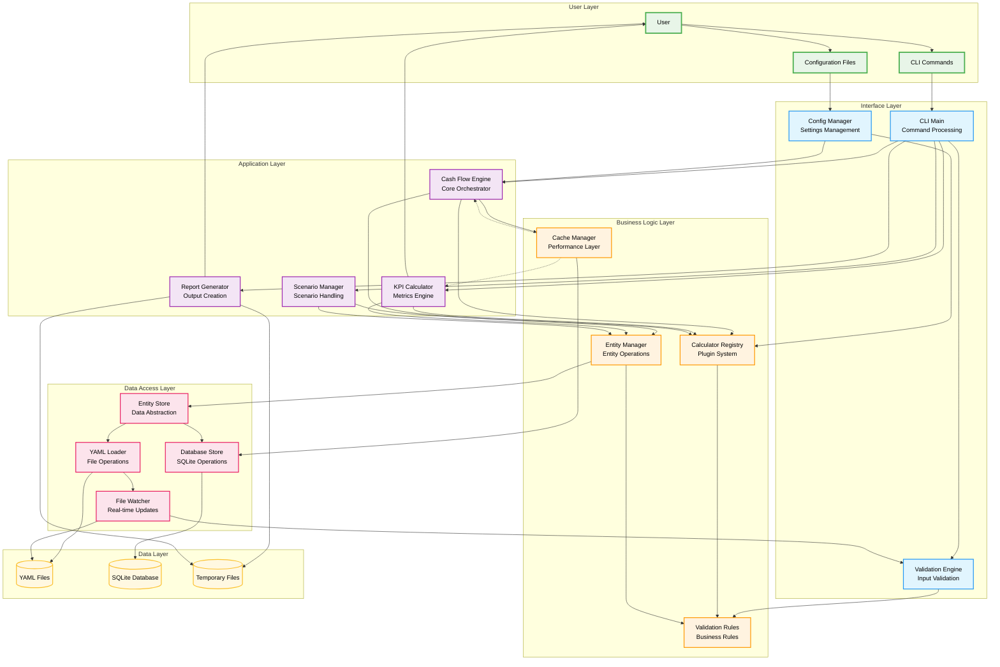
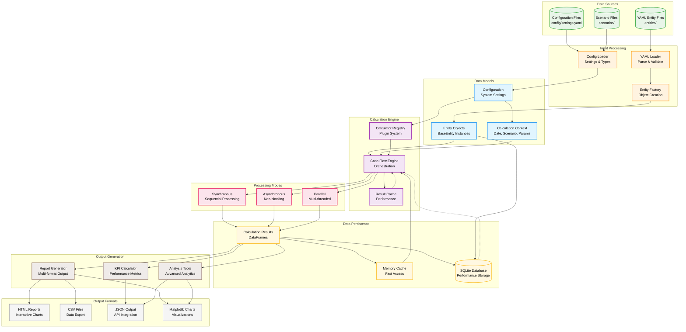
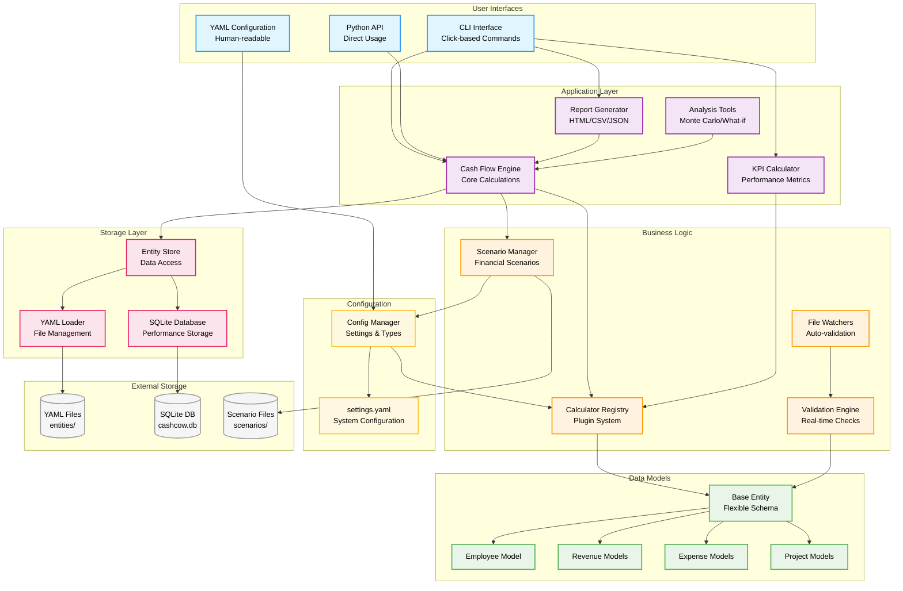

# Architecture

## Component Interactions

```mermaid
flowchart TB
    subgraph "User Layer"
        User[User]
        CLI[CLI Commands]
        ConfigFiles[Configuration Files]
    end

    
    subgraph "Interface Layer"
        CLIMain[CLI Main<br/>Command Processing]
        ConfigMgr[Config Manager<br/>Settings Management]
        Validation[Validation Engine<br/>Input Validation]
    end
    
    subgraph "Application Layer"
        CashFlowEngine[Cash Flow Engine<br/>Core Orchestrator]
        KPICalculator[KPI Calculator<br/>Metrics Engine]
        ReportGenerator[Report Generator<br/>Output Creation]
        ScenarioManager[Scenario Manager<br/>Scenario Handling]
    end
    
    subgraph "Business Logic Layer"
        CalculatorRegistry[Calculator Registry<br/>Plugin System]
        EntityManager[Entity Manager<br/>Entity Operations]
        CacheManager[Cache Manager<br/>Performance Layer]
        ValidationRules[Validation Rules<br/>Business Rules]
    end
    
    subgraph "Data Access Layer"
        YamlLoader[YAML Loader<br/>File Operations]
        DatabaseStore[Database Store<br/>SQLite Operations]
        EntityStore[Entity Store<br/>Data Abstraction]
        FileWatcher[File Watcher<br/>Real-time Updates]
    end
    
    subgraph "Data Layer"
        YamlFiles[(YAML Files)]
        SQLiteDB[(SQLite Database)]
        TempFiles[(Temporary Files)]
    end
    
    %% User Interactions
    User --> CLI
    User --> ConfigFiles
    
    %% Interface Layer Interactions
    CLI --> CLIMain
    ConfigFiles --> ConfigMgr
    CLIMain --> Validation
    
    %% Application Layer Interactions
    CLIMain --> CashFlowEngine
    CLIMain --> KPICalculator
    CLIMain --> ReportGenerator
    CLIMain --> ScenarioManager
    
    ConfigMgr --> CashFlowEngine
    ConfigMgr --> CalculatorRegistry
    
    Validation --> ValidationRules
    
    %% Business Logic Interactions
    CashFlowEngine --> CalculatorRegistry
    CashFlowEngine --> EntityManager
    CashFlowEngine --> CacheManager
    
    KPICalculator --> CalculatorRegistry
    KPICalculator --> EntityManager
    
    ScenarioManager --> EntityManager
    ScenarioManager --> CalculatorRegistry
    
    CalculatorRegistry --> ValidationRules
    EntityManager --> ValidationRules
    
    %% Data Access Interactions
    EntityManager --> EntityStore
    EntityStore --> YamlLoader
    EntityStore --> DatabaseStore
    
    YamlLoader --> FileWatcher
    CacheManager --> DatabaseStore
    
    %% Data Layer Interactions
    YamlLoader --> YamlFiles
    DatabaseStore --> SQLiteDB
    ReportGenerator --> TempFiles
    
    %% Real-time Updates
    FileWatcher --> YamlFiles
    FileWatcher --> Validation
    
    %% Cache Interactions
    CacheManager -.-> CashFlowEngine
    CacheManager -.-> KPICalculator
    
    %% Output Generation
    ReportGenerator --> TempFiles
    KPICalculator --> User
    ReportGenerator --> User
    
    %% Styling
    classDef user fill:#e8f5e8,stroke:#4caf50,stroke-width:3px,color:#000
    classDef interface fill:#e1f5fe,stroke:#2196f3,stroke-width:2px,color:#000
    classDef application fill:#f3e5f5,stroke:#9c27b0,stroke-width:2px,color:#000
    classDef business fill:#fff3e0,stroke:#ff9800,stroke-width:2px,color:#000
    classDef access fill:#fce4ec,stroke:#e91e63,stroke-width:2px,color:#000
    classDef data fill:#fff8e1,stroke:#fbc02d,stroke-width:2px,color:#000
    
    class User,CLI,ConfigFiles user
    class CLIMain,ConfigMgr,Validation interface
    class CashFlowEngine,KPICalculator,ReportGenerator,ScenarioManager application
    class CalculatorRegistry,EntityManager,CacheManager,ValidationRules business
    class YamlLoader,DatabaseStore,EntityStore,FileWatcher access
    class YamlFiles,SQLiteDB,TempFiles data
```

## Data Flow

```mermaid
flowchart TB
    subgraph "Data Sources"
        YamlFiles[(YAML Entity Files<br/>entities/)]
        ConfigFiles[(Configuration Files<br/>config/settings.yaml)]
        ScenarioFiles[(Scenario Files<br/>scenarios/)]
    end
    
    subgraph "Input Processing"
        YamlLoader[YAML Loader<br/>Parse & Validate]
        ConfigLoader[Config Loader<br/>Settings & Types]
        EntityFactory[Entity Factory<br/>Object Creation]
    end
    

    subgraph "Data Models"
        Entities[Entity Objects<br/>BaseEntity Instances]
        Config[Configuration<br/>System Settings]
        Context[Calculation Context<br/>Date, Scenario, Params]
    end
    
    subgraph "Calculation Engine"
        Registry[Calculator Registry<br/>Plugin System]
        Engine[Cash Flow Engine<br/>Orchestration]
        Cache[Result Cache<br/>Performance]
    end
    
    subgraph "Processing Modes"
        Sync[Synchronous<br/>Sequential Processing]
        Async[Asynchronous<br/>Non-blocking]
        Parallel[Parallel<br/>Multi-threaded]
    end
    
    subgraph "Data Persistence"
        MemoryCache[Memory Cache<br/>Fast Access]
        SQLiteDB[(SQLite Database<br/>Performance Storage)]
        Results[Calculation Results<br/>DataFrames]
    end
    
    subgraph "Output Generation"
        KPICalc[KPI Calculator<br/>Performance Metrics]
        ReportGen[Report Generator<br/>Multi-format Output]
        Analysis[Analysis Tools<br/>Advanced Analytics]
    end
    
    subgraph "Output Formats"
        HTML[HTML Reports<br/>Interactive Charts]
        CSV[CSV Files<br/>Data Export]
        JSON[JSON Output<br/>API Integration]
        Charts[Matplotlib Charts<br/>Visualizations]
    end
    
    %% Data Flow Connections
    YamlFiles --> YamlLoader
    ConfigFiles --> ConfigLoader
    ScenarioFiles --> ConfigLoader
    
    YamlLoader --> EntityFactory
    ConfigLoader --> Config
    EntityFactory --> Entities
    
    Entities --> Engine
    Config --> Registry
    Config --> Context
    Context --> Engine
    
    Registry --> Engine
    Engine --> Cache
    Engine --> Sync
    Engine --> Async
    Engine --> Parallel
    
    Sync --> Results
    Async --> Results
    Parallel --> Results
    
    Results --> MemoryCache
    Results --> SQLiteDB
    Entities --> SQLiteDB
    
    Results --> KPICalc
    Results --> ReportGen
    Results --> Analysis
    MemoryCache --> Engine
    
    KPICalc --> JSON
    ReportGen --> HTML
    ReportGen --> CSV
    ReportGen --> Charts
    Analysis --> JSON
    Analysis --> Charts
    
    %% Feedback Loops
    Cache -.-> Engine
    SQLiteDB -.-> Engine
    
    %% Styling
    classDef source fill:#e8f5e8,stroke:#4caf50,stroke-width:2px,color:#000
    classDef input fill:#fff3e0,stroke:#ff9800,stroke-width:2px,color:#000
    classDef model fill:#e1f5fe,stroke:#2196f3,stroke-width:2px,color:#000
    classDef engine fill:#f3e5f5,stroke:#9c27b0,stroke-width:2px,color:#000
    classDef processing fill:#fce4ec,stroke:#e91e63,stroke-width:2px,color:#000
    classDef storage fill:#fff8e1,stroke:#fbc02d,stroke-width:2px,color:#000
    classDef output fill:#efebe9,stroke:#8d6e63,stroke-width:2px,color:#000
    classDef format fill:#f5f5f5,stroke:#9e9e9e,stroke-width:2px,color:#000
    
    class YamlFiles,ConfigFiles,ScenarioFiles source
    class YamlLoader,ConfigLoader,EntityFactory input
    class Entities,Config,Context model
    class Registry,Engine,Cache engine
    class Sync,Async,Parallel processing
    class MemoryCache,SQLiteDB,Results storage
    class KPICalc,ReportGen,Analysis output
    class HTML,CSV,JSON,Charts format
```

## Module Dependencies

```mermaid
flowchart TD
    subgraph "Level 4: User Interfaces"
        CLI[cli/main.py<br/>Command Interface]
        ReportGen[reports/generator.py<br/>Report Generation]
        MonteCarlo[analysis/monte_carlo.py<br/>Monte Carlo Analysis]
        WhatIf[analysis/whatif.py<br/>What-if Analysis]
    end
    
    subgraph "Level 3: Business Logic"
        CashFlow[engine/cashflow.py<br/>Cash Flow Engine]
        KPIs[engine/kpis.py<br/>KPI Calculations]
        Scenarios[engine/scenarios.py<br/>Scenario Management]
        Validation[validation.py<br/>Entity Validation]
        Watchers[watchers.py<br/>File Watchers]
    end
    
    subgraph "Level 2: Core Services"
        Entities[models/entities.py<br/>Entity Factory]
        Calculators[engine/calculators.py<br/>Calculator Framework]
        Database[storage/database.py<br/>Database Operations]
        BuiltinCalc[engine/builtin_calculators.py<br/>Standard Calculators]
    end
    
    subgraph "Level 1: Foundation"
        BaseModel[models/base.py<br/>Base Entity Model]
        Config[config.py<br/>Configuration System]
        YamlLoader[storage/yaml_loader.py<br/>YAML File Operations]
        SpecificModels[models/<br/>Entity Models]
    end
    
    subgraph "External Dependencies"
        Pydantic[Pydantic<br/>Data Validation]
        Click[Click<br/>CLI Framework]
        PyYAML[PyYAML<br/>YAML Processing]
        Pandas[Pandas<br/>Data Analysis]
        SQLite[SQLite<br/>Database]
        Matplotlib[Matplotlib<br/>Charting]
    end
    
    %% Level 4 Dependencies
    CLI --> CashFlow
    CLI --> KPIs
    CLI --> Scenarios
    CLI --> Config
    CLI --> Click
    
    ReportGen --> CashFlow
    ReportGen --> Matplotlib
    ReportGen --> Pandas
    
    MonteCarlo --> CashFlow
    MonteCarlo --> Calculators
    
    WhatIf --> CashFlow
    WhatIf --> Scenarios
    
    %% Level 3 Dependencies
    CashFlow --> Calculators
    CashFlow --> Database
    CashFlow --> Entities
    CashFlow --> Pandas
    
    KPIs --> Calculators
    KPIs --> Database
    
    Scenarios --> Calculators
    Scenarios --> Config
    Scenarios --> YamlLoader
    
    Validation --> BaseModel
    Validation --> Config
    
    Watchers --> Validation
    Watchers --> YamlLoader
    
    %% Level 2 Dependencies
    Entities --> BaseModel
    Entities --> SpecificModels
    Entities --> Pydantic
    
    Calculators --> BaseModel
    Calculators --> Pydantic
    
    Database --> Entities
    Database --> SQLite
    
    BuiltinCalc --> Calculators
    BuiltinCalc --> BaseModel
    
    %% Level 1 Dependencies
    BaseModel --> Pydantic
    
    Config --> PyYAML
    Config --> Pydantic
    
    YamlLoader --> BaseModel
    YamlLoader --> Entities
    YamlLoader --> PyYAML
    
    SpecificModels --> BaseModel
    SpecificModels --> Pydantic
    
    %% Styling
    classDef level4 fill:#e1f5fe,stroke:#2196f3,stroke-width:2px,color:#000
    classDef level3 fill:#f3e5f5,stroke:#9c27b0,stroke-width:2px,color:#000
    classDef level2 fill:#fff3e0,stroke:#ff9800,stroke-width:2px,color:#000
    classDef level1 fill:#e8f5e8,stroke:#4caf50,stroke-width:2px,color:#000
    classDef external fill:#ffebee,stroke:#f44336,stroke-width:2px,color:#000
    
    class CLI,ReportGen,MonteCarlo,WhatIf level4
    class CashFlow,KPIs,Scenarios,Validation,Watchers level3
    class Entities,Calculators,Database,BuiltinCalc level2
    class BaseModel,Config,YamlLoader,SpecificModels level1
    class Pydantic,Click,PyYAML,Pandas,SQLite,Matplotlib external
```

## Plugin Architecture

```mermaid
flowchart TB
    subgraph "Plugin Registration System"
        Registry[Calculator Registry<br/>Central Plugin Hub]
        Decorator["@register_calculator<br/>Registration Decorator"]
        Metadata[Plugin Metadata<br/>Description, Dependencies]
    end
    
    subgraph "Built-in Calculators"
        SalaryCalc[Salary Calculator<br/>Employee Compensation]
        EquityCalc[Equity Calculator<br/>Stock Options]
        OverheadCalc[Overhead Calculator<br/>Operational Costs]
        MilestoneCalc[Milestone Calculator<br/>Project Payments]
        RecurringCalc[Recurring Calculator<br/>Subscription Costs]
        RevenueCalc[Revenue Calculator<br/>Sales Income]
    end
    
    subgraph "Plugin Interface"
        CalculatorProtocol[Calculator Protocol<br/>Function Signature]
        ContextInterface[Context Interface<br/>Calculation Parameters]
        EntityInterface[Entity Interface<br/>Data Access]
    end
    
    subgraph "Custom Plugins"
        CustomCalc1[Custom Calculator 1<br/>Domain-specific Logic]
        CustomCalc2[Custom Calculator 2<br/>Business Rules]
        CustomCalc3[Custom Calculator 3<br/>Integration Logic]
    end
    
    subgraph "Plugin Execution"
        PluginLoader[Plugin Loader<br/>Dynamic Discovery]
        DependencyResolver[Dependency Resolver<br/>Plugin Dependencies]
        ExecutionEngine[Execution Engine<br/>Plugin Orchestration]
    end
    
    subgraph "Configuration"
        EntityConfig[Entity Type Config<br/>Assigned Calculators]
        PluginConfig[Plugin Configuration<br/>Runtime Parameters]
        ValidationConfig[Validation Config<br/>Plugin Validation]
    end
    
    subgraph "Entity Types"
        Employee[Employee Entities]
        Revenue[Revenue Entities]
        Expense[Expense Entities]
        Project[Project Entities]
    end
    
    %% Registration Flow
    Decorator --> Registry
    SalaryCalc --> Decorator
    EquityCalc --> Decorator
    OverheadCalc --> Decorator
    MilestoneCalc --> Decorator
    RecurringCalc --> Decorator
    RevenueCalc --> Decorator
    
    CustomCalc1 --> Decorator
    CustomCalc2 --> Decorator
    CustomCalc3 --> Decorator
    
    Decorator --> Metadata
    
    %% Interface Compliance
    SalaryCalc -.-> CalculatorProtocol
    EquityCalc -.-> CalculatorProtocol
    OverheadCalc -.-> CalculatorProtocol
    MilestoneCalc -.-> CalculatorProtocol
    RecurringCalc -.-> CalculatorProtocol
    RevenueCalc -.-> CalculatorProtocol
    
    CustomCalc1 -.-> CalculatorProtocol
    CustomCalc2 -.-> CalculatorProtocol
    CustomCalc3 -.-> CalculatorProtocol
    
    CalculatorProtocol --> ContextInterface
    CalculatorProtocol --> EntityInterface
    
    %% Plugin Management
    Registry --> PluginLoader
    Registry --> DependencyResolver
    PluginLoader --> ExecutionEngine
    DependencyResolver --> ExecutionEngine
    
    %% Configuration Mapping
    EntityConfig --> Registry
    PluginConfig --> ExecutionEngine
    ValidationConfig --> DependencyResolver
    
    %% Entity Assignment
    EntityConfig --> Employee
    EntityConfig --> Revenue
    EntityConfig --> Expense
    EntityConfig --> Project
    
    %% Execution Flow
    Employee --> ExecutionEngine
    Revenue --> ExecutionEngine
    Expense --> ExecutionEngine
    Project --> ExecutionEngine
    
    ExecutionEngine --> ContextInterface
    ExecutionEngine --> EntityInterface
    
    %% Plugin Relationships
    SalaryCalc -.-> Employee
    EquityCalc -.-> Employee
    OverheadCalc -.-> Employee
    OverheadCalc -.-> Expense
    
    MilestoneCalc -.-> Project
    MilestoneCalc -.-> Revenue
    
    RecurringCalc -.-> Expense
    RecurringCalc -.-> Revenue
    
    RevenueCalc -.-> Revenue
    
    %% Custom Plugin Examples
    CustomCalc1 -.-> Project
    CustomCalc2 -.-> Revenue
    CustomCalc3 -.-> Employee
    
    %% Styling
    classDef registry fill:#e1f5fe,stroke:#2196f3,stroke-width:3px,color:#000
    classDef builtin fill:#e8f5e8,stroke:#4caf50,stroke-width:2px,color:#000
    classDef interface fill:#fff3e0,stroke:#ff9800,stroke-width:2px,color:#000
    classDef custom fill:#f3e5f5,stroke:#9c27b0,stroke-width:2px,color:#000
    classDef execution fill:#fce4ec,stroke:#e91e63,stroke-width:2px,color:#000
    classDef config fill:#fff8e1,stroke:#fbc02d,stroke-width:2px,color:#000
    classDef entity fill:#efebe9,stroke:#8d6e63,stroke-width:2px,color:#000
    
    class Registry,Decorator,Metadata registry
    class SalaryCalc,EquityCalc,OverheadCalc,MilestoneCalc,RecurringCalc,RevenueCalc builtin
    class CalculatorProtocol,ContextInterface,EntityInterface interface
    class CustomCalc1,CustomCalc2,CustomCalc3 custom
    class PluginLoader,DependencyResolver,ExecutionEngine execution
    class EntityConfig,PluginConfig,ValidationConfig config
    class Employee,Revenue,Expense,Project entity
```

## System Overview

```mermaid
flowchart TB
    subgraph "User Interfaces"
        CLI[CLI Interface<br/>Click-based Commands]
        API[Python API<br/>Direct Usage]
        YAML[YAML Configuration<br/>Human-readable]
    end
    
    subgraph "Application Layer"
        Engine[Cash Flow Engine<br/>Core Calculations]
        KPI[KPI Calculator<br/>Performance Metrics]
        Reports[Report Generator<br/>HTML/CSV/JSON]
        Analysis[Analysis Tools<br/>Monte Carlo/What-if]
    end
    
    subgraph "Business Logic"
        Registry[Calculator Registry<br/>Plugin System]
        Scenarios[Scenario Manager<br/>Financial Scenarios]
        Validation[Validation Engine<br/>Real-time Checks]
        Watchers[File Watchers<br/>Auto-validation]
    end
    
    subgraph "Data Models"
        BaseEntity[Base Entity<br/>Flexible Schema]
        Employee[Employee Model]
        Revenue[Revenue Models]
        Expense[Expense Models]
        Project[Project Models]
    end
    
    subgraph "Storage Layer"
        YamlLoader[YAML Loader<br/>File Management]
        Database[SQLite Database<br/>Performance Storage]
        EntityStore[Entity Store<br/>Data Access]
    end
    
    subgraph "Configuration"
        Config[Config Manager<br/>Settings & Types]
        Settings[settings.yaml<br/>System Configuration]
    end
    
    subgraph "External Storage"
        YamlFiles[(YAML Files<br/>entities/)]
        SQLiteDB[(SQLite DB<br/>cashcow.db)]
        ScenarioFiles[(Scenario Files<br/>scenarios/)]
    end
    
    %% User Interface Connections
    CLI --> Engine
    CLI --> KPI
    CLI --> Reports
    API --> Engine
    YAML --> Config
    
    %% Application Layer Connections
    Engine --> Registry
    Engine --> Scenarios
    KPI --> Registry
    Reports --> Engine
    Analysis --> Engine
    
    %% Business Logic Connections
    Registry --> BaseEntity
    Scenarios --> Config
    Validation --> BaseEntity
    Watchers --> Validation
    
    %% Data Model Connections
    BaseEntity --> Employee
    BaseEntity --> Revenue
    BaseEntity --> Expense
    BaseEntity --> Project
    
    %% Storage Connections
    Engine --> EntityStore
    EntityStore --> YamlLoader
    EntityStore --> Database
    YamlLoader --> YamlFiles
    Database --> SQLiteDB
    
    %% Configuration Connections
    Config --> Settings
    Config --> Registry
    Scenarios --> ScenarioFiles
    
    %% Styling
    classDef userInterface fill:#e1f5fe,stroke:#2196f3,stroke-width:2px,color:#000
    classDef application fill:#f3e5f5,stroke:#9c27b0,stroke-width:2px,color:#000
    classDef business fill:#fff3e0,stroke:#ff9800,stroke-width:2px,color:#000
    classDef models fill:#e8f5e8,stroke:#4caf50,stroke-width:2px,color:#000
    classDef storage fill:#fce4ec,stroke:#e91e63,stroke-width:2px,color:#000
    classDef config fill:#fff8e1,stroke:#fbc02d,stroke-width:2px,color:#000
    classDef external fill:#f5f5f5,stroke:#9e9e9e,stroke-width:2px,color:#000
    
    class CLI,API,YAML userInterface
    class Engine,KPI,Reports,Analysis application
    class Registry,Scenarios,Validation,Watchers business
    class BaseEntity,Employee,Revenue,Expense,Project models
    class YamlLoader,Database,EntityStore storage
    class Config,Settings config
    class YamlFiles,SQLiteDB,ScenarioFiles external
```
