# Entity Class Hierarchy

```mermaid
classDiagram
    class BaseEntity {
        +str type
        +str name
        +date start_date
        +Optional~date~ end_date
        +List~str~ tags
        +Optional~str~ notes
        +is_active(as_of_date) bool
        +get_field(field_name, default) Any
        +to_dict() Dict
        +from_yaml_dict(data) BaseEntity
    }

    class Employee {
        +float salary
        +Optional~str~ position
        +Optional~str~ department
        +float overhead_multiplier
        +bool equity_eligible
        +Optional~int~ equity_shares
        +Optional~date~ equity_start_date
        +calculate_total_cost(as_of_date) float
        +calculate_overhead_cost(as_of_date) float
        +calculate_allowances(as_of_date) float
        +is_equity_vested(as_of_date) bool
    }

    class Grant {
        +float amount
        +Optional~str~ agency
        +Optional~str~ program
        +Optional~List~ payment_schedule
        +float indirect_cost_rate
        +Optional~List~ milestones
        +calculate_monthly_disbursement(as_of_date) float
        +get_milestone_status(as_of_date) Dict
    }

    class Investment {
        +float amount
        +Optional~str~ investor
        +Optional~str~ round_name
        +Optional~float~ valuation
        +Optional~List~ disbursement_schedule
        +calculate_monthly_disbursement(as_of_date) float
    }

    class Sale {
        +float amount
        +Optional~str~ customer
        +Optional~str~ product
        +Optional~int~ quantity
        +Optional~date~ delivery_date
        +calculate_monthly_revenue(as_of_date) float
    }

    class Service {
        +float monthly_amount
        +Optional~str~ customer
        +Optional~str~ service_type
        +Optional~float~ hourly_rate
        +Optional~float~ hours_per_month
        +calculate_monthly_revenue(as_of_date) float
        +get_service_metrics(as_of_date) Dict
    }

    class Facility {
        +float monthly_cost
        +Optional~str~ location
        +Optional~int~ size_sqft
        +Optional~float~ utilities_monthly
        +Optional~float~ insurance_annual
        +calculate_monthly_cost(as_of_date) float
        +get_facility_metrics(as_of_date) Dict
    }

    class Software {
        +float monthly_cost
        +Optional~str~ vendor
        +Optional~int~ license_count
        +Optional~float~ annual_cost
        +str depreciation_method
        +calculate_monthly_cost(as_of_date) float
        +get_renewal_alert(as_of_date) Optional~Dict~
    }

    class Equipment {
        +float cost
        +date purchase_date
        +Optional~str~ vendor
        +Optional~str~ category
        +Optional~int~ depreciation_years
        +str depreciation_method
        +calculate_monthly_depreciation(as_of_date) float
        +get_current_book_value(as_of_date) float
    }

    class Project {
        +float total_budget
        +Optional~str~ project_manager
        +Optional~List~ milestones
        +Optional~List~ team_members
        +str status
        +calculate_monthly_burn_rate(as_of_date) float
        +get_project_health_score(as_of_date) Dict
        +get_active_milestone(as_of_date) Optional~Dict~
    }

    BaseEntity <|-- Employee
    BaseEntity <|-- Grant
    BaseEntity <|-- Investment
    BaseEntity <|-- Sale
    BaseEntity <|-- Service
    BaseEntity <|-- Facility
    BaseEntity <|-- Software
    BaseEntity <|-- Equipment
    BaseEntity <|-- Project

    note for BaseEntity "All entities inherit from BaseEntity\nProvides common fields and validation\nSupports flexible schema with extra fields"
    note for Employee "Personnel costs with equity,\noverhead, and bonus calculations"
    note for Grant "Government/institutional funding\nwith milestone tracking"
    note for Investment "VC/private investment\nwith valuation tracking"
    note for Sale "One-time product sales\nwith delivery scheduling"
    note for Service "Recurring service contracts\nwith hourly rate calculations"
    note for Facility "Real estate and facility\ncosts with utilities tracking"
    note for Software "Software subscriptions\nwith renewal management"
    note for Equipment "Capital equipment with\ndepreciation calculations"
    note for Project "R&D projects with milestone\nand budget tracking"

    
    class BaseEntity baseEntity
    class Sale revenue
    class Service revenue
    class Investment revenue
    class Grant revenue
    class Equipment expense
    class Software expense
    class Employee expense
    class Facility expense
    class Project project
```

## Entity Type Categories

The entities are organized into three main categories:

### Revenue Entities
- **Grant**: Government and institutional funding
- **Investment**: Venture capital and private investment
- **Sale**: Product sales and one-time revenue
- **Service**: Recurring service contracts

### Expense Entities
- **Employee**: Personnel costs and compensation
- **Facility**: Real estate and facility expenses
- **Software**: Software subscriptions and licenses
- **Equipment**: Capital equipment purchases

### Project Entities
- **Project**: R&D projects with milestone tracking

Each category provides specific calculation methods and validation rules appropriate for that type of financial component.