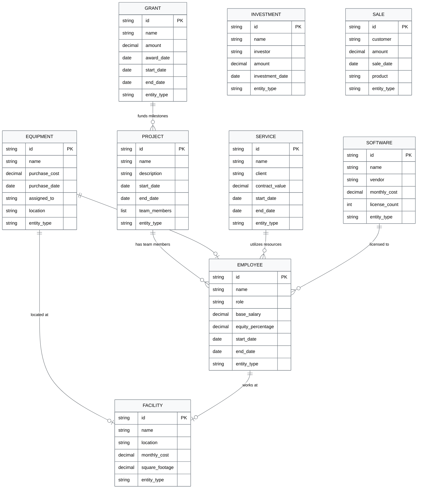

# Entity Relationships



## Relationship Types

### Direct References
- **Project** → **Employee**: Projects can list team members by name
- **Equipment** → **Employee**: Equipment can be assigned to specific employees
- **Equipment** → **Facility**: Equipment can be located at specific facilities
- **Grant** → **Project**: Grant milestones can reference project deliverables

### Indirect Relationships
- **Service** → **Employee**: Service contracts may specify required employee hours
- **Software** → **Employee**: Software licenses are often allocated per employee
- **Facility** → **Employee**: Facilities house employees and determine overhead costs

### Configuration Dependencies
All entity types are configured through the `settings.yaml` file, which defines:
- Required fields for each entity type
- Default values and multipliers
- Validation rules and constraints
- Calculator assignments

### Storage Organization
```
entities/
├── revenue/
│   ├── grants/          # Grant YAML files
│   ├── investments/     # Investment YAML files  
│   ├── sales/          # Sale YAML files
│   └── services/       # Service YAML files
├── expenses/
│   ├── employees/      # Employee YAML files
│   ├── facilities/     # Facility YAML files
│   ├── softwares/      # Software YAML files
│   └── equipments/     # Equipment YAML files
└── projects/           # Project YAML files
```

## Data Flow

1. **Entity Creation**: Entities are created from YAML files or programmatically
2. **Validation**: Pydantic validators ensure data integrity
3. **Storage**: Entities are persisted as YAML files and aggregated in SQLite
4. **Calculation**: Entity methods calculate costs, revenues, and metrics
5. **Reporting**: Aggregated data feeds into reports and forecasts