# Entity Storage Patterns

```mermaid
flowchart TB
    subgraph "Entity Creation"
        UserInput[User Input]
        APICall[API Call]
        CLICommand[CLI Command]
        ImportTool[Import Tool]
    end

    subgraph "Entity Processing"
        Validation[Validation Layer]
        Transformation[Data Transformation]
        EntityFactory[Entity Factory]
    end

    subgraph "Storage Layer"
        YAMLLoader[YAML Loader]
        FileSystem[File System]
        Database[SQLite Database]
        EntityStore[Entity Store]
    end

    subgraph "File Organization"
        RevenueDir[revenue/]
        ExpenseDir[expenses/]
        ProjectDir[projects/]
        
        subgraph "Revenue Types"
            GrantFiles[grants/*.yaml]
            InvestmentFiles[investments/*.yaml]
            SaleFiles[sales/*.yaml]
            ServiceFiles[services/*.yaml]
        end
        
        subgraph "Expense Types"
            EmployeeFiles[employees/*.yaml]
            FacilityFiles[facilities/*.yaml]
            SoftwareFiles[softwares/*.yaml]
            EquipmentFiles[equipments/*.yaml]
        end
        
        subgraph "Project Types"
            ProjectFiles[*.yaml]
        end
    end

    subgraph "Database Schema"
        EntityTable[entities table]
        MetadataTable[metadata table]
        CalculationsTable[calculations table]
        AuditTable[audit_log table]
    end

    subgraph "Access Patterns"
        LoadAll[Load All Entities]
        LoadByType[Load By Type]
        LoadByDate[Load By Date Range]
        LoadActive[Load Active Only]
        Search[Search & Filter]
    end

    %% Data Flow
    UserInput --> Validation
    APICall --> Validation
    CLICommand --> Validation
    ImportTool --> Validation

    Validation --> Transformation
    Transformation --> EntityFactory
    EntityFactory --> YAMLLoader

    YAMLLoader --> FileSystem
    YAMLLoader --> Database
    FileSystem --> EntityStore
    Database --> EntityStore

    %% File Organization
    RevenueDir --> GrantFiles
    RevenueDir --> InvestmentFiles
    RevenueDir --> SaleFiles
    RevenueDir --> ServiceFiles

    ExpenseDir --> EmployeeFiles
    ExpenseDir --> FacilityFiles
    ExpenseDir --> SoftwareFiles
    ExpenseDir --> EquipmentFiles

    ProjectDir --> ProjectFiles

    FileSystem --> RevenueDir
    FileSystem --> ExpenseDir
    FileSystem --> ProjectDir

    %% Database Relations
    Database --> EntityTable
    Database --> MetadataTable
    Database --> CalculationsTable
    Database --> AuditTable

    %% Access Patterns
    EntityStore --> LoadAll
    EntityStore --> LoadByType
    EntityStore --> LoadByDate
    EntityStore --> LoadActive
    EntityStore --> Search

    %% Styling with accessible light backgrounds for black text
    classDef input fill:#e1f5fe,stroke:#0288d1,stroke-width:2px,color:#000
    classDef process fill:#f3e5f5,stroke:#7b1fa2,stroke-width:2px,color:#000
    classDef storage fill:#e8f5e8,stroke:#388e3c,stroke-width:2px,color:#000
    classDef files fill:#fff3e0,stroke:#f57c00,stroke-width:2px,color:#000
    classDef database fill:#fce4ec,stroke:#ad1457,stroke-width:2px,color:#000
    classDef access fill:#f1f8e9,stroke:#689f38,stroke-width:2px,color:#000

    class UserInput,APICall,CLICommand,ImportTool input
    class Validation,Transformation,EntityFactory process
    class YAMLLoader,FileSystem,Database,EntityStore storage
    class RevenueDir,ExpenseDir,ProjectDir,GrantFiles,InvestmentFiles,SaleFiles,ServiceFiles,EmployeeFiles,FacilityFiles,SoftwareFiles,EquipmentFiles,ProjectFiles files
    class EntityTable,MetadataTable,CalculationsTable,AuditTable database
    class LoadAll,LoadByType,LoadByDate,LoadActive,Search access
```



## Storage Architecture

### Dual Storage System
The CashCow system uses a dual storage approach:

1. **YAML Files**: Human-readable source of truth
2. **SQLite Database**: Optimized for queries and aggregations

### File System Organization

```
entities/
├── revenue/
│   ├── grants/
│   │   ├── nsf-sbir-phase2.yaml
│   │   └── dod-sttr-phase1.yaml
│   ├── investments/
│   │   ├── series-a-round.yaml
│   │   └── seed-funding.yaml
│   ├── sales/
│   │   ├── spacex-engine-cluster.yaml
│   │   └── boeing-contract.yaml
│   └── services/
│       ├── nasa-support-contract.yaml
│       └── consulting-services.yaml
├── expenses/
│   ├── employees/
│   │   ├── john-smith.yaml
│   │   ├── jane-doe.yaml
│   │   └── bob-johnson.yaml
│   ├── facilities/
│   │   ├── main-office.yaml
│   │   └── manufacturing-facility.yaml
│   ├── softwares/
│   │   ├── solidworks-licenses.yaml
│   │   └── slack-subscription.yaml
│   └── equipments/
│       ├── cnc-machine.yaml
│       └── test-equipment.yaml
└── projects/
    ├── raptor-engine-development.yaml
    ├── combustion-chamber-optimization.yaml
    └── fuel-system-redesign.yaml
```

### File Naming Conventions

#### Automatic Generation
```python
def generate_filename(entity: BaseEntity) -> str:
    """Generate standardized filename from entity name."""
    safe_name = entity.name.lower()
    safe_name = safe_name.replace(' ', '-')
    safe_name = safe_name.replace('/', '-')
    safe_name = safe_name.replace('_', '-')
    return f"{safe_name}.yaml"
```

#### Manual Override
```python
# Save with custom filename
loader.save_entity(entity, "custom-filename.yaml")

# Save with auto-generated filename  
loader.save_entity(entity)  # Uses entity.name
```

### Database Schema

#### entities Table
```sql
CREATE TABLE entities (
    id INTEGER PRIMARY KEY AUTOINCREMENT,
    type TEXT NOT NULL,
    name TEXT NOT NULL,
    start_date DATE NOT NULL,
    end_date DATE,
    data JSON NOT NULL,
    file_path TEXT,
    created_at TIMESTAMP DEFAULT CURRENT_TIMESTAMP,
    updated_at TIMESTAMP DEFAULT CURRENT_TIMESTAMP
);
```

#### metadata Table
```sql
CREATE TABLE metadata (
    entity_id INTEGER,
    key TEXT NOT NULL,
    value TEXT NOT NULL,
    data_type TEXT NOT NULL,
    FOREIGN KEY (entity_id) REFERENCES entities(id)
);
```

#### calculations Table
```sql
CREATE TABLE calculations (
    entity_id INTEGER,
    calculation_date DATE NOT NULL,
    calculation_type TEXT NOT NULL,
    result REAL NOT NULL,
    parameters JSON,
    FOREIGN KEY (entity_id) REFERENCES entities(id)
);
```

#### audit_log Table
```sql
CREATE TABLE audit_log (
    id INTEGER PRIMARY KEY AUTOINCREMENT,
    entity_id INTEGER,
    action TEXT NOT NULL,
    old_data JSON,
    new_data JSON,
    timestamp TIMESTAMP DEFAULT CURRENT_TIMESTAMP,
    user_id TEXT,
    FOREIGN KEY (entity_id) REFERENCES entities(id)
);
```

### Loading Patterns

#### Load All Entities
```python
# Load all entities from file system
all_entities = loader.load_all()

# Filter by type in memory
employees = [e for e in all_entities if e.type == 'employee']
```

#### Load By Type
```python
# Load specific entity type
employees = loader.load_by_type('employee')
grants = loader.load_by_type('grant')
```

#### Load By Date Range
```python
# Load entities active in date range
active_entities = [
    entity for entity in all_entities 
    if entity.is_active(target_date)
]
```

#### Database Queries
```python
# Query database for optimized access
db_entities = db.query_entities(
    entity_type='employee',
    start_date=date(2024, 1, 1),
    end_date=date(2024, 12, 31),
    active_only=True
)
```

### Synchronization

#### YAML to Database
```python
def sync_yaml_to_db():
    """Synchronize YAML files to database."""
    entities = loader.load_all()
    for entity in entities:
        db.upsert_entity(entity)
```

#### Database to YAML
```python
def sync_db_to_yaml():
    """Export database entities to YAML files."""
    entities = db.get_all_entities()
    for entity in entities:
        loader.save_entity(entity)
```

### Performance Considerations

#### File System Access
- **Lazy Loading**: Load entities on-demand
- **Caching**: Cache frequently accessed entities
- **Batch Operations**: Process multiple files together
- **Watch for Changes**: Monitor file system for updates

#### Database Access
- **Indexing**: Index commonly queried fields
- **Connection Pooling**: Reuse database connections
- **Prepared Statements**: Use parameterized queries
- **Bulk Operations**: Insert/update multiple records

### Backup and Recovery

#### File System Backup
```bash
# Backup entire entities directory
tar -czf entities-backup-$(date +%Y%m%d).tar.gz entities/

# Version control with git
git add entities/
git commit -m "Entity updates $(date)"
```

#### Database Backup
```bash
# SQLite backup
sqlite3 cashcow.db ".backup backup-$(date +%Y%m%d).db"

# Export to SQL
sqlite3 cashcow.db ".dump" > backup-$(date +%Y%m%d).sql
```

### Migration Support

#### Schema Versioning
```python
class EntityMigrator:
    def migrate_v1_to_v2(self, entity_data: Dict) -> Dict:
        """Migrate entity from v1 to v2 format."""
        # Handle field renames, type changes, etc.
        if 'old_field' in entity_data:
            entity_data['new_field'] = entity_data.pop('old_field')
        return entity_data
```

#### Batch Migration
```python
def migrate_all_entities():
    """Migrate all entities to latest format."""
    migrator = EntityMigrator()
    for yaml_file in entities_dir.rglob("*.yaml"):
        entity_data = load_yaml(yaml_file)
        migrated_data = migrator.migrate_to_latest(entity_data)
        save_yaml(yaml_file, migrated_data)
```

This storage pattern provides flexibility, performance, and reliability for the CashCow entity system while maintaining human-readable source files and efficient database access.