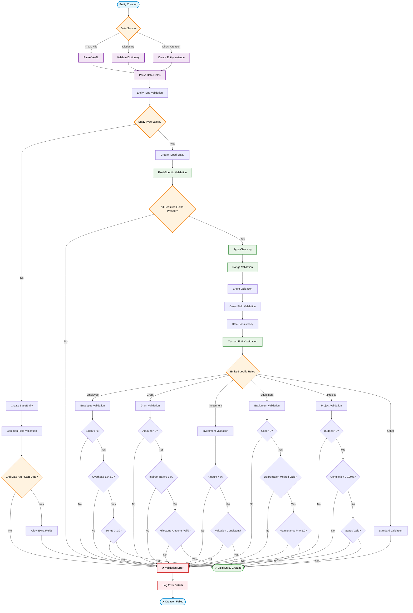

# Entity Validation Flow



## Validation Stages

### 1. Data Source Processing
- **YAML Parsing**: Convert YAML files to Python dictionaries
- **Date Parsing**: Transform ISO date strings to date objects
- **Type Inference**: Determine entity type from data

### 2. Entity Type Validation
- **Type Mapping**: Map entity type to appropriate class
- **Fallback Handling**: Use BaseEntity for unknown types
- **Configuration Check**: Verify type is configured in settings

### 3. Field Validation
- **Required Fields**: Ensure all mandatory fields are present
- **Type Checking**: Verify field types match expectations
- **Range Validation**: Check numeric values are within valid ranges
- **Enum Validation**: Validate enumerated values (status, frequency, etc.)

### 4. Cross-Field Validation
- **Date Consistency**: Ensure end_date > start_date
- **Logical Relationships**: Validate interdependent fields
- **Business Rules**: Apply domain-specific validation logic

### 5. Entity-Specific Validation

#### Employee Validation
- Salary must be positive
- Overhead multiplier between 1.0 and 3.0
- Bonus percentages between 0 and 1.0
- Pay frequency from valid options

#### Grant Validation
- Amount must be positive
- Indirect cost rate between 0 and 1.0
- Milestone amounts cannot exceed total grant amount

#### Investment Validation
- Amount must be positive
- Valuation data consistency
- Disbursement schedule validation

#### Equipment Validation
- Cost must be positive
- Depreciation method from valid options
- Maintenance percentage between 0 and 1.0

#### Project Validation
- Budget must be positive
- Completion percentage between 0 and 100
- Status from valid options
- Milestone date consistency

## Error Handling

### Validation Errors
When validation fails, the system provides detailed error messages:

```python
ValidationError: 1 validation error for Employee
salary
  Input should be greater than 0 [type=greater_than, input=-50000]
```

### Error Recovery
- **Partial Validation**: Continue processing other entities if one fails
- **Error Logging**: Record validation failures for review
- **Graceful Degradation**: Use BaseEntity for unparseable types

## Best Practices

### Data Quality
1. **Use ISO Date Formats**: Always use YYYY-MM-DD for dates
2. **Validate Early**: Check data before entity creation
3. **Handle Missing Data**: Provide sensible defaults where possible
4. **Document Constraints**: Clearly specify validation rules

### Performance
1. **Batch Validation**: Process multiple entities together
2. **Cache Validators**: Reuse validation logic across entities
3. **Lazy Loading**: Validate only when needed
4. **Early Exit**: Stop validation on first critical error