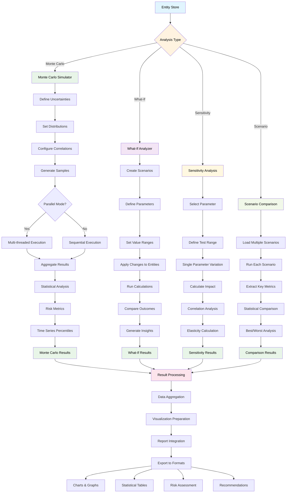
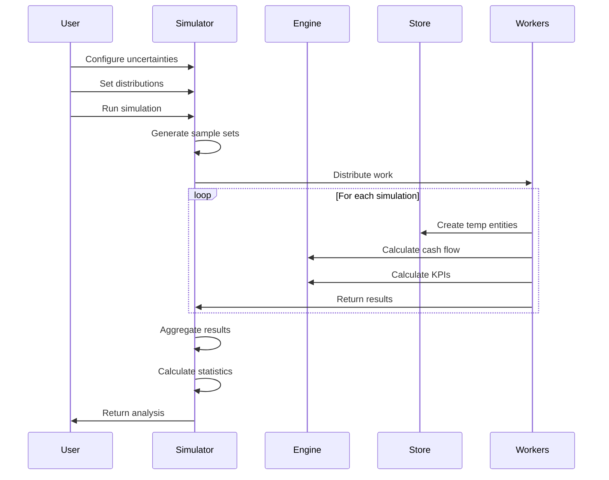
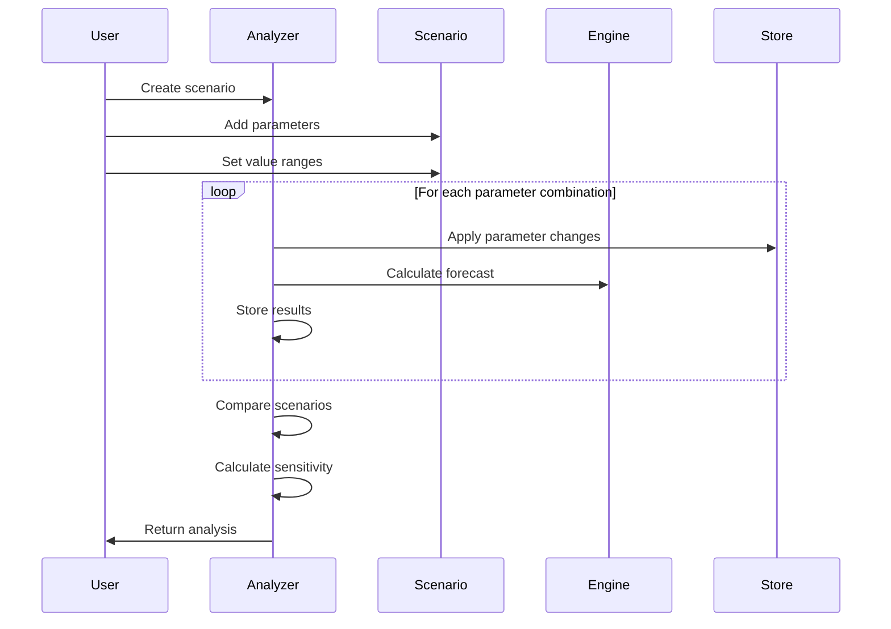
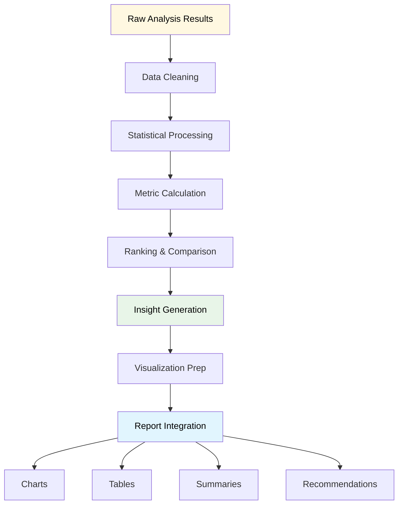

# Analysis Tool Workflows

## Analysis Workflow Details

### Monte Carlo Simulation Workflow

### What-If Analysis Workflow

### Sensitivity Analysis Process

## Analysis Types and Capabilities

### 1. Monte Carlo Simulation
- **Purpose**: Probabilistic risk analysis
- **Input**: Uncertainty distributions for key parameters
- **Output**: Statistical distributions of outcomes
- **Metrics**: VaR, Expected Shortfall, Confidence Intervals

### 2. What-If Analysis
- **Purpose**: Scenario planning and impact assessment
- **Input**: Parameter changes and scenarios
- **Output**: Comparative scenario outcomes
- **Metrics**: Sensitivity coefficients, breakeven points

### 3. Sensitivity Analysis
- **Purpose**: Parameter importance ranking
- **Input**: Single parameter variations
- **Output**: Impact correlation and elasticity
- **Metrics**: Correlation coefficients, elasticity measures

### 4. Scenario Comparison
- **Purpose**: Multi-scenario evaluation
- **Input**: Multiple defined scenarios
- **Output**: Comparative analysis and rankings
- **Metrics**: Best/worst case identification, variance analysis

## Analysis Result Processing

## Performance Optimization

### Parallel Processing Strategy
1. **Work Distribution**: Split simulations across worker threads
2. **Memory Management**: Use temporary in-memory stores
3. **Result Aggregation**: Efficient statistical calculations
4. **Progress Tracking**: Real-time progress reporting

### Efficiency Considerations
- **Batch Processing**: Group similar calculations
- **Caching**: Reuse intermediate results
- **Memory Cleanup**: Garbage collection for large datasets
- **Error Recovery**: Robust error handling and continuation