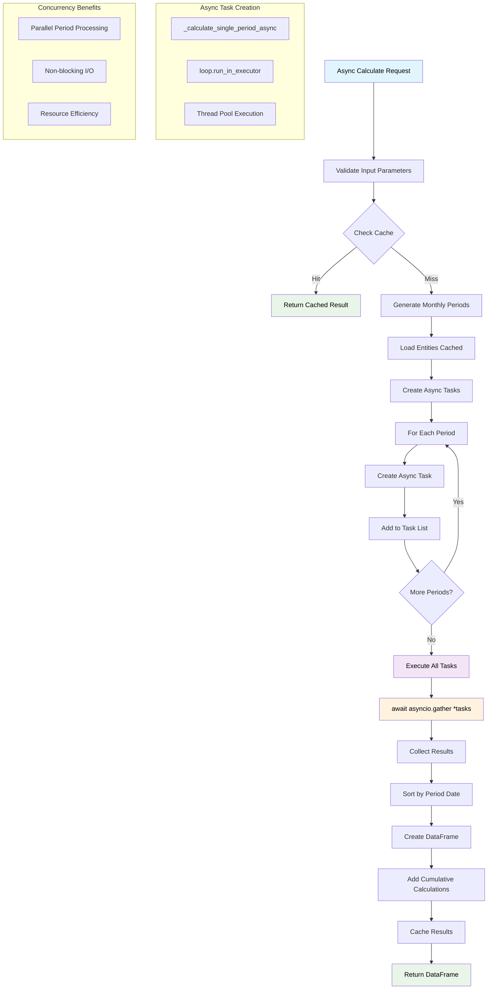
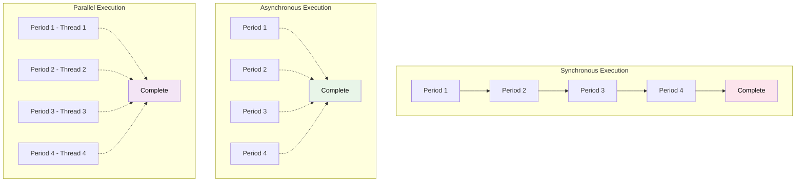
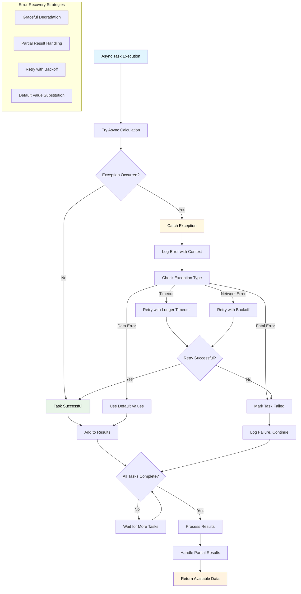
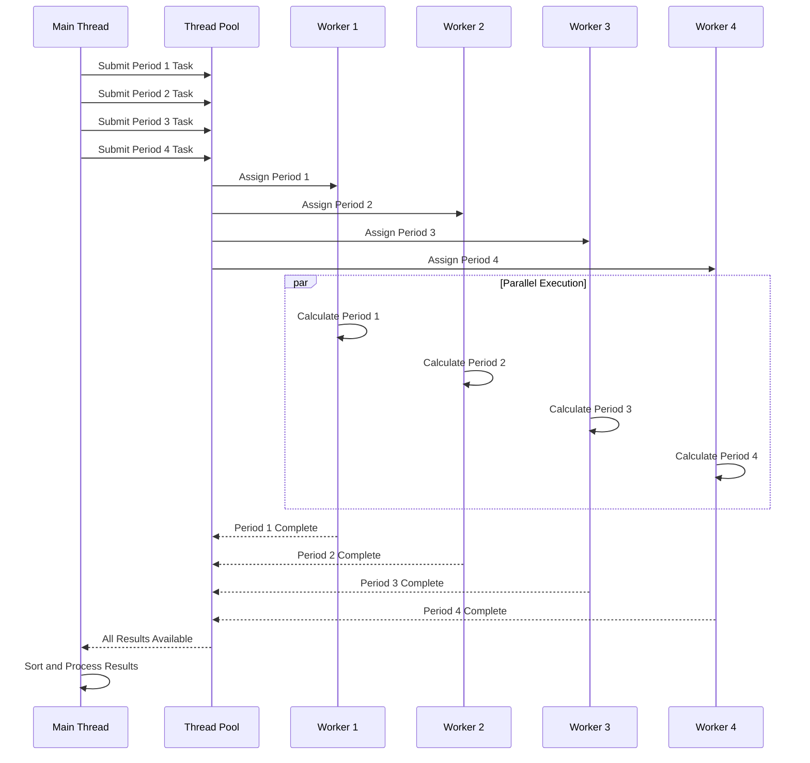
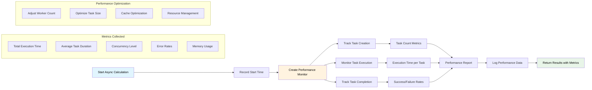
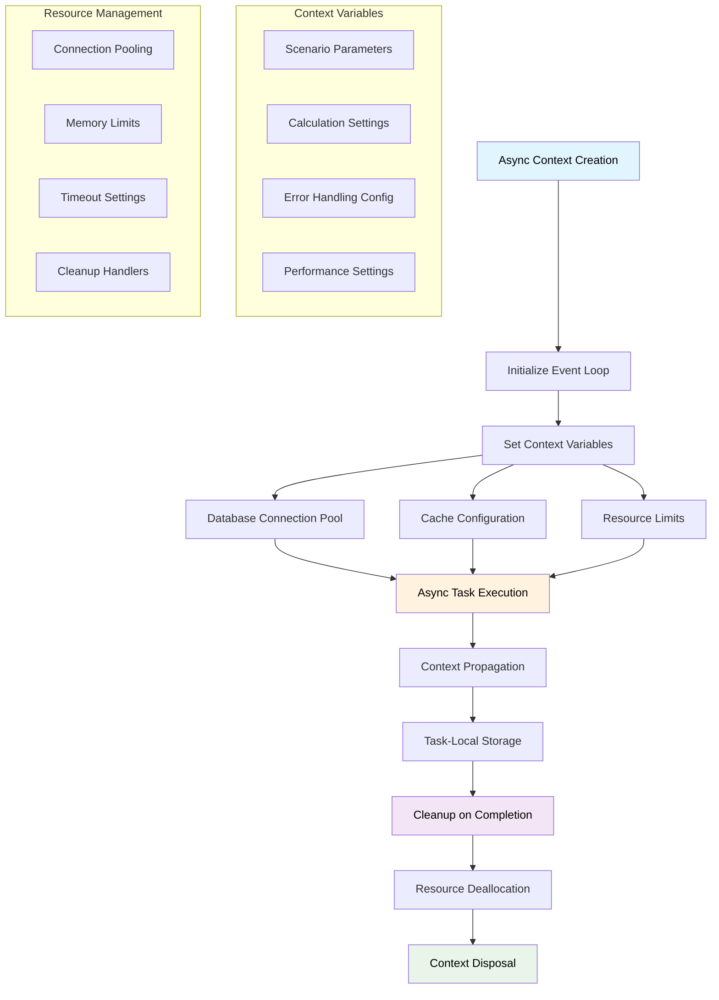
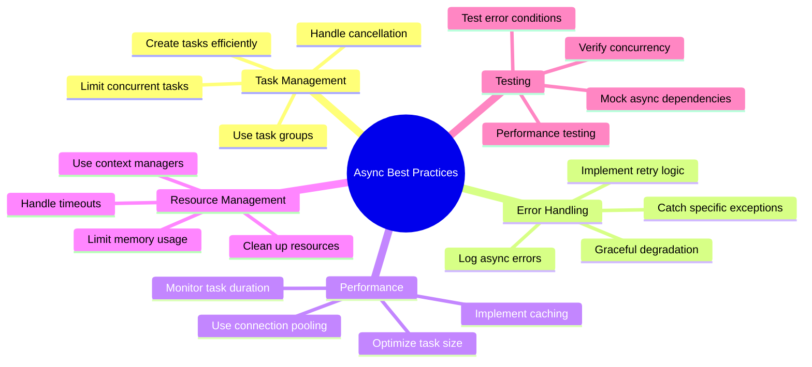
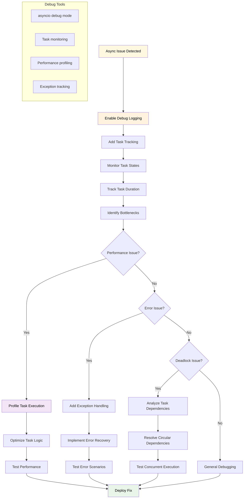

# Async Execution Flow

## Async vs Sync Comparison

## Async Error Handling

## Thread Pool Execution

## Async Performance Monitoring

## Async Context Management

## Async Best Practices

## Async Debugging Flow

