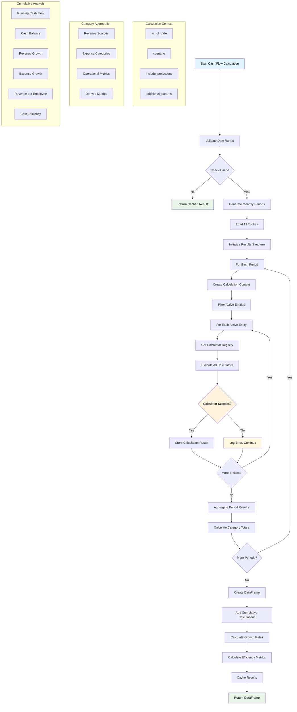
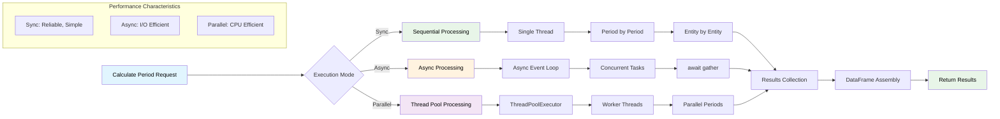
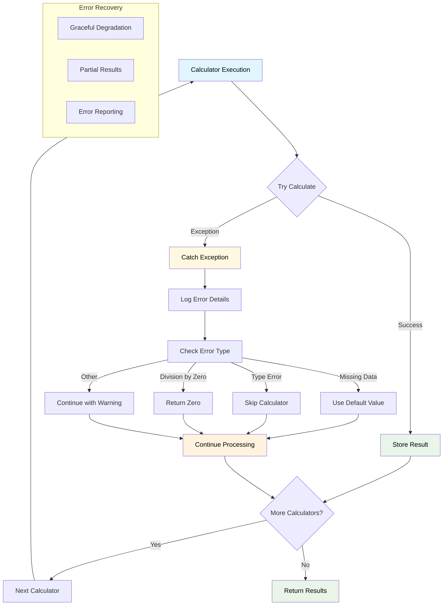

# Calculation Flow Process

```mermaid
flowchart TD
    A[Start Cash Flow Calculation] --> B[Validate Date Range]
    B --> C{Check Cache}
    C -->|Hit| D[Return Cached Result]
    C -->|Miss| E[Generate Monthly Periods]
    
    E --> F[Load All Entities]
    F --> G[Initialize Results Structure]
    
    G --> H[For Each Period]
    H --> I[Create Calculation Context]
    I --> J[Filter Active Entities]
    
    J --> K[For Each Active Entity]
    K --> L[Get Calculator Registry]
    L --> M[Execute All Calculators]
    
    M --> N{Calculator Success?}
    N -->|Yes| O[Store Calculation Result]
    N -->|No| P[Log Error, Continue]
    
    O --> Q{More Entities?}
    P --> Q
    Q -->|Yes| K
    Q -->|No| R[Aggregate Period Results]
    
    R --> S[Calculate Category Totals]
    S --> T{More Periods?}
    T -->|Yes| H
    T -->|No| U[Create DataFrame]
    
    U --> V[Add Cumulative Calculations]
    V --> W[Calculate Growth Rates]
    W --> X[Calculate Efficiency Metrics]
    X --> Y[Cache Results]
    Y --> Z[Return DataFrame]
    
    subgraph "Calculation Context"
        I1[as_of_date]
        I2[scenario]
        I3[include_projections]
        I4[additional_params]
    end
    
    subgraph "Category Aggregation"
        S1[Revenue Sources]
        S2[Expense Categories]
        S3[Operational Metrics]
        S4[Derived Metrics]
    end
    
    subgraph "Cumulative Analysis"
        V1[Running Cash Flow]
        V2[Cash Balance]
        W1[Revenue Growth]
        W2[Expense Growth]
        X1[Revenue per Employee]
        X2[Cost Efficiency]
    end
    
    style A fill:#e1f5fe,color:#000
    style D fill:#e8f5e8,color:#000
    style Z fill:#e8f5e8,color:#000
    style N fill:#fff3e0,color:#000
    style P fill:#fff8e1,color:#000
    
 
```

## Execution Modes

```mermaid
flowchart LR
    A[Calculate Period Request] --> B{Execution Mode}
    
    B -->|Sync| C[Sequential Processing]
    B -->|Async| D[Async Processing]
    B -->|Parallel| E[Thread Pool Processing]
    
    C --> F[Single Thread]
    F --> G[Period by Period]
    G --> H[Entity by Entity]
    
    D --> I[Async Event Loop]
    I --> J[Concurrent Tasks]
    J --> K[await gather]
    
    E --> L[ThreadPoolExecutor]
    L --> M[Worker Threads]
    M --> N[Parallel Periods]
    
    H --> O[Results Collection]
    K --> O
    N --> O
    
    O --> P[DataFrame Assembly]
    P --> Q[Return Results]
    
    subgraph "Performance Characteristics"
        F1[Sync: Reliable, Simple]
        F2[Async: I/O Efficient]
        F3[Parallel: CPU Efficient]
    end
    
    style A fill:#e1f5fe,color:#000
    style C fill:#e8f5e8,color:#000
    style D fill:#fff3e0,color:#000
    style E fill:#f3e5f5,color:#000
    style Q fill:#e8f5e8,color:#000
    
 
```

## Error Handling Flow

```mermaid
flowchart TD
    A[Calculator Execution] --> B{Try Calculate}
    B -->|Success| C[Store Result]
    B -->|Exception| D[Catch Exception]
    
    D --> E[Log Error Details]
    E --> F[Check Error Type]
    
    F -->|Missing Data| G[Use Default Value]
    F -->|Type Error| H[Skip Calculator]
    F -->|Division by Zero| I[Return Zero]
    F -->|Other| J[Continue with Warning]
    
    G --> K[Continue Processing]
    H --> K
    I --> K
    J --> K
    
    C --> L{More Calculators?}
    K --> L
    
    L -->|Yes| M[Next Calculator]
    L -->|No| N[Return Results]
    
    M --> A
    
    subgraph "Error Recovery"
        G1[Graceful Degradation]
        G2[Partial Results]
        G3[Error Reporting]
    end
    
    style A fill:#e1f5fe,color:#000
    style C fill:#e8f5e8,color:#000
    style D fill:#fff8e1,color:#000
    style K fill:#fff3e0,color:#000
    style N fill:#e8f5e8,color:#000
    
 
```