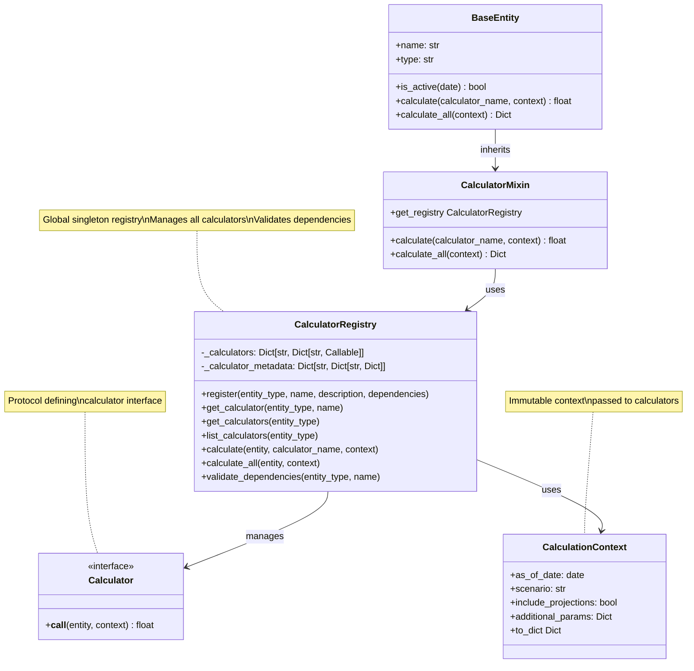
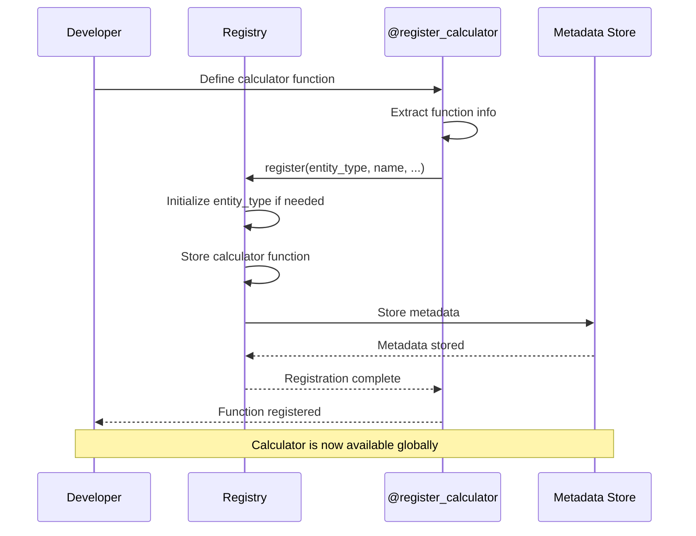
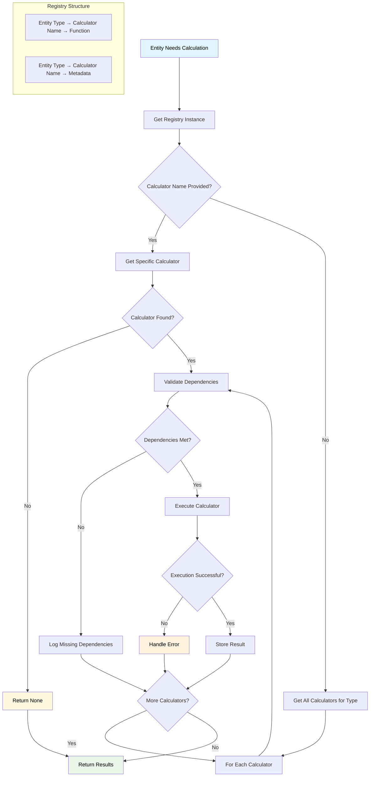
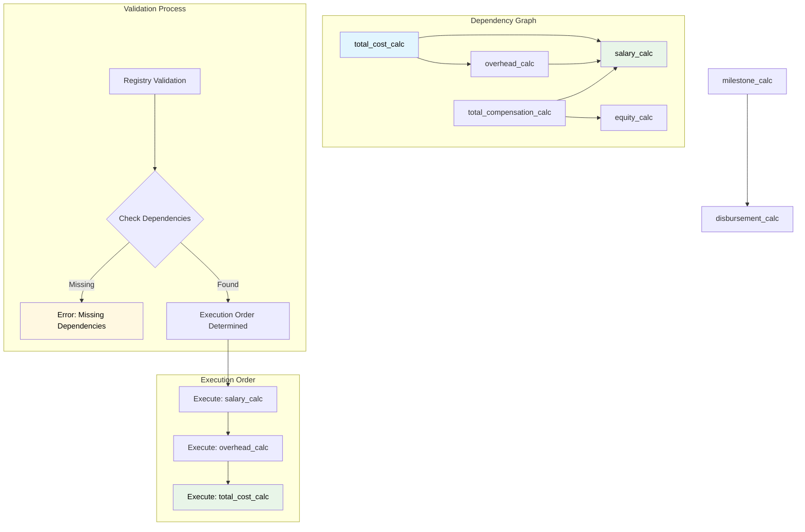
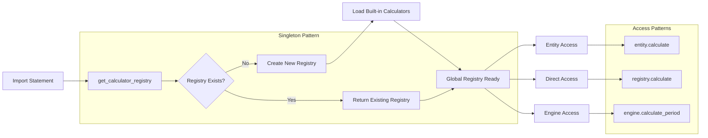

# Calculator Registry Pattern

```mermaid
classDiagram
    class CalculatorRegistry {
        -_calculators: Dict[str, Dict[str, Callable]]
        -_calculator_metadata: Dict[str, Dict[str, Dict]]
        +register(entity_type, name, description, dependencies)
        +get_calculator(entity_type, name)
        +get_calculators(entity_type)
        +list_calculators(entity_type)
        +calculate(entity, calculator_name, context)
        +calculate_all(entity, context)
        +validate_dependencies(entity_type, name)
    }
    
    class Calculator {
        <<interface>>
        +__call__(entity, context) float
    }
    
    class CalculationContext {
        +as_of_date: date
        +scenario: str
        +include_projections: bool
        +additional_params: Dict
        +to_dict Dict
    }
    
    class CalculatorMixin {
        +get_registry CalculatorRegistry
        +calculate(calculator_name, context) float
        +calculate_all(context) Dict
    }
    
    class BaseEntity {
        +name: str
        +type: str
        +is_active(date) bool
        +calculate(calculator_name, context) float
        +calculate_all(context) Dict
    }
    
    CalculatorRegistry --> Calculator : manages
    CalculatorRegistry --> CalculationContext : uses
    BaseEntity --> CalculatorMixin : inherits
    CalculatorMixin --> CalculatorRegistry : uses
    
    note for CalculatorRegistry "Global singleton registry\nManages all calculators\nValidates dependencies"
    note for Calculator "Protocol defining\ncalculator interface"
    note for CalculationContext "Immutable context\npassed to calculators"
```

## Registration Process

```mermaid
sequenceDiagram
    participant Dev as Developer
    participant Reg as Registry
    participant Dec as @register_calculator
    participant Meta as Metadata Store
    
    Dev->>Dec: Define calculator function
    Dec->>Dec: Extract function info
    Dec->>Reg: register(entity_type, name, ...)
    Reg->>Reg: Initialize entity_type if needed
    Reg->>Reg: Store calculator function
    Reg->>Meta: Store metadata
    Meta-->>Reg: Metadata stored
    Reg-->>Dec: Registration complete
    Dec-->>Dev: Function registered
    
    Note over Dev,Meta: Calculator is now available globally
```

## Calculator Discovery and Execution

```mermaid
flowchart TD
    A[Entity Needs Calculation] --> B[Get Registry Instance]
    B --> C{Calculator Name Provided?}
    
    C -->|Yes| D[Get Specific Calculator]
    C -->|No| E[Get All Calculators for Type]
    
    D --> F{Calculator Found?}
    F -->|No| G[Return None]
    F -->|Yes| H[Validate Dependencies]
    
    E --> I[For Each Calculator]
    I --> H
    
    H --> J{Dependencies Met?}
    J -->|No| K[Log Missing Dependencies]
    J -->|Yes| L[Execute Calculator]
    
    L --> M{Execution Successful?}
    M -->|No| N[Handle Error]
    M -->|Yes| O[Store Result]
    
    N --> P{More Calculators?}
    O --> P
    K --> P
    
    P -->|Yes| I
    P -->|No| Q[Return Results]
    
    G --> Q
    
    subgraph "Registry Structure"
        R1[Entity Type → Calculator Name → Function]
        R2[Entity Type → Calculator Name → Metadata]
    end
    
    style A fill:#e1f5fe,color:#000
    style Q fill:#e8f5e8,color:#000
    style G fill:#fff8e1,color:#000
    style N fill:#fff3e0,color:#000
    
 
```

## Dependency Resolution

```mermaid
graph TD
    A[total_cost_calc] --> B[salary_calc]
    A --> C[overhead_calc]
    C --> B
    
    D[total_compensation_calc] --> B
    D --> E[equity_calc]
    
    F[milestone_calc] --> G[disbursement_calc]
    
    H[Registry Validation] --> I{Check Dependencies}
    I -->|Missing| J[Error: Missing Dependencies]
    I -->|Found| K[Execution Order Determined]
    
    K --> L[Execute: salary_calc]
    L --> M[Execute: overhead_calc]
    M --> N[Execute: total_cost_calc]
    
    subgraph "Dependency Graph"
        B
        C
        A
        E
        D
    end
    
    subgraph "Validation Process"
        H
        I
        J
        K
    end
    
    subgraph "Execution Order"
        L
        M
        N
    end
    
    style A fill:#e1f5fe,color:#000
    style B fill:#e8f5e8,color:#000
    style J fill:#fff8e1,color:#000
    style N fill:#e8f5e8,color:#000
    
 
```

## Global Registry Access Pattern

```mermaid
flowchart LR
    A[Import Statement] --> B[get_calculator_registry]
    B --> C{Registry Exists?}
    
    C -->|No| D[Create New Registry]
    C -->|Yes| E[Return Existing Registry]
    
    D --> F[Load Built-in Calculators]
    F --> G[Global Registry Ready]
    E --> G
    
    G --> H[Entity Access]
    G --> I[Direct Access]
    G --> J[Engine Access]
    
    H --> K[entity.calculate]
    I --> L[registry.calculate]
    J --> M[engine.calculate_period]
    
    subgraph "Access Patterns"
        K
        L
        M
    end
    
    subgraph "Singleton Pattern"
        B
        C
        D
        E
        G
    end    
```