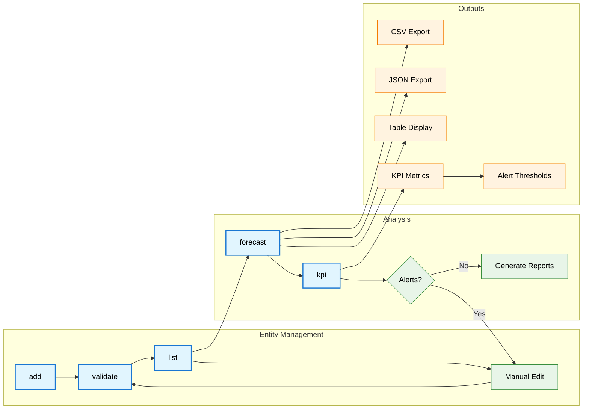
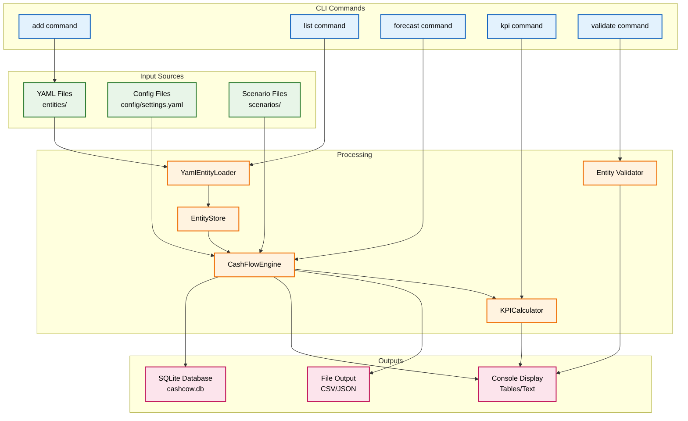

# CLI Command Structure Diagram

This diagram shows the complete command structure of the CashCow CLI.

```mermaid
    graph TD
        CLI[cashcow CLI] --> GLOBAL{Global Options}
        GLOBAL --> VERSION[--version]
        GLOBAL --> HELP[--help]
        
        CLI --> ADD[add]
        CLI --> LIST[list]
        CLI --> FORECAST[forecast]
        CLI --> KPI[kpi]
        CLI --> VALIDATE[validate]
        
        %% ADD Command
        ADD --> ADD_OPTS{Options}
        ADD_OPTS --> ADD_TYPE[--type ENTITY_TYPE<br/>Required]
        ADD_OPTS --> ADD_NAME[--name NAME<br/>Required]
        ADD_OPTS --> ADD_INTERACTIVE[--interactive, -i<br/>Flag]
        ADD_OPTS --> ADD_FILE[--file, -f PATH<br/>Optional]
        
        ADD_TYPE --> EMPLOYEE[employee]
        ADD_TYPE --> GRANT[grant]
        ADD_TYPE --> INVESTMENT[investment]
        ADD_TYPE --> SALE[sale]
        ADD_TYPE --> SERVICE[service]
        ADD_TYPE --> FACILITY[facility]
        ADD_TYPE --> SOFTWARE[software]
        ADD_TYPE --> EQUIPMENT[equipment]
        ADD_TYPE --> PROJECT[project]
        
        %% LIST Command
        LIST --> LIST_OPTS{Options}
        LIST_OPTS --> LIST_TYPE[--type ENTITY_TYPE<br/>Optional]
        LIST_OPTS --> LIST_ACTIVE[--active<br/>Flag]
        LIST_OPTS --> LIST_TAG[--tag TAG<br/>Multiple]
        
        %% FORECAST Command
        FORECAST --> FORECAST_OPTS{Options}
        FORECAST_OPTS --> FORECAST_MONTHS[--months INTEGER<br/>Default: 24]
        FORECAST_OPTS --> FORECAST_SCENARIO[--scenario STRING<br/>Default: baseline]
        FORECAST_OPTS --> FORECAST_START[--start-date DATE<br/>Format: YYYY-MM-DD]
        FORECAST_OPTS --> FORECAST_FORMAT[--format CHOICE<br/>table/csv/json]
        FORECAST_OPTS --> FORECAST_OUTPUT[--output, -o PATH<br/>Optional]
        FORECAST_OPTS --> FORECAST_KPIS[--kpis<br/>Flag]
        
        %% KPI Command
        KPI --> KPI_OPTS{Options}
        KPI_OPTS --> KPI_MONTHS[--months INTEGER<br/>Default: 12]
        KPI_OPTS --> KPI_SCENARIO[--scenario STRING<br/>Default: baseline]
        KPI_OPTS --> KPI_ALERTS[--alerts<br/>Flag]
        
        %% VALIDATE Command
        VALIDATE --> VALIDATE_OPTS{Options}
        VALIDATE_OPTS --> VALIDATE_FIX[--fix<br/>Flag]
        
        %% Styling
        classDef commandClass fill:#e1f5fe,stroke:#01579b,stroke-width:2px,color:#000
        classDef optionClass fill:#f3e5f5,stroke:#4a148c,stroke-width:1px,color:#000
        classDef entityClass fill:#e8f5e8,stroke:#1b5e20,stroke-width:1px,color:#000
     
        
        class CLI,ADD,LIST,FORECAST,KPI,VALIDATE commandClass
        class ADD_OPTS,LIST_OPTS,FORECAST_OPTS,KPI_OPTS,VALIDATE_OPTS optionClass
        class EMPLOYEE,GRANT,INVESTMENT,SALE,SERVICE,FACILITY,SOFTWARE,EQUIPMENT,PROJECT entityClass
```

## Command Relationships

```mermaid
    graph LR
        subgraph "Entity Management"
            ADD[add] --> VALIDATE[validate]
            VALIDATE --> LIST[list]
            LIST --> MODIFY[Manual Edit]
            MODIFY --> VALIDATE
        end
        
        subgraph "Analysis"
            LIST --> FORECAST[forecast]
            FORECAST --> KPI[kpi]
            KPI --> ALERT{Alerts?}
            ALERT -->|Yes| MODIFY
            ALERT -->|No| REPORT[Generate Reports]
        end
        
        subgraph "Outputs"
            FORECAST --> CSV[CSV Export]
            FORECAST --> JSON[JSON Export]
            FORECAST --> TABLE[Table Display]
            KPI --> METRICS[KPI Metrics]
            METRICS --> THRESHOLDS[Alert Thresholds]
        end
        
        classDef primary fill:#e1f5fe,stroke:#1976d2,stroke-width:2px,color:#000
        classDef secondary fill:#e8f5e8,stroke:#388e3c,stroke-width:1px,color:#000
        classDef output fill:#fff3e0,stroke:#f57c00,stroke-width:1px,color:#000
     
        
        class ADD,LIST,FORECAST,KPI,VALIDATE primary
        class MODIFY,ALERT,REPORT secondary
        class CSV,JSON,TABLE,METRICS,THRESHOLDS output
```

## Data Flow

```mermaid
    flowchart TD
        subgraph "Input Sources"
            YAML[YAML Files<br/>entities/]
            CONFIG[Config Files<br/>config/settings.yaml]
            SCENARIOS[Scenario Files<br/>scenarios/]
        end
        
        subgraph "CLI Commands"
            ADD_CMD[add command]
            LIST_CMD[list command]
            FORECAST_CMD[forecast command]
            KPI_CMD[kpi command]
            VALIDATE_CMD[validate command]
        end
        
        subgraph "Processing"
            LOADER[YamlEntityLoader]
            STORE[EntityStore]
            ENGINE[CashFlowEngine]
            KPI_CALC[KPICalculator]
            VALIDATOR[Entity Validator]
        end
        
        subgraph "Outputs"
            FILE_OUT[File Output<br/>CSV/JSON]
            CONSOLE[Console Display<br/>Tables/Text]
            DATABASE[SQLite Database<br/>cashcow.db]
        end
        
        %% Data flow connections
        YAML --> LOADER
        CONFIG --> ENGINE
        SCENARIOS --> ENGINE
        
        ADD_CMD --> YAML
        LIST_CMD --> LOADER
        FORECAST_CMD --> ENGINE
        KPI_CMD --> KPI_CALC
        VALIDATE_CMD --> VALIDATOR
        
        LOADER --> STORE
        STORE --> ENGINE
        ENGINE --> KPI_CALC
        
        ENGINE --> FILE_OUT
        ENGINE --> CONSOLE
        ENGINE --> DATABASE
        KPI_CALC --> CONSOLE
        VALIDATOR --> CONSOLE
        
        classDef input fill:#e8f5e8,stroke:#2e7d32,stroke-width:2px,color:#000
        classDef command fill:#e3f2fd,stroke:#1565c0,stroke-width:2px,color:#000
        classDef process fill:#fff3e0,stroke:#ef6c00,stroke-width:2px,color:#000
        classDef output fill:#fce4ec,stroke:#c2185b,stroke-width:2px,color:#000
     
        
        class YAML,CONFIG,SCENARIOS input
        class ADD_CMD,LIST_CMD,FORECAST_CMD,KPI_CMD,VALIDATE_CMD command
        class LOADER,STORE,ENGINE,KPI_CALC,VALIDATOR process
        class FILE_OUT,CONSOLE,DATABASE output
```