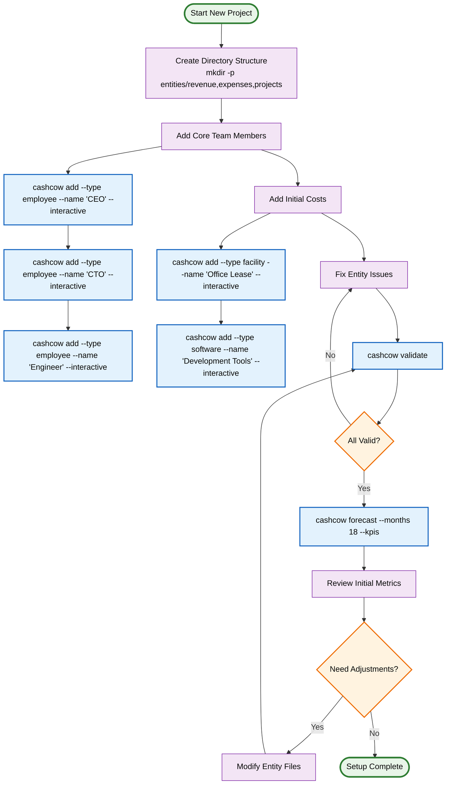
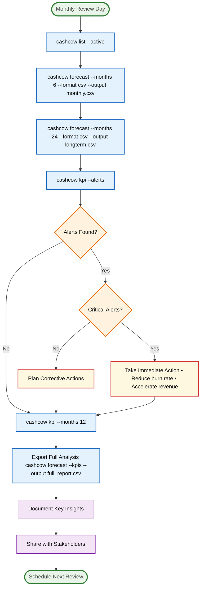
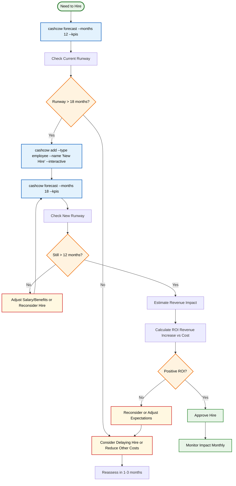
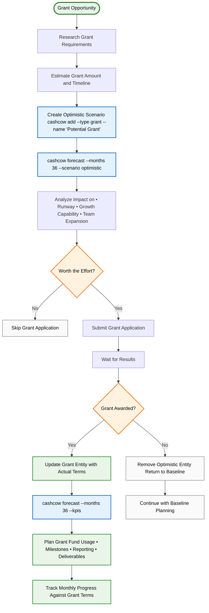
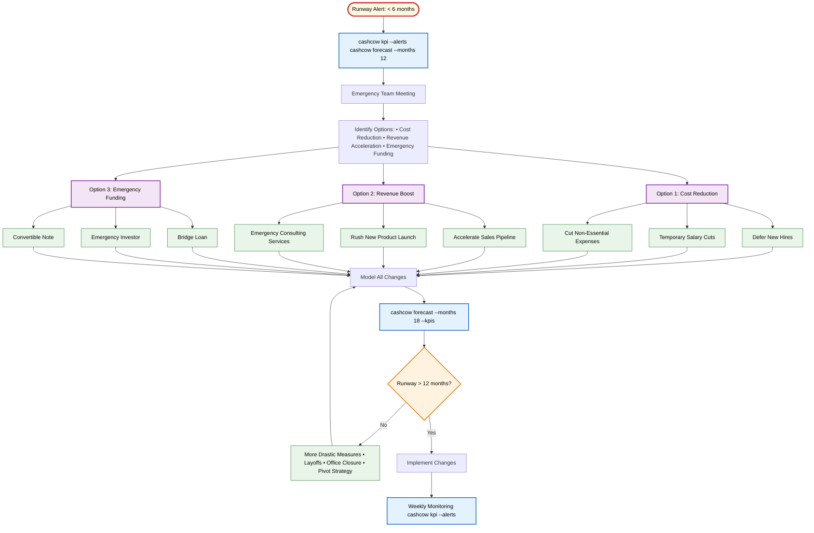
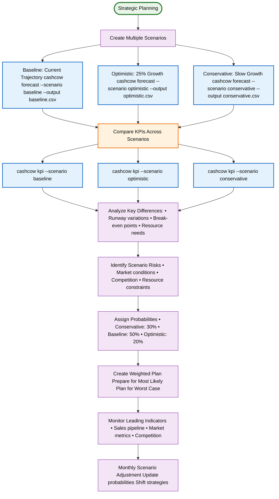

# Common Workflow Patterns

This document contains Mermaid diagrams showing the most common user workflows in CashCow CLI.

## 1. Initial Project Setup Workflow

## 2. Monthly Financial Review Workflow

## 3. Hiring Decision Workflow

## 4. Grant Application Workflow

## 5. Crisis Management Workflow (Low Runway)

## 6. Scenario Comparison Workflow

