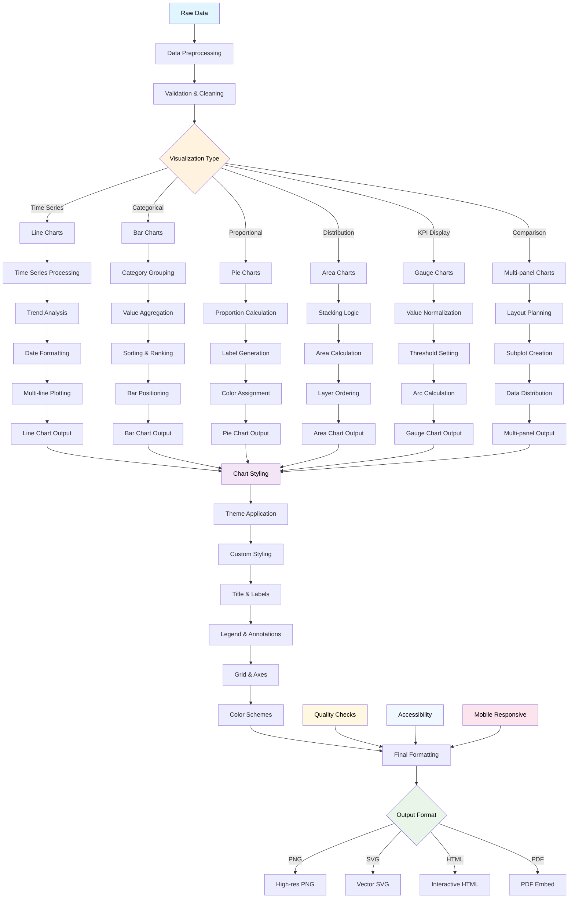
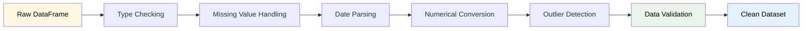
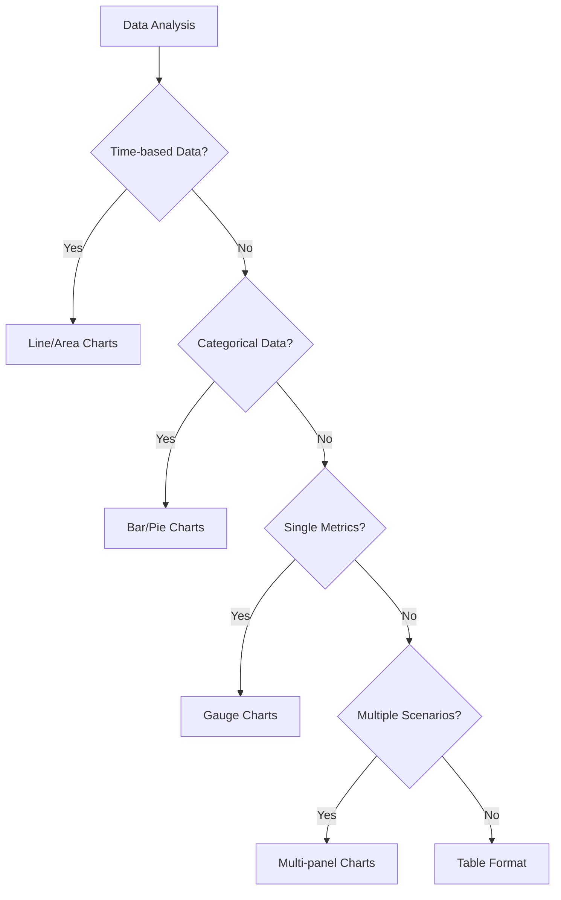
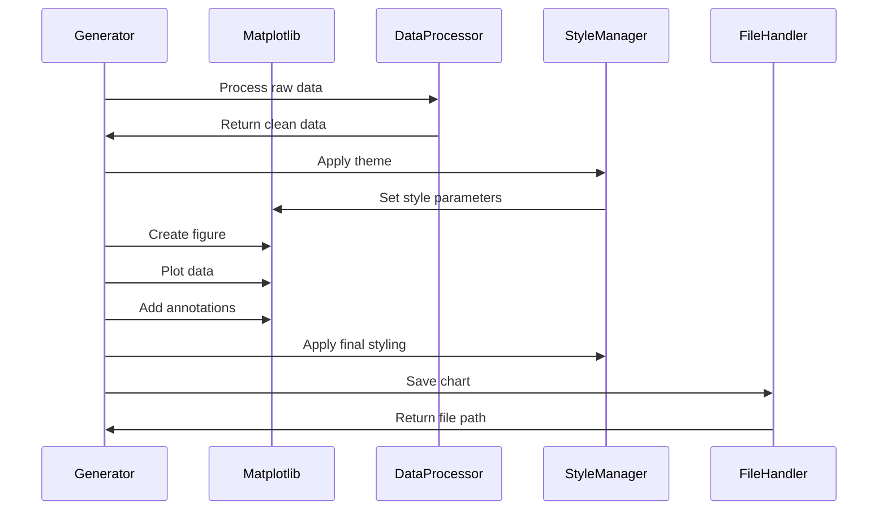
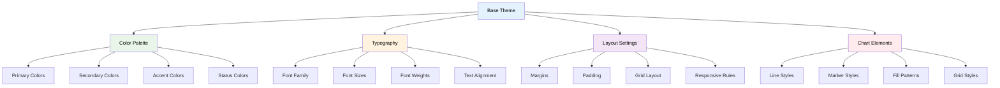
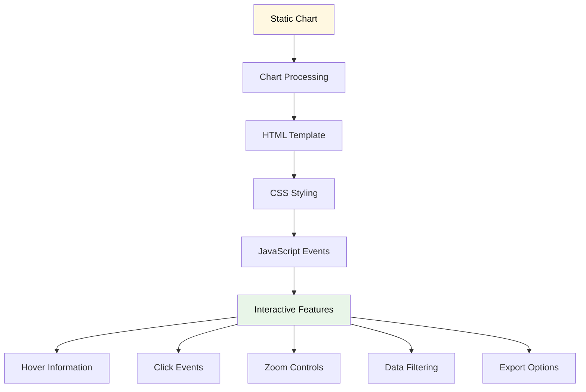
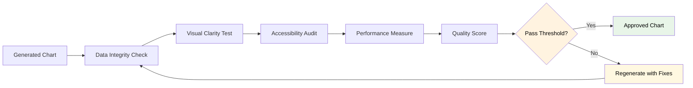
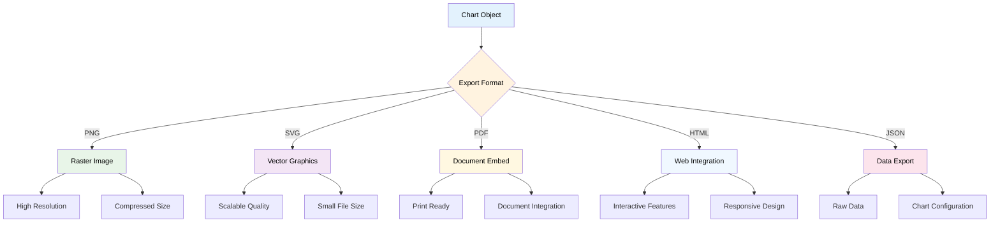

# Data Visualization Flow



## Visualization Pipeline Details

### Data Preprocessing Stage



### Chart Type Selection Logic



### Chart Generation Process



## Visualization Types and Use Cases

### 1. Line Charts
**Use Cases**: Time-series data, trends, forecasts
**Features**:
- Multi-line support for comparisons
- Trend line overlays
- Confidence bands for uncertainty
- Interactive zoom and pan
- Custom markers and line styles

```python
# Example configuration
line_chart_config = {
    "x_axis": "period_date",
    "y_axis": ["total_revenue", "total_expenses", "net_cash_flow"],
    "colors": ["green", "red", "blue"],
    "line_styles": ["-", "-", "--"],
    "markers": ["o", "s", "^"],
    "fill_areas": [True, False, False]
}
```

### 2. Bar Charts
**Use Cases**: Category comparisons, periodic summaries
**Features**:
- Grouped and stacked bars
- Horizontal and vertical orientation
- Value labels on bars
- Color coding by category
- Animation support

### 3. Pie Charts
**Use Cases**: Proportional breakdowns, composition analysis
**Features**:
- Percentage labels
- Exploded slices for emphasis
- Custom color palettes
- Legend positioning
- Donut chart variation

### 4. Area Charts
**Use Cases**: Stacked categories, cumulative analysis
**Features**:
- Stacked area visualization
- Transparency for overlapping areas
- Category highlighting
- Smooth interpolation
- Zero-baseline anchoring

### 5. Gauge Charts
**Use Cases**: KPI displays, threshold monitoring
**Features**:
- Color-coded threshold zones
- Needle indicators
- Value displays
- Customizable ranges
- Alert indicators

### 6. Multi-panel Charts
**Use Cases**: Scenario comparisons, dashboard layouts
**Features**:
- Synchronized axes
- Shared legends
- Flexible layouts (2x2, 1x3, etc.)
- Individual customization
- Cross-panel annotations

## Styling and Theming System

### Theme Architecture



### Built-in Themes

1. **Professional Theme**
   - Clean, corporate styling
   - Conservative color palette
   - High contrast for readability

2. **Modern Theme**
   - Contemporary design elements
   - Vibrant color schemes
   - Minimal decorative elements

3. **Dark Theme**
   - Dark backgrounds
   - High contrast text
   - Optimized for screen viewing

4. **Print Theme**
   - Black and white compatible
   - High resolution optimized
   - Clear, readable fonts

### Custom Styling Options

```python
# Custom style configuration
custom_style = {
    "figure": {
        "figsize": (16, 10),
        "dpi": 300,
        "facecolor": "white"
    },
    "axes": {
        "titlesize": 16,
        "labelsize": 12,
        "grid": True,
        "spines": {"top": False, "right": False}
    },
    "colors": {
        "primary": "#2E86AB",
        "secondary": "#A23B72",
        "success": "#F18F01",
        "danger": "#C73E1D"
    },
    "fonts": {
        "family": "Arial",
        "title_weight": "bold",
        "label_weight": "normal"
    }
}
```

## Interactive Features

### HTML Chart Integration



### Responsive Design

- **Mobile Optimization**: Adjusted layouts for small screens
- **Tablet Support**: Medium-sized optimizations
- **Desktop Enhancement**: Full-featured displays
- **Print Optimization**: High-quality print layouts

## Quality Assurance

### Chart Validation



### Accessibility Features

1. **Color Blind Friendly**: Colorblind-safe palettes
2. **High Contrast**: Sufficient contrast ratios
3. **Alt Text**: Descriptive alternative text
4. **Screen Reader**: Compatible with screen readers
5. **Keyboard Navigation**: Full keyboard accessibility

### Performance Optimization

1. **File Size**: Optimized image compression
2. **Render Speed**: Efficient plotting algorithms
3. **Memory Usage**: Controlled memory consumption
4. **Batch Processing**: Optimized for multiple charts
5. **Caching**: Intelligent caching strategies

## Export and Integration

### File Format Support



### Integration Points

1. **HTML Reports**: Embedded chart images
2. **Excel Workbooks**: Chart objects in spreadsheets
3. **PDF Documents**: High-quality chart inclusion
4. **Web Dashboards**: Interactive chart widgets
5. **Presentation Slides**: Export-ready formats