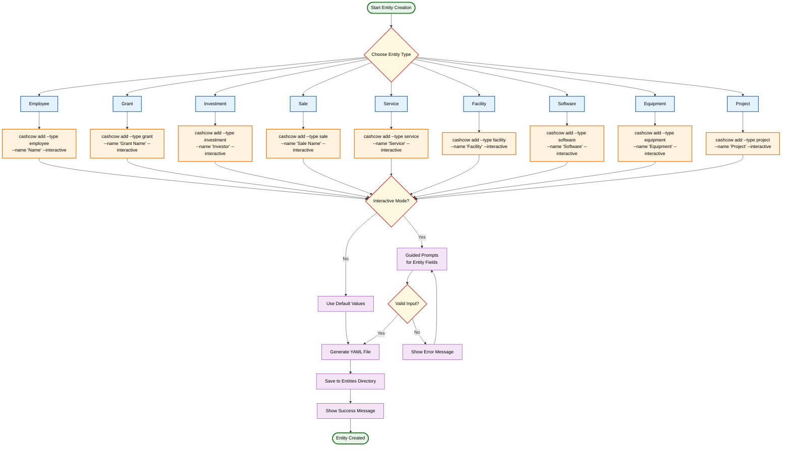
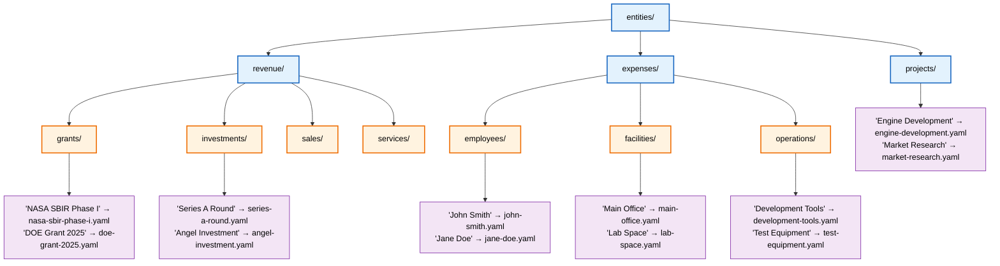
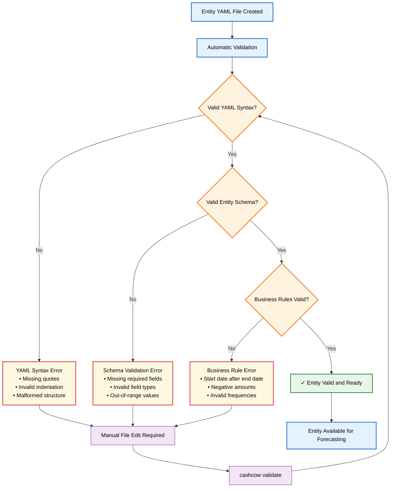

# Entity Creation Workflow

This document contains detailed Mermaid diagrams showing the entity creation process and workflows for different entity types.

## 1. General Entity Creation Workflow

## 2. Employee Creation Detailed Workflow

```mermaid
flowchart TD
    START([Employee Creation]) --> CMD[cashcow add --type employee<br/>--name 'Employee Name' --interactive]
    
    CMD --> SALARY_PROMPT[Prompt: Annual salary]
    SALARY_PROMPT --> SALARY_INPUT[User Input: e.g., 85000]
    SALARY_INPUT --> SALARY_VALIDATE{Salary > 0?}
    SALARY_VALIDATE -->|No| SALARY_ERROR[Error: Salary must be positive]
    SALARY_ERROR --> SALARY_PROMPT
    SALARY_VALIDATE -->|Yes| POSITION_PROMPT[Prompt: Position<br/>default: empty]
    
    POSITION_PROMPT --> POSITION_INPUT[User Input: e.g., 'Software Engineer']
    POSITION_INPUT --> DEPT_PROMPT[Prompt: Department default: Engineering]
    DEPT_PROMPT --> DEPT_INPUT[User Input: e.g., 'Engineering']
    
    DEPT_INPUT --> EQUITY_PROMPT[Prompt: Add equity? y/N]
    EQUITY_PROMPT --> EQUITY_CHOICE{Add Equity?}
    EQUITY_CHOICE -->|Yes| EQUITY_SHARES[Prompt: Equity shares default: 0]
    EQUITY_SHARES --> EQUITY_INPUT[User Input: e.g., 1000]
    EQUITY_CHOICE -->|No| END_DATE_PROMPT[Prompt: Add end date? y/N]
    EQUITY_INPUT --> END_DATE_PROMPT
    
    END_DATE_PROMPT --> END_DATE_CHOICE{Add End Date?}
    END_DATE_CHOICE -->|Yes| END_DATE_INPUT[Prompt: End date YYYY-MM-DD]
    END_DATE_INPUT --> DATE_VALIDATE{Valid Date Format?}
    DATE_VALIDATE -->|No| DATE_ERROR[Error: Use YYYY-MM-DD format]
    DATE_ERROR --> END_DATE_INPUT
    DATE_VALIDATE -->|Yes| CREATE_ENTITY[Create Entity Object]
    END_DATE_CHOICE -->|No| CREATE_ENTITY
    
    CREATE_ENTITY --> CALC_PATH[Calculate File Path:<br/>entities/expenses/employees/<br/>employee-name.yaml]
    CALC_PATH --> CREATE_DIR[Create Directory if Needed]
    CREATE_DIR --> WRITE_YAML[Write YAML File]
    
    WRITE_YAML --> YAML_CONTENT{{'type: employee
name: Employee Name
start_date: '2025-07-11'
salary: 85000.0
position: Software Engineer
department: Engineering
equity_shares: 1000
tags: '}}
    
    YAML_CONTENT --> SUCCESS[✓ Created employee 'Employee Name'<br/>at entities/expenses/employees/employee-name.yaml]
    SUCCESS --> END([Complete])
    
    classDef startEnd fill:#e8f5e8,stroke:#2e7d32,stroke-width:3px,color:#000
    classDef prompt fill:#e3f2fd,stroke:#1565c0,stroke-width:2px,color:#000
    classDef input fill:#fff3e0,stroke:#ef6c00,stroke-width:1px,color:#000
    classDef decision fill:#fff8e1,stroke:#d32f2f,stroke-width:2px,color:#000
    classDef error fill:#fff8e1,stroke:#d32f2f,stroke-width:2px,color:#000
    classDef process fill:#f3e5f5,stroke:#7b1fa2,stroke-width:1px,color:#000
    classDef success fill:#e8f5e8,stroke:#2e7d32,stroke-width:2px,color:#000
    classDef yaml fill:#fafafa,stroke:#616161,stroke-width:1px,color:#000
    
    class START,END startEnd
    class SALARY_PROMPT,POSITION_PROMPT,DEPT_PROMPT,EQUITY_PROMPT,EQUITY_SHARES,END_DATE_PROMPT,END_DATE_INPUT prompt
    class SALARY_INPUT,POSITION_INPUT,DEPT_INPUT,EQUITY_INPUT input
    class SALARY_VALIDATE,EQUITY_CHOICE,END_DATE_CHOICE,DATE_VALIDATE decision
    class SALARY_ERROR,DATE_ERROR error
    class CREATE_ENTITY,CALC_PATH,CREATE_DIR,WRITE_YAML process
    class SUCCESS success
    class YAML_CONTENT yaml
```

## 3. Grant Creation Detailed Workflow

```mermaid
flowchart TD
    START([Grant Creation]) --> CMD[cashcow add --type grant<br/>--name 'Grant Name' --interactive]
    
    CMD --> AMOUNT_PROMPT[Prompt: Grant amount]
    AMOUNT_PROMPT --> AMOUNT_INPUT[User Input: e.g., 256000]
    AMOUNT_INPUT --> AMOUNT_VALIDATE{Amount > 0?}
    AMOUNT_VALIDATE -->|No| AMOUNT_ERROR[Error: Amount must be positive]
    AMOUNT_ERROR --> AMOUNT_PROMPT
    AMOUNT_VALIDATE -->|Yes| AGENCY_PROMPT[Prompt: Funding agency default: empty]
    
    AGENCY_PROMPT --> AGENCY_INPUT[User Input: e.g., 'NASA']
    AGENCY_INPUT --> PROGRAM_PROMPT[Prompt: Program default: empty]
    PROGRAM_PROMPT --> PROGRAM_INPUT[User Input: e.g., 'SBIR Phase I']
    
    PROGRAM_INPUT --> MILESTONES_PROMPT[Prompt: Add milestones? y/N]
    MILESTONES_PROMPT --> MILESTONES_CHOICE{Add Milestones?}
    
    MILESTONES_CHOICE -->|Yes| MILESTONE_LOOP[Milestone Entry Loop]
    MILESTONE_LOOP --> MILESTONE_NAME[Prompt: Milestone name]
    MILESTONE_NAME --> MILESTONE_AMT[Prompt: Milestone amount]
    MILESTONE_AMT --> MILESTONE_DATE[Prompt: Milestone date]
    MILESTONE_DATE --> MORE_MILESTONES{Add another milestone?}
    MORE_MILESTONES -->|Yes| MILESTONE_LOOP
    MORE_MILESTONES -->|No| END_DATE_PROMPT[Prompt: Add end date? y/N]
    
    MILESTONES_CHOICE -->|No| END_DATE_PROMPT
    END_DATE_PROMPT --> END_DATE_CHOICE{Add End Date?}
    END_DATE_CHOICE -->|Yes| END_DATE_INPUT[Prompt: End date YYYY-MM-DD]
    END_DATE_INPUT --> CREATE_ENTITY[Create Entity Object]
    END_DATE_CHOICE -->|No| CREATE_ENTITY
    
    CREATE_ENTITY --> CALC_PATH[Calculate File Path:<br/>entities/revenue/grants/<br/>grant-name.yaml]
    CALC_PATH --> CREATE_DIR[Create Directory if Needed]
    CREATE_DIR --> WRITE_YAML[Write YAML File]
    
    WRITE_YAML --> YAML_CONTENT{{'type: grant
name: Grant Name
start_date: '2025-07-11'
end_date: '2026-07-11'
amount: 256000.0
funding_agency: NASA
program: SBIR Phase I
milestones:
  - name: Initial Research
    amount: 64000
    date: '2025-10-11'
tags: '}}
    
    YAML_CONTENT --> SUCCESS[✓ Created grant 'Grant Name'<br/>at entities/revenue/grants/grant-name.yaml]
    SUCCESS --> END([Complete])
    
    classDef startEnd fill:#e8f5e8,stroke:#2e7d32,stroke-width:3px,color:#000
    classDef prompt fill:#e3f2fd,stroke:#1565c0,stroke-width:2px,color:#000
    classDef input fill:#fff3e0,stroke:#ef6c00,stroke-width:1px,color:#000
    classDef decision fill:#fff8e1,stroke:#d32f2f,stroke-width:2px,color:#000
    classDef error fill:#fff8e1,stroke:#d32f2f,stroke-width:2px,color:#000
    classDef process fill:#f3e5f5,stroke:#7b1fa2,stroke-width:1px,color:#000
    classDef success fill:#e8f5e8,stroke:#2e7d32,stroke-width:2px,color:#000
    classDef yaml fill:#fafafa,stroke:#616161,stroke-width:1px,color:#000
    classDef loop fill:#f3e5f5,stroke:#8e24aa,stroke-width:2px,color:#000
    
    class START,END startEnd
    class AMOUNT_PROMPT,AGENCY_PROMPT,PROGRAM_PROMPT,MILESTONES_PROMPT,MILESTONE_NAME,MILESTONE_AMT,MILESTONE_DATE,END_DATE_PROMPT,END_DATE_INPUT prompt
    class AMOUNT_INPUT,AGENCY_INPUT,PROGRAM_INPUT input
    class AMOUNT_VALIDATE,MILESTONES_CHOICE,MORE_MILESTONES,END_DATE_CHOICE decision
    class AMOUNT_ERROR error
    class CREATE_ENTITY,CALC_PATH,CREATE_DIR,WRITE_YAML process
    class SUCCESS success
    class YAML_CONTENT yaml
    class MILESTONE_LOOP loop
```

## 4. Facility Creation Detailed Workflow

```mermaid
flowchart TD
    START([Facility Creation]) --> CMD[cashcow add --type facility<br/>--name 'Facility Name' --interactive]
    
    CMD --> COST_PROMPT[Prompt: Monthly cost]
    COST_PROMPT --> COST_INPUT[User Input: e.g., 12000]
    COST_INPUT --> COST_VALIDATE{Cost > 0?}
    COST_VALIDATE -->|No| COST_ERROR[Error: Cost must be positive]
    COST_ERROR --> COST_PROMPT
    COST_VALIDATE -->|Yes| LOCATION_PROMPT[Prompt: Location
    default: empty]
    
    LOCATION_PROMPT --> LOCATION_INPUT[User Input: e.g., 'Silicon Valley, CA']
    LOCATION_INPUT --> LEASE_PROMPT[Prompt: Lease type
    default: Monthly]
    LEASE_PROMPT --> LEASE_INPUT[User Input: e.g., 'Monthly']
    
    LEASE_INPUT --> SQFT_PROMPT[Prompt: Square footage 
    optional]
    SQFT_PROMPT --> SQFT_INPUT[User Input: e.g., 4000]
    SQFT_INPUT --> UTILS_PROMPT[Prompt: Utilities included? y/N]
    UTILS_PROMPT --> UTILS_CHOICE{Utilities Included?}
    
    UTILS_CHOICE -->|No| ADDITIONAL_COSTS[Prompt: Additional monthly costs?<br/>• Utilities<br/>• Insurance<br/>• Maintenance]
    ADDITIONAL_COSTS --> COSTS_INPUT[User Input for Each Cost Type]
    UTILS_CHOICE -->|Yes| END_DATE_PROMPT[Prompt: Add end date? y/N]
    COSTS_INPUT --> END_DATE_PROMPT
    
    END_DATE_PROMPT --> END_DATE_CHOICE{Add End Date?}
    END_DATE_CHOICE -->|Yes| END_DATE_INPUT[Prompt: End date YYYY-MM-DD]
    END_DATE_INPUT --> CREATE_ENTITY[Create Entity Object]
    END_DATE_CHOICE -->|No| CREATE_ENTITY
    
    CREATE_ENTITY --> CALC_PATH[Calculate File Path:<br/>entities/expenses/facilities/<br/>facility-name.yaml]
    CALC_PATH --> CREATE_DIR[Create Directory if Needed]
    CREATE_DIR --> WRITE_YAML[Write YAML File]
    
    WRITE_YAML --> YAML_CONTENT{{'type: facility
name: Facility Name
start_date: '2025-07-11'
monthly_cost: 12000.0
location: Silicon Valley, CA
lease_type: Monthly
square_footage: 4000
utilities_included: false
additional_costs:
  utilities: 800
  insurance: 300
  maintenance: 200
tags: '}}
    
    YAML_CONTENT --> SUCCESS[✓ Created facility 'Facility Name'<br/>at entities/expenses/facilities/facility-name.yaml]
    SUCCESS --> END([Complete])
    
    classDef startEnd fill:#e8f5e8,stroke:#2e7d32,stroke-width:3px,color:#000
    classDef prompt fill:#e3f2fd,stroke:#1565c0,stroke-width:2px,color:#000
    classDef input fill:#fff3e0,stroke:#ef6c00,stroke-width:1px,color:#000
    classDef decision fill:#fff8e1,stroke:#d32f2f,stroke-width:2px,color:#000
    classDef error fill:#fff8e1,stroke:#d32f2f,stroke-width:2px,color:#000
    classDef process fill:#f3e5f5,stroke:#7b1fa2,stroke-width:1px,color:#000
    classDef success fill:#e8f5e8,stroke:#2e7d32,stroke-width:2px,color:#000
    classDef yaml fill:#fafafa,stroke:#616161,stroke-width:1px,color:#000
    
    class START,END startEnd
    class COST_PROMPT,LOCATION_PROMPT,LEASE_PROMPT,SQFT_PROMPT,UTILS_PROMPT,ADDITIONAL_COSTS,END_DATE_PROMPT,END_DATE_INPUT prompt
    class COST_INPUT,LOCATION_INPUT,LEASE_INPUT,SQFT_INPUT,COSTS_INPUT input
    class COST_VALIDATE,UTILS_CHOICE,END_DATE_CHOICE decision
    class COST_ERROR error
    class CREATE_ENTITY,CALC_PATH,CREATE_DIR,WRITE_YAML process
    class SUCCESS success
    class YAML_CONTENT yaml
```

## 5. Entity Directory Structure and File Naming

## 6. Validation and Error Handling

