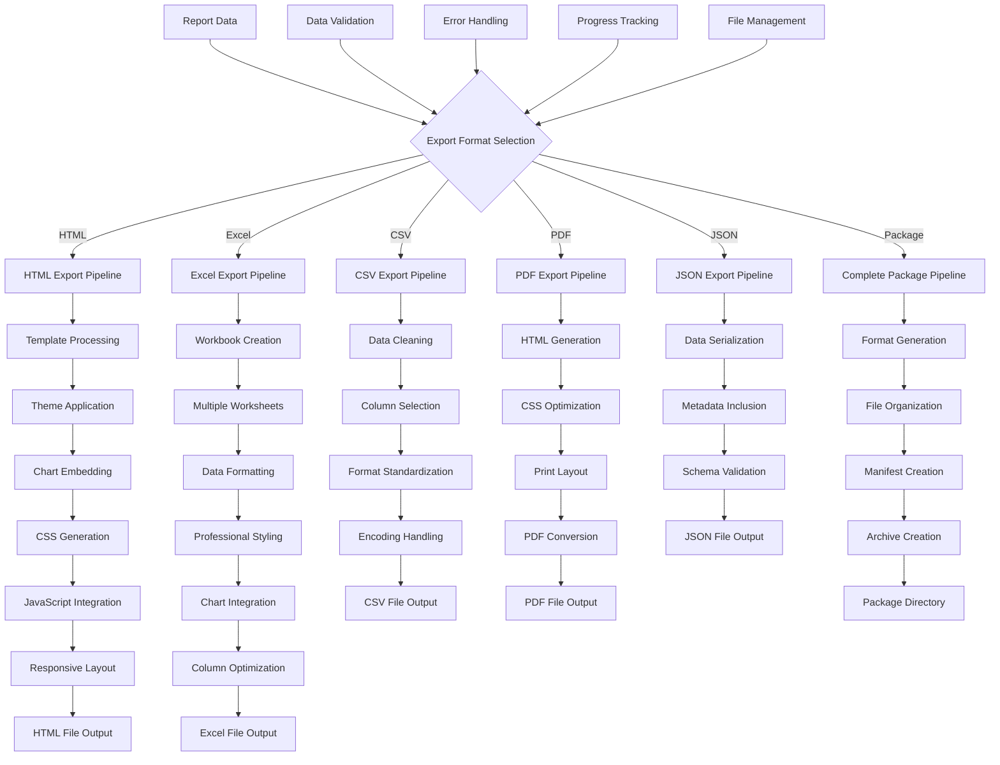
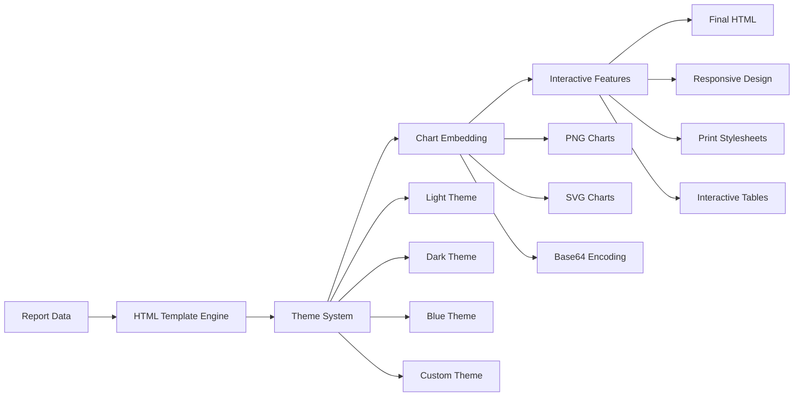
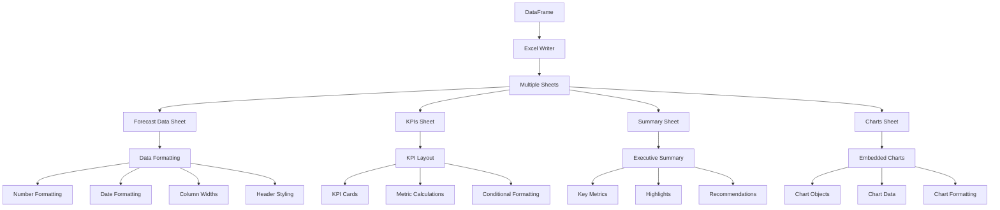
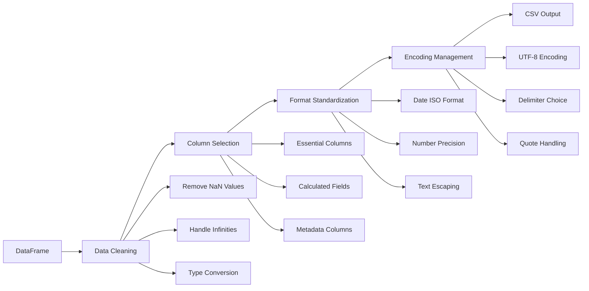
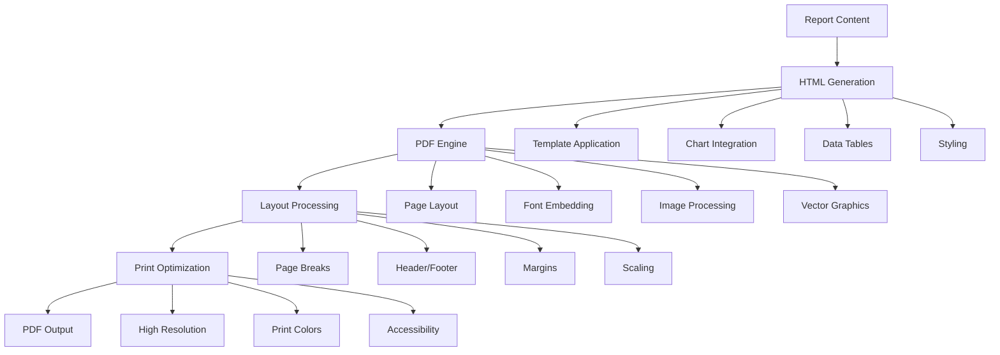
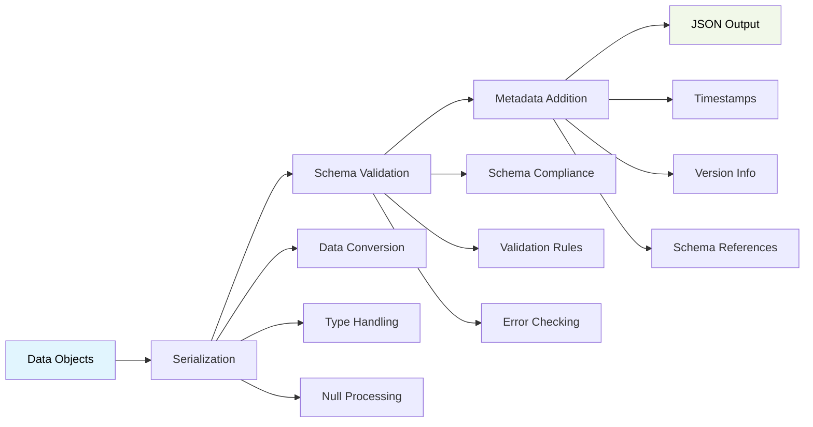
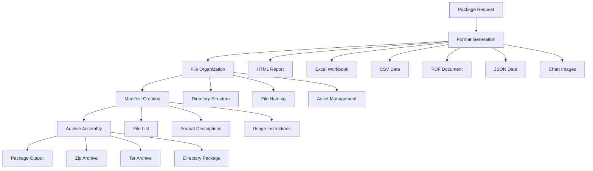
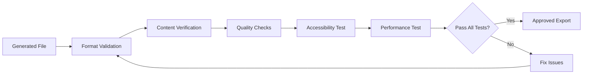
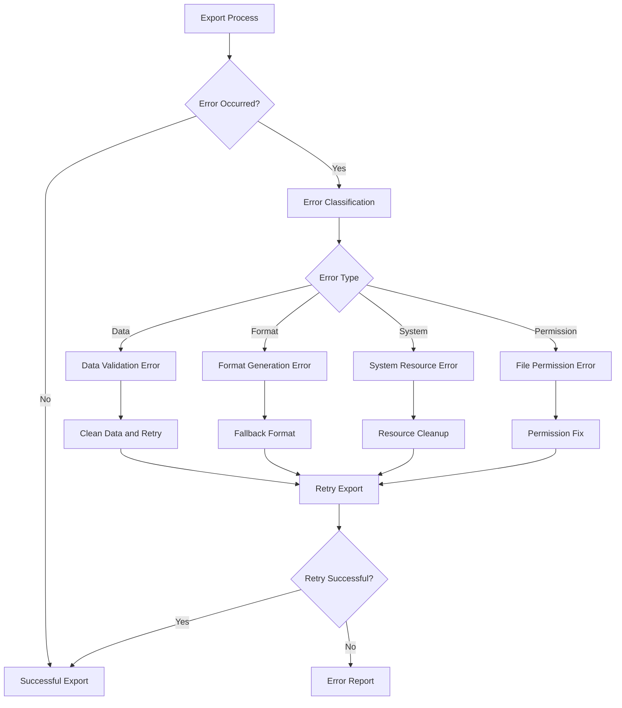

# Export Format Options



## Export Format Specifications

### HTML Export Format



#### HTML Features
- **Responsive Design**: Mobile-friendly layouts
- **Multiple Themes**: Professional styling options
- **Embedded Charts**: High-quality visualization integration
- **Interactive Elements**: Sortable tables, collapsible sections
- **Print Optimization**: Print-friendly CSS
- **Custom Branding**: Logo and color customization

#### HTML Structure
```html
<!DOCTYPE html>
<html>
<head>
    <title>Financial Report</title>
    <style>/* Theme CSS */</style>
</head>
<body>
    <header>Report Header</header>
    <section class="executive-summary">...</section>
    <section class="charts">...</section>
    <section class="data-tables">...</section>
    <footer>Report Footer</footer>
</body>
</html>
```

### Excel Export Format



#### Excel Features
- **Multiple Worksheets**: Organized data presentation
- **Professional Formatting**: Corporate-style layouts
- **Conditional Formatting**: Visual data highlighting
- **Chart Integration**: Native Excel charts
- **Formula Support**: Calculated fields and totals
- **Print Layout**: Optimized for printing

#### Excel Sheet Structure
1. **Forecast Data**: Complete time-series data
2. **KPIs**: Key performance indicators
3. **Summary**: Executive overview
4. **Charts**: Visualization gallery
5. **Raw Data**: Unformatted source data (optional)

### CSV Export Format



#### CSV Features
- **Clean Data**: Processed and validated data
- **Standard Format**: RFC 4180 compliant
- **UTF-8 Encoding**: International character support
- **Configurable Delimiters**: Comma, semicolon, tab options
- **Header Row**: Column name descriptions
- **Data Types**: Consistent formatting

#### CSV Column Structure
```csv
period,total_revenue,total_expenses,net_cash_flow,cash_balance,runway_months
2024-01,150000,120000,30000,30000,18.5
2024-02,155000,125000,30000,60000,19.2
```

### PDF Export Format



#### PDF Features
- **Print-Ready**: High-quality print output
- **Professional Layout**: Corporate document styling
- **Embedded Charts**: Vector graphics when possible
- **Page Management**: Automatic page breaks
- **Headers/Footers**: Consistent page elements
- **Accessibility**: PDF/A compliance options

### JSON Export Format



#### JSON Features
- **Structured Data**: Hierarchical organization
- **Schema Validation**: Data integrity checks
- **Metadata Rich**: Comprehensive information
- **API Compatible**: RESTful service integration
- **Version Control**: Schema versioning support
- **Cross-platform**: Universal data exchange

#### JSON Structure
```json
{
  "report_metadata": {
    "title": "Financial Forecast",
    "generated_at": "2024-01-15T10:30:00Z",
    "version": "1.0",
    "schema": "cashcow-report-v1"
  },
  "forecast_data": [...],
  "kpis": {...},
  "charts": {...},
  "summary": {...}
}
```

### Complete Package Format



#### Package Contents
```
report_package_2024-01-15/
├── README.md
├── manifest.json
├── report.html
├── forecast_data.xlsx
├── forecast_data.csv
├── kpis.json
├── charts/
│   ├── cash_flow_chart.png
│   ├── revenue_breakdown.png
│   ├── expense_breakdown.png
│   └── kpi_dashboard.png
└── assets/
    ├── styles.css
    └── logo.png
```

## Format Comparison Matrix

| Feature | HTML | Excel | CSV | PDF | JSON | Package |
|---------|------|-------|-----|-----|------|---------|
| **Interactive** | ✅ | ✅ | ❌ | ❌ | ❌ | ✅ |
| **Charts** | ✅ | ✅ | ❌ | ✅ | 📊 | ✅ |
| **Styling** | ✅ | ✅ | ❌ | ✅ | ❌ | ✅ |
| **Data Analysis** | ✅ | ✅ | ✅ | ✅ | ✅ | ✅ |
| **Print Ready** | ✅ | ✅ | ❌ | ✅ | ❌ | ✅ |
| **Mobile Friendly** | ✅ | ❌ | ❌ | ✅ | ❌ | ✅ |
| **API Compatible** | ❌ | ❌ | ✅ | ❌ | ✅ | ❌ |
| **File Size** | 📊 | 📊 | ✅ | 📊 | ✅ | ❌ |
| **Accessibility** | ✅ | 📊 | ❌ | ✅ | ❌ | ✅ |

Legend: ✅ Full Support, 📊 Partial Support, ❌ Not Supported

## Export Configuration Options

### Global Export Settings

```python
export_config = {
    "output_directory": "reports",
    "file_naming": "timestamp",  # timestamp, sequential, custom
    "compression": True,
    "quality": "high",  # low, medium, high
    "include_metadata": True,
    "validate_output": True,
    "backup_existing": True
}
```

### Format-Specific Settings

```python
format_settings = {
    "html": {
        "theme": "professional",
        "include_charts": True,
        "responsive": True,
        "custom_css": None
    },
    "excel": {
        "include_charts": True,
        "auto_width": True,
        "freeze_headers": True,
        "conditional_formatting": True
    },
    "csv": {
        "delimiter": ",",
        "encoding": "utf-8",
        "include_headers": True,
        "date_format": "ISO"
    },
    "pdf": {
        "page_size": "A4",
        "orientation": "portrait",
        "margins": "normal",
        "dpi": 300
    }
}
```

## Quality Assurance and Validation

### Export Validation Pipeline



### Validation Criteria
1. **Format Compliance**: Meets format standards
2. **Data Integrity**: Complete and accurate data
3. **Visual Quality**: Clear and readable output
4. **Accessibility**: Meets accessibility guidelines
5. **Performance**: Acceptable file size and load time
6. **Cross-platform**: Works across different systems

## Error Handling and Recovery

### Export Error Management



### Recovery Strategies
1. **Automatic Retry**: Configurable retry attempts
2. **Fallback Formats**: Alternative export options
3. **Partial Export**: Save what's possible
4. **Error Logging**: Detailed error tracking
5. **User Notification**: Clear error messages
6. **Data Preservation**: Prevent data loss