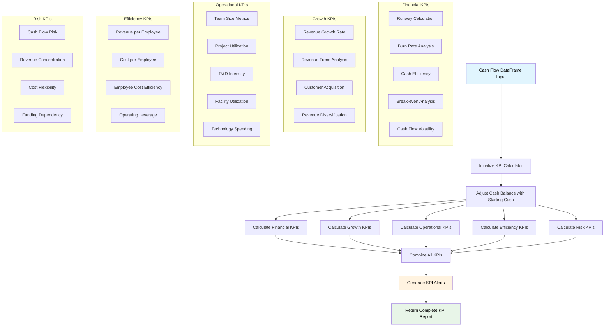
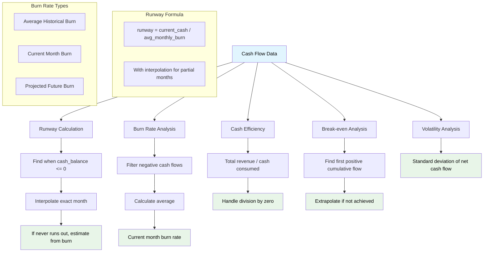
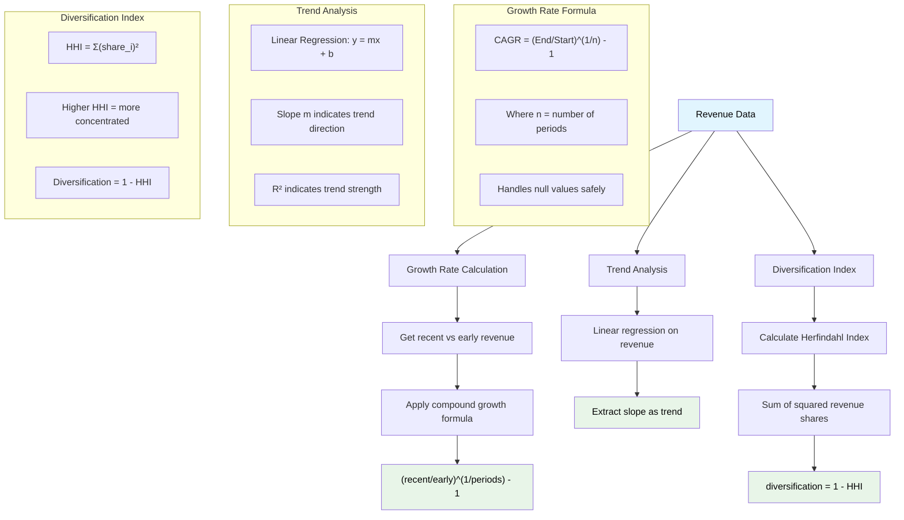
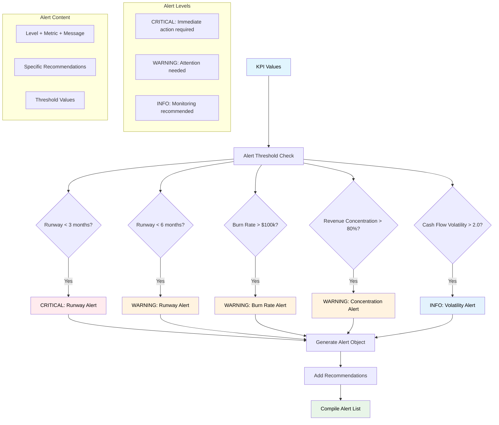
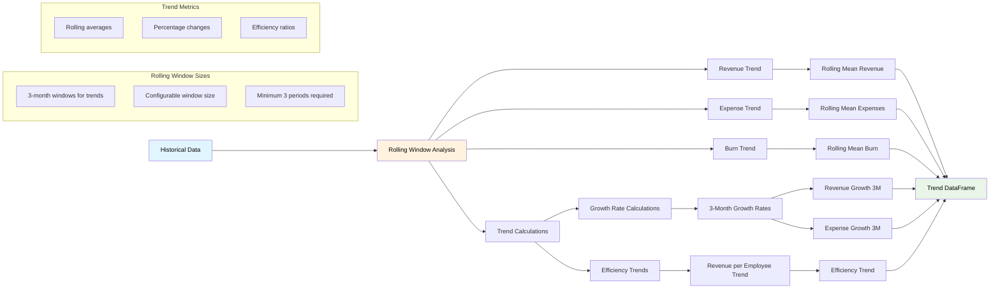
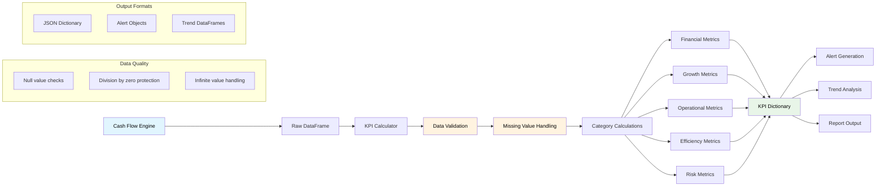

# KPI Calculation Pipeline

```mermaid
flowchart TD
    A[Cash Flow DataFrame Input] --> B[Initialize KPI Calculator]
    B --> C[Adjust Cash Balance with Starting Cash]
    
    C --> D[Calculate Financial KPIs]
    C --> E[Calculate Growth KPIs]
    C --> F[Calculate Operational KPIs]
    C --> G[Calculate Efficiency KPIs]
    C --> H[Calculate Risk KPIs]
    
    D --> I[Combine All KPIs]
    E --> I
    F --> I
    G --> I
    H --> I
    
    I --> J[Generate KPI Alerts]
    J --> K[Return Complete KPI Report]
    
    subgraph "Financial KPIs"
        D1[Runway Calculation]
        D2[Burn Rate Analysis]
        D3[Cash Efficiency]
        D4[Break-even Analysis]
        D5[Cash Flow Volatility]
    end
    
    subgraph "Growth KPIs"
        E1[Revenue Growth Rate]
        E2[Revenue Trend Analysis]
        E3[Customer Acquisition]
        E4[Revenue Diversification]
    end
    
    subgraph "Operational KPIs"
        F1[Team Size Metrics]
        F2[Project Utilization]
        F3[R&D Intensity]
        F4[Facility Utilization]
        F5[Technology Spending]
    end
    
    subgraph "Efficiency KPIs"
        G1[Revenue per Employee]
        G2[Cost per Employee]
        G3[Employee Cost Efficiency]
        G4[Operating Leverage]
    end
    
    subgraph "Risk KPIs"
        H1[Cash Flow Risk]
        H2[Revenue Concentration]
        H3[Cost Flexibility]
        H4[Funding Dependency]
    end
    
    style A fill:#e1f5fe,color:#050505
    style K fill:#e8f5e8,color:#050505
    style J fill:#fff3e0,color:#050505
    
```

## Financial KPI Calculations

```mermaid
flowchart TD
    A[Cash Flow Data] --> B[Runway Calculation]
    A --> C[Burn Rate Analysis]
    A --> D[Cash Efficiency]
    A --> E[Break-even Analysis]
    A --> F[Volatility Analysis]
    
    B --> B1[Find when cash_balance <= 0]
    B1 --> B2[Interpolate exact month]
    B2 --> B3[If never runs out, estimate from burn]
    
    C --> C1[Filter negative cash flows]
    C1 --> C2[Calculate average]
    C2 --> C3[Current month burn rate]
    
    D --> D1[Total revenue / cash consumed]
    D1 --> D2[Handle division by zero]
    
    E --> E1[Find first positive cumulative flow]
    E1 --> E2[Extrapolate if not achieved]
    
    F --> F1[Standard deviation of net cash flow]
    
    subgraph "Runway Formula"
        R1["runway = current_cash / avg_monthly_burn"]
        R2["With interpolation for partial months"]
    end
    
    subgraph "Burn Rate Types"
        BR1[Average Historical Burn]
        BR2[Current Month Burn]
        BR3[Projected Future Burn]
    end
    
    style A fill:#e1f5fe,color:#050505
    style B3 fill:#e8f5e8,color:#050505
    style C3 fill:#e8f5e8,color:#050505
    style D2 fill:#e8f5e8,color:#050505
    style E2 fill:#e8f5e8,color:#050505
    style F1 fill:#e8f5e8,color:#050505
    
```

## Growth KPI Analysis

```mermaid
flowchart TD
    A[Revenue Data] --> B[Growth Rate Calculation]
    A --> C[Trend Analysis]
    A --> D[Diversification Index]
    
    B --> B1[Get recent vs early revenue]
    B1 --> B2[Apply compound growth formula]
    B2 --> B3["(recent/early)^(1/periods) - 1"]
    
    C --> C1[Linear regression on revenue]
    C1 --> C2[Extract slope as trend]
    
    D --> D1[Calculate Herfindahl Index]
    D1 --> D2[Sum of squared revenue shares]
    D2 --> D3["diversification = 1 - HHI"]
    
    subgraph "Growth Rate Formula"
        GR1["CAGR = (End/Start)^(1/n) - 1"]
        GR2["Where n = number of periods"]
        GR3["Handles null values safely"]
    end
    
    subgraph "Trend Analysis"
        T1[Linear Regression: y = mx + b]
        T2[Slope m indicates trend direction]
        T3[R² indicates trend strength]
    end
    
    subgraph "Diversification Index"
        DI1["HHI = Σ(share_i)²"]
        DI2["Higher HHI = more concentrated"]
        DI3["Diversification = 1 - HHI"]
    end
    
    style A fill:#e1f5fe,color:#050505
    style B3 fill:#e8f5e8,color:#050505
    style C2 fill:#e8f5e8,color:#050505
    style D3 fill:#e8f5e8,color:#050505
    
```

## KPI Alert System

```mermaid
flowchart TD
    A[KPI Values] --> B[Alert Threshold Check]
    
    B --> C{Runway < 3 months?}
    B --> D{Runway < 6 months?}
    B --> E{Burn Rate > $100k?}
    B --> F{Revenue Concentration > 80%?}
    B --> G{Cash Flow Volatility > 2.0?}
    
    C -->|Yes| H[CRITICAL: Runway Alert]
    D -->|Yes| I[WARNING: Runway Alert]
    E -->|Yes| J[WARNING: Burn Rate Alert]
    F -->|Yes| K[WARNING: Concentration Alert]
    G -->|Yes| L[INFO: Volatility Alert]
    
    H --> M[Generate Alert Object]
    I --> M
    J --> M
    K --> M
    L --> M
    
    M --> N[Add Recommendations]
    N --> O[Compile Alert List]
    
    subgraph "Alert Levels"
        AL1[CRITICAL: Immediate action required]
        AL2[WARNING: Attention needed]
        AL3[INFO: Monitoring recommended]
    end
    
    subgraph "Alert Content"
        AC1[Level + Metric + Message]
        AC2[Specific Recommendations]
        AC3[Threshold Values]
    end
    
    style A fill:#e1f5fe,color:#050505
    style H fill:#ffebee,color:#050505
    style I fill:#fff3e0,color:#050505
    style J fill:#fff3e0,color:#050505
    style K fill:#fff3e0,color:#050505
    style L fill:#e3f2fd,color:#050505
    style O fill:#e8f5e8,color:#050505
    
```

## KPI Trend Analysis

```mermaid
flowchart LR
    A[Historical Data] --> B[Rolling Window Analysis]
    B --> C[Trend Calculations]
    
    B --> D[Revenue Trend]
    B --> E[Expense Trend]
    B --> F[Burn Trend]
    
    C --> G[Growth Rate Calculations]
    G --> H[3-Month Growth Rates]
    
    C --> I[Efficiency Trends]
    I --> J[Revenue per Employee Trend]
    
    D --> K[Rolling Mean Revenue]
    E --> L[Rolling Mean Expenses]
    F --> M[Rolling Mean Burn]
    
    H --> N[Revenue Growth 3M]
    H --> O[Expense Growth 3M]
    
    J --> P[Efficiency Trend]
    
    K --> Q[Trend DataFrame]
    L --> Q
    M --> Q
    N --> Q
    O --> Q
    P --> Q
    
    subgraph "Rolling Window Sizes"
        RW1[3-month windows for trends]
        RW2[Configurable window size]
        RW3[Minimum 3 periods required]
    end
    
    subgraph "Trend Metrics"
        TM1[Rolling averages]
        TM2[Percentage changes]
        TM3[Efficiency ratios]
    end
    
    style A fill:#e1f5fe,color:#050505
    style Q fill:#e8f5e8,color:#050505
    style B fill:#fff3e0,color:#050505
    
```

## KPI Data Flow

```mermaid
graph LR
    A[Cash Flow Engine] --> B[Raw DataFrame]
    B --> C[KPI Calculator]
    
    C --> D[Data Validation]
    D --> E[Missing Value Handling]
    E --> F[Category Calculations]
    
    F --> G[Financial Metrics]
    F --> H[Growth Metrics]
    F --> I[Operational Metrics]
    F --> J[Efficiency Metrics]
    F --> K[Risk Metrics]
    
    G --> L[KPI Dictionary]
    H --> L
    I --> L
    J --> L
    K --> L
    
    L --> M[Alert Generation]
    L --> N[Trend Analysis]
    L --> O[Report Output]
    
    subgraph "Data Quality"
        DQ1[Null value checks]
        DQ2[Division by zero protection]
        DQ3[Infinite value handling]
    end
    
    subgraph "Output Formats"
        OF1[JSON Dictionary]
        OF2[Alert Objects]
        OF3[Trend DataFrames]
    end
    
    style A fill:#e1f5fe,color:#050505
    style L fill:#e8f5e8,color:#050505
    style D fill:#fff3e0,color:#050505
    style E fill:#fff3e0,color:#050505
    
```