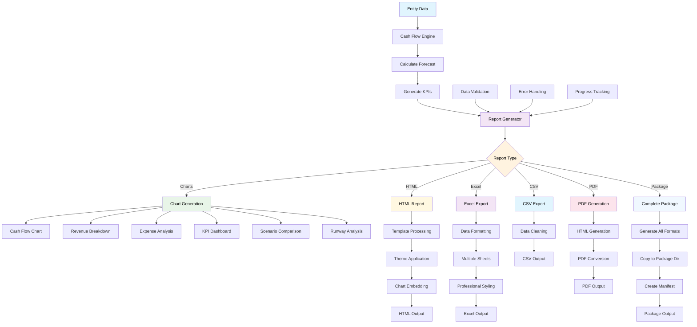

# Report Generation Pipeline

## Pipeline Stages

### 1. Data Input Stage
- **Entity Data**: Source entities from storage system
- **Cash Flow Engine**: Core calculation engine
- **Forecast Calculation**: Generate time-series financial data
- **KPI Generation**: Calculate key performance indicators

### 2. Validation Stage
- **Data Validation**: Check for data quality issues
- **Error Handling**: Manage calculation errors
- **Progress Tracking**: Monitor generation progress

### 3. Report Generation Stage
- **Report Type Selection**: Choose output format
- **Template Processing**: Apply report templates
- **Data Formatting**: Format data for output

### 4. Chart Generation
- **Cash Flow Charts**: Primary financial visualizations
- **Breakdown Charts**: Revenue and expense analysis
- **KPI Dashboards**: Performance indicator displays
- **Comparative Charts**: Scenario and trend analysis

### 5. Output Generation
- **HTML Reports**: Rich web-based reports
- **Excel Exports**: Professional spreadsheets
- **CSV Exports**: Raw data exports
- **PDF Reports**: Print-ready documents
- **Complete Packages**: All formats combined

### 6. Post-Processing
- **File Organization**: Structure output files
- **Metadata Generation**: Create report manifests
- **Archive Management**: Handle report versioning