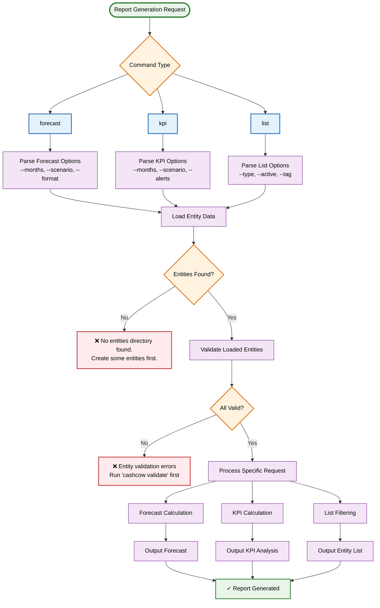
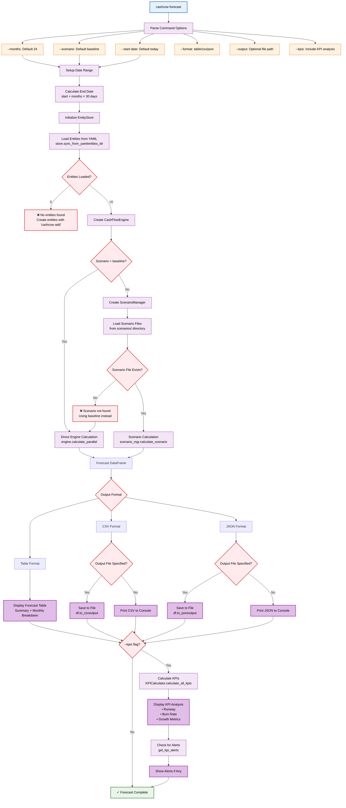
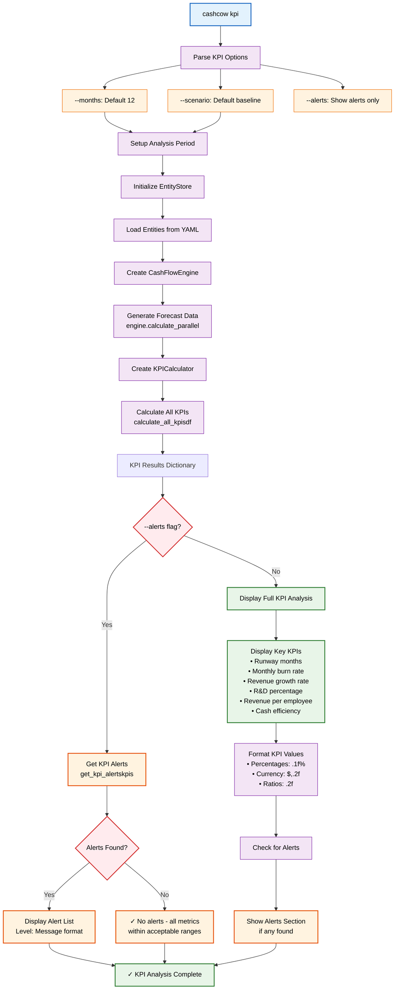
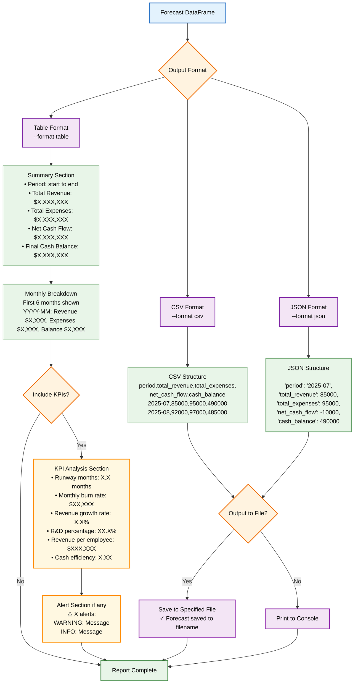

# Report Generation Workflow

This document contains detailed Mermaid diagrams showing the report generation process and workflows for different types of financial reports and forecasts.

## 1. General Report Generation Workflow

## 2. Forecast Generation Detailed Workflow

## 3. KPI Analysis Workflow

## 4. Entity Listing Workflow

```mermaid
flowchart TD
    LIST_CMD[cashcow list] --> PARSE_LIST_OPTIONS[Parse List Options]
    
    PARSE_LIST_OPTIONS --> FILTER_TYPE[--type: Filter by entity type]
    PARSE_LIST_OPTIONS --> FILTER_ACTIVE[--active: Show only active]
    PARSE_LIST_OPTIONS --> FILTER_TAGS[--tag: Filter by tags multiple]
    
    FILTER_TYPE --> LOAD_LIST_STORE[Initialize EntityStore]
    FILTER_ACTIVE --> LOAD_LIST_STORE
    FILTER_TAGS --> LOAD_LIST_STORE
    
    LOAD_LIST_STORE --> CHECK_ENTITIES_DIR[Check entities/ directory]
    CHECK_ENTITIES_DIR --> DIR_EXISTS{Directory Exists?}
    
    DIR_EXISTS -->|No| NO_DIR_ERROR[❌ No entities directory found]
    DIR_EXISTS -->|Yes| SYNC_LIST_ENTITIES[Load Entities from YAML<br/>store.sync_from_yaml]
    
    SYNC_LIST_ENTITIES --> BUILD_FILTERS[Build Query Filters]
    BUILD_FILTERS --> TYPE_FILTER{Type Filter?}
    TYPE_FILTER -->|Yes| ADD_TYPE_FILTER[Add type filter to query]
    TYPE_FILTER -->|No| ACTIVE_FILTER{Active Filter?}
    ADD_TYPE_FILTER --> ACTIVE_FILTER
    
    ACTIVE_FILTER -->|Yes| ADD_ACTIVE_FILTER[Add active filter to query]
    ACTIVE_FILTER -->|No| TAG_FILTER{Tag Filters?}
    ADD_ACTIVE_FILTER --> TAG_FILTER
    
    TAG_FILTER -->|Yes| ADD_TAG_FILTERS[Add tag filters to query]
    TAG_FILTER -->|No| EXECUTE_QUERY[Execute Entity Query<br/>store.queryfilters]
    ADD_TAG_FILTERS --> EXECUTE_QUERY
    
    EXECUTE_QUERY --> QUERY_RESULTS[Query Results]
    QUERY_RESULTS --> HAS_RESULTS{Entities Found?}
    
    HAS_RESULTS -->|No| NO_MATCHES[No entities found<br/>matching filters]
    HAS_RESULTS -->|Yes| COUNT_ENTITIES[Count Results<br/>Found X entities:]
    
    COUNT_ENTITIES --> DISPLAY_HEADER[Display Results Header]
    DISPLAY_HEADER --> ENTITY_LOOP[For Each Entity]
    
    ENTITY_LOOP --> ENTITY_STATUS[Determine Status<br/>Active/Inactive based on dates]
    ENTITY_STATUS --> DISPLAY_ENTITY[Display Entity Info<br/>• Name type - Status<br/>• Start: date<br/>• End: date if exists<br/>• Tags: tag list]
    
    DISPLAY_ENTITY --> MORE_ENTITIES{More Entities?}
    MORE_ENTITIES -->|Yes| ENTITY_LOOP
    MORE_ENTITIES -->|No| LIST_COMPLETE[✓ Entity List Complete]
    
    NO_DIR_ERROR --> LIST_COMPLETE
    NO_MATCHES --> LIST_COMPLETE
    
    classDef command fill:#e3f2fd,stroke:#1565c0,stroke-width:2px,color:#000
    classDef option fill:#fff3e0,stroke:#ef6c00,stroke-width:1px,color:#000
    classDef decision fill:#ffebee,stroke:#d32f2f,stroke-width:2px,color:#000
    classDef process fill:#f3e5f5,stroke:#7b1fa2,stroke-width:1px,color:#000
    classDef error fill:#ffebee,stroke:#d32f2f,stroke-width:2px,color:#000
    classDef success fill:#e8f5e8,stroke:#2e7d32,stroke-width:2px,color:#000
    classDef display fill:#f3e5f5,stroke:#8e24aa,stroke-width:2px,color:#000
    classDef loop fill:#fff8e1,stroke:#f57f17,stroke-width:2px,color:#000
    
    class LIST_CMD command
    class FILTER_TYPE,FILTER_ACTIVE,FILTER_TAGS option
    class DIR_EXISTS,TYPE_FILTER,ACTIVE_FILTER,TAG_FILTER,HAS_RESULTS,MORE_ENTITIES decision
    class PARSE_LIST_OPTIONS,LOAD_LIST_STORE,CHECK_ENTITIES_DIR,SYNC_LIST_ENTITIES,BUILD_FILTERS,ADD_TYPE_FILTER,ADD_ACTIVE_FILTER,ADD_TAG_FILTERS,EXECUTE_QUERY,COUNT_ENTITIES,ENTITY_STATUS process
    class NO_DIR_ERROR error
    class LIST_COMPLETE success
    class DISPLAY_HEADER,DISPLAY_ENTITY,NO_MATCHES display
    class ENTITY_LOOP loop
```

## 5. Report Output Formats and Examples

## 6. Error Handling in Report Generation

```mermaid
flowchart TD
    REPORT_REQUEST[Report Generation Request] --> TRY_EXECUTE[Try Execute Command]
    
    TRY_EXECUTE --> ERROR_TYPE{Error Occurred?}
    
    ERROR_TYPE -->|No Error| SUCCESS_PATH[Normal Execution Path]
    ERROR_TYPE -->|Entity Error| ENTITY_ERRORS[Entity-Related Errors]
    ERROR_TYPE -->|Calculation Error| CALC_ERRORS[Calculation Errors]
    ERROR_TYPE -->|File Error| FILE_ERRORS[File I/O Errors]
    ERROR_TYPE -->|Config Error| CONFIG_ERRORS[Configuration Errors]
    
    ENTITY_ERRORS --> NO_ENTITIES[❌ No entities directory found<br/>Create some entities first with 'cashcow add']
    ENTITY_ERRORS --> INVALID_ENTITIES[❌ Entity validation errors<br/>Run 'cashcow validate' to see details]
    ENTITY_ERRORS --> CORRUPTED_YAML[❌ YAML parsing error<br/>Check file syntax in entities/]
    
    CALC_ERRORS --> ENGINE_ERROR[❌ Calculation engine error<br/>Check entity data consistency]
    CALC_ERRORS --> SCENARIO_ERROR[❌ Scenario not found<br/>Available scenarios: baseline, ...]
    CALC_ERRORS --> DATE_ERROR[❌ Invalid date range<br/>End date must be after start date]
    
    FILE_ERRORS --> PERMISSION_ERROR[❌ Permission denied<br/>Check file write permissions]
    FILE_ERRORS --> DISK_SPACE[❌ Insufficient disk space<br/>Free up space and try again]
    FILE_ERRORS --> INVALID_PATH[❌ Invalid output path<br/>Check directory exists]
    
    CONFIG_ERRORS --> MISSING_CONFIG[❌ Configuration file missing<br/>Create config/settings.yaml]
    CONFIG_ERRORS --> INVALID_CONFIG[❌ Invalid configuration<br/>Check YAML syntax in config/]
    
    NO_ENTITIES --> SHOW_HELP[Show Help Message<br/>• How to create entities<br/>• Directory structure<br/>• Example commands]
    INVALID_ENTITIES --> VALIDATION_PROMPT[Suggest Validation<br/>Run: cashcow validate --fix]
    CORRUPTED_YAML --> YAML_HELP[Show YAML Help<br/>• Common syntax errors<br/>• Validation tools<br/>• Example formats]
    
    ENGINE_ERROR --> DEBUG_PROMPT[Offer Debug Mode<br/>Show detailed error? y/N]
    SCENARIO_ERROR --> LIST_SCENARIOS[List Available Scenarios<br/>From scenarios/ directory]
    DATE_ERROR --> DATE_HELP[Show Date Format Help<br/>Use YYYY-MM-DD format]
    
    PERMISSION_ERROR --> PERMISSION_FIX[Suggest Permission Fix<br/>chmod 755 directory<br/>Check ownership]
    DISK_SPACE --> CLEANUP_SUGGEST[Suggest Cleanup<br/>• Remove old reports<br/>• Clear temp files]
    INVALID_PATH --> PATH_HELP[Show Path Help<br/>Use absolute or relative paths<br/>Ensure parent dir exists]
    
    MISSING_CONFIG --> CONFIG_TEMPLATE[Offer Config Template<br/>Create default settings.yaml?]
    INVALID_CONFIG --> CONFIG_VALIDATION[Validate Config<br/>Show specific errors]
    
    SUCCESS_PATH --> NORMAL_OUTPUT[Generate Normal Report Output]
    SHOW_HELP --> GRACEFUL_EXIT[Graceful Exit with Help]
    VALIDATION_PROMPT --> GRACEFUL_EXIT
    YAML_HELP --> GRACEFUL_EXIT
    DEBUG_PROMPT --> DETAILED_ERROR[Show Stack Trace<br/>if user confirms]
    LIST_SCENARIOS --> GRACEFUL_EXIT
    DATE_HELP --> GRACEFUL_EXIT
    PERMISSION_FIX --> GRACEFUL_EXIT
    CLEANUP_SUGGEST --> GRACEFUL_EXIT
    PATH_HELP --> GRACEFUL_EXIT
    CONFIG_TEMPLATE --> GRACEFUL_EXIT
    CONFIG_VALIDATION --> GRACEFUL_EXIT
    
    NORMAL_OUTPUT --> COMPLETE[✓ Report Complete]
    DETAILED_ERROR --> COMPLETE
    GRACEFUL_EXIT --> COMPLETE
    
    classDef request fill:#e3f2fd,stroke:#1565c0,stroke-width:2px,color:#000
    classDef decision fill:#fff3e0,stroke:#ef6c00,stroke-width:2px,color:#000
    classDef errorType fill:#ffebee,stroke:#d32f2f,stroke-width:2px,color:#000
    classDef specificError fill:#ffebee,stroke:#d32f2f,stroke-width:2px,color:#000
    classDef help fill:#e8f5e8,stroke:#2e7d32,stroke-width:2px,color:#000
    classDef success fill:#e8f5e8,stroke:#2e7d32,stroke-width:2px,color:#000
    classDef normal fill:#f3e5f5,stroke:#7b1fa2,stroke-width:1px,color:#000
    
    class REPORT_REQUEST,TRY_EXECUTE request
    class ERROR_TYPE decision
    class ENTITY_ERRORS,CALC_ERRORS,FILE_ERRORS,CONFIG_ERRORS errorType
    class NO_ENTITIES,INVALID_ENTITIES,CORRUPTED_YAML,ENGINE_ERROR,SCENARIO_ERROR,DATE_ERROR,PERMISSION_ERROR,DISK_SPACE,INVALID_PATH,MISSING_CONFIG,INVALID_CONFIG specificError
    class SHOW_HELP,VALIDATION_PROMPT,YAML_HELP,DEBUG_PROMPT,LIST_SCENARIOS,DATE_HELP,PERMISSION_FIX,CLEANUP_SUGGEST,PATH_HELP,CONFIG_TEMPLATE,CONFIG_VALIDATION,GRACEFUL_EXIT help
    class COMPLETE success
    class SUCCESS_PATH,NORMAL_OUTPUT,DETAILED_ERROR normal
```

