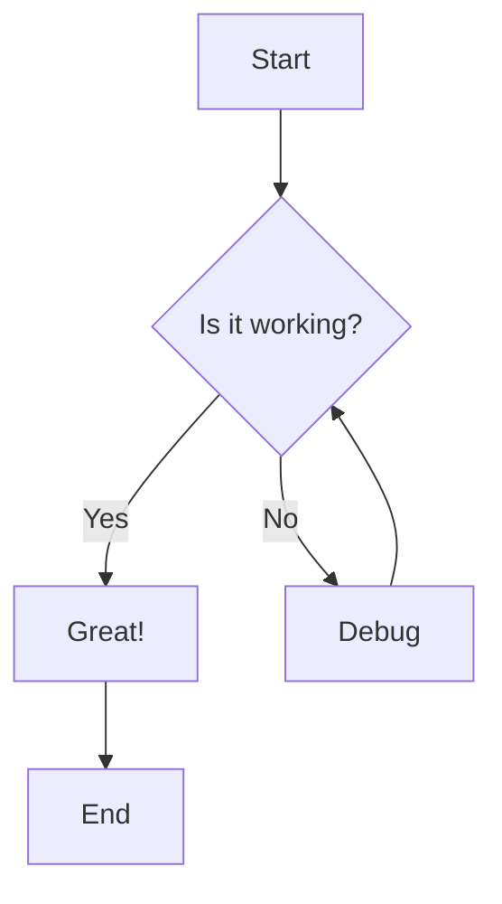
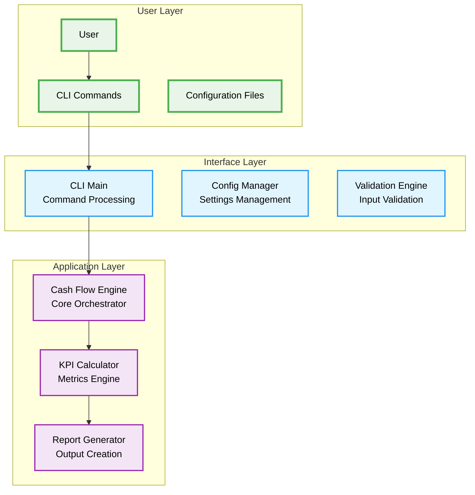

# Test Mermaid Diagrams

This page tests the Mermaid diagram rendering functionality.

## Simple Flowchart

```mermaid
flowchart TD
    A[Start] --> B{Is it working?}
    B -->|Yes| C[Great!]
    B -->|No| D[Debug]
    D --> B
    C --> E[End]
```

## Cash Flow Architecture

```mermaid
flowchart TB
    subgraph "User Layer"
        User[User]
        CLI[CLI Commands]
        ConfigFiles[Configuration Files]
    end

    subgraph "Interface Layer"
        CLIMain[CLI Main<br/>Command Processing]
        ConfigMgr[Config Manager<br/>Settings Management]
        Validation[Validation Engine<br/>Input Validation]
    end
    
    subgraph "Application Layer"
        CashFlowEngine[Cash Flow Engine<br/>Core Orchestrator]
        KPICalculator[KPI Calculator<br/>Metrics Engine]
        ReportGenerator[Report Generator<br/>Output Creation]
    end
    
    User --> CLI
    CLI --> CLIMain
    CLIMain --> CashFlowEngine
    CashFlowEngine --> KPICalculator
    KPICalculator --> ReportGenerator
    
    classDef user fill:#e8f5e8,stroke:#4caf50,stroke-width:3px,color:#000
    classDef interface fill:#e1f5fe,stroke:#2196f3,stroke-width:2px,color:#000
    classDef application fill:#f3e5f5,stroke:#9c27b0,stroke-width:2px,color:#000
    
    class User,CLI,ConfigFiles user
    class CLIMain,ConfigMgr,Validation interface
    class CashFlowEngine,KPICalculator,ReportGenerator application
```